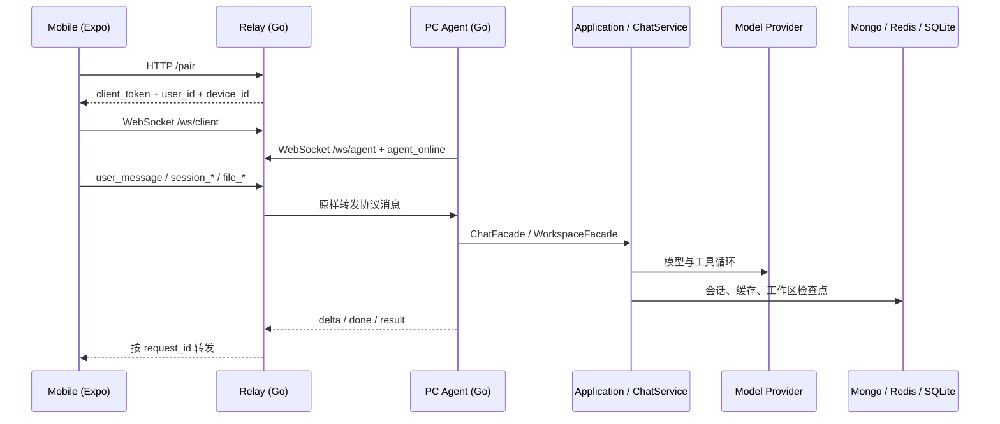

# MyAI 开发人员流程运行手册

> 本文面向需要维护、排错或扩展 MyAI 的开发人员。
>
> - 架构职责与目录说明见 [PROJECT_ARCHITECTURE_GUIDE.md](PROJECT_ARCHITECTURE_GUIDE.md)。
> - 动态概览见 [PROJECT_ARCHITECTURE_INTRO.html](PROJECT_ARCHITECTURE_INTRO.html)。
> - 已落地功能与修复的时间线见 [DEVELOPMENT_CHANGELOG.md](DEVELOPMENT_CHANGELOG.md)。
> - 本文只回答运行细节：一个命令或消息从哪里进入、经过哪些函数、改变哪些状态、最终如何返回。

需要按功能结合真实源码逐段学习时，阅读：

- [Agent 启动功能实现](FEATURE_AGENT_STARTUP_IMPLEMENTATION.md)
- [普通聊天消息功能实现](FEATURE_CHAT_MESSAGE_IMPLEMENTATION.md)
- [模型生成功能实现](FEATURE_MODEL_GENERATION_IMPLEMENTATION.md)
- [工具执行功能实现](FEATURE_TOOL_EXECUTION_IMPLEMENTATION.md)
- [Plan 模式功能实现](FEATURE_PLAN_MODE_IMPLEMENTATION.md)
- [AI 记忆系统功能实现](FEATURE_AI_MEMORY_IMPLEMENTATION.md)
- [RAG 文档解析与分块实现](FEATURE_RAG_DOCUMENT_PROCESSING_IMPLEMENTATION.md)
- [RAG 文档索引功能实现](FEATURE_RAG_INDEXING_IMPLEMENTATION.md)
- [RAG Embedding Model 管理实现](FEATURE_RAG_EMBEDDING_MODEL_IMPLEMENTATION.md)
- [RAG Milvus VectorStore 实现](FEATURE_RAG_MILVUS_VECTOR_STORE_IMPLEMENTATION.md)
- [RAG SQLite FTS5 KeywordStore 实现](FEATURE_RAG_SQLITE_FTS5_KEYWORD_STORE_IMPLEMENTATION.md)
- [RAG sqlite-vec VectorStore 实现](FEATURE_RAG_SQLITE_VEC_VECTOR_STORE_IMPLEMENTATION.md)
- [RAG 本地优先检索实现](FEATURE_RAG_RETRIEVAL_IMPLEMENTATION.md)

## 1. 阅读方式

建议先读第 2～5 节建立进程和启动认识，再按实际要修改的场景查阅：

| 需求 | 阅读章节 |
|---|---|
| 启动 PC Agent 或排查启动失败 | 3、4 |
| 手机无法配对或连接 | 5、6 |
| 用户消息没有回复 | 7、8 |
| Plan 没有生成、没有执行或状态不同步 | 9 |
| 工具没有执行或一直等待授权 | 10 |
| 会话、历史消息、模型设置异常 | 11、12 |
| 文件、变更或检查点恢复异常 | 13 |
| Skill、MCP、Hook 不生效 | 14 |
| 知识库分类、文档索引或检索异常 | RAG 架构设计、RAG 功能实现文档 |
| AI 经验没有提取、审核或注入回答 | AI 记忆系统功能实现 |
| 新增协议或业务能力 | 17 |

## 2. 运行时总览

MyAI 的远程使用由三个独立进程组成：



关键边界：

```text
Mobile: 界面、手机本地缓存、协议发送与状态归并
Relay: 配对、鉴权、连接注册、按 request_id 转发
Agent: 电脑端协议适配和会话并发控制
ChatService: CLI 和 Agent 的统一业务门面
application: Chat、Plan、Session、Tool 等真正业务流程
adapter: Mongo、Redis、LLM、SQLite、工具、MCP、Hook 等技术实现
```

Relay **不调用模型、不读写会话、不执行工具**。Agent 才是远程业务执行端。

## 3. 启动前准备

### 3.1 必需运行环境

| 项目 | 用途 | 是否必须 |
|---|---|---|
| Go 1.25 | 后端、CLI、Relay、Agent | 是 |
| Node.js + npm | Expo 手机端 | 手机端需要 |
| OpenAI-compatible 模型地址与密钥 | 模型生成 | 是 |
| MongoDB | 会话、消息、模型、资源持久化 | 推荐，可选 |
| Redis | 当前会话 ID 缓存 | 推荐，可选 |
| SQLite | 工作区变更基线和任务检查点 | Agent 自动使用 |
| Asset 服务 | 手机上传文件、`share_file` | 可选 |
| MCP 服务 | 外部工具 | 可选 |

启用 MongoDB 时必须使用副本集模式，单节点副本集即可。子智能体通过事务原子保存
`Task + Run`，重新生成也通过事务替换 transcript；standalone MongoDB 会返回
`Transaction numbers are only allowed on a replica set member or mongos`。Agent 在
MongoDB Docker 网络外连接单节点副本集时，URI 需要包含
`replicaSet=rs0&directConnection=true`。

### 3.2 配置文件

默认配置路径是当前工作目录下的：

```text
resource/application.yaml
```

配置加载入口：

```text
core/App.go
  Application.InitConfig
    -> config.ViperLoader.Load
       -> config.ViperLoader.Map
```

已脱敏的配置结构见 [application.redacted.yaml](application.redacted.yaml)。开发环境最少需要：

```yaml
myai:
  base_url: "https://provider.example/v1"
  api_key: "your-api-key"
  model: "your-model-id"

thread:
  core: 5
  queueSize: 10
```

配置行为：

- `myai.model` 为空时使用 `gpt-5.5` 作为默认模型 ID。
- `skill.root` 为空时使用 `skills`，相对路径会按 `--workspace` 解析。
- Mongo 或 Redis 未配置时，`Application` 不创建相应 Adapter；内存会话和模型调用仍可工作，但跨进程持久化能力会下降。
- 配置键支持环境变量覆盖，Viper 将 `.` 转换为 `_`。
- 配置文件路径仍以启动进程的当前工作目录为基准。通常应从项目根目录执行命令。

### 3.3 推荐启动顺序

```powershell
# 终端 1：Relay
cd D:\Go_All\myai
go run . relay --addr 0.0.0.0:18080 --agent-token "replace-with-a-strong-token" --agent-user local --agent-device pc-local

# 终端 2：PC Agent
cd D:\Go_All\myai
go run . agent `
  --server ws://127.0.0.1:18080/ws/agent `
  --relay-token "replace-with-a-strong-token" `
  --user local `
  --device pc-local `
  --workspace D:\Go_All\myai

# 终端 3：手机端
cd D:\Go_All\myai\mobile
npm start
```

真机连接 Relay 时，手机配置中必须填写电脑可访问的局域网地址，例如 `http://192.168.1.23:18080`。`127.0.0.1` 在真机上指向手机自身。

## 4. 场景一：启动 PC Agent

### 4.1 命令与参数

```powershell
go run . agent `
  --server ws://127.0.0.1:18080/ws/agent `
  --relay-token "replace-with-a-strong-token" `
  --user local `
  --device pc-local `
  --bind-code 123456 `
  --workspace D:\Go_All\myai
```

| 参数 | 默认值 | 作用 | 失败条件 |
|---|---|---|---|
| `--server` | 空 | Relay 的 Agent WebSocket 地址 | 空值直接返回 `server url is empty` |
| `--relay-token` | `MYAI_RELAY_AGENT_TOKEN` | 当前 `user/device` 对应的 Agent 凭据 | 空值、身份或 Token 与 Relay 配置不一致时连接失败 |
| `--user` | `local` | Relay 路由中的用户标识 | 空值启动失败 |
| `--device` | `pc-local` | 同一用户下的电脑标识 | 空值启动失败 |
| `--bind-code` | 空 | 固定配对码；为空时 Agent 自动生成 6 位码 | 不是启动失败条件 |
| `--workspace` | `.` | 本地工具、文件预览、SQLite 历史的工作区根目录 | 不是目录时初始化失败 |

`--bind-code` 适合开发调试或固定设备；正常情况下让 Agent 打印随机码即可。

### 4.2 完整函数路径

```text
main.main
  -> cmd.Execute
     -> cmd.agentCmd.RunE                              core/cmd/agent.go
        -> core.SetWorkspace(agentWorkspace)
        -> core.InitApp()
        -> files.New(agentWorkspace)
        -> changes.NewWithStoreFactory(... SQLite ...)
        -> remoteagent.New(config, ChatService, fileService, changeService)
        -> Agent.Run(ctx)
```

### 4.3 `core.InitApp()` 的初始化顺序

包级入口 `core.InitApp()` 使用 `sync.Once`，同一进程只会执行一次；它按顺序调用 `Application` 上的各个初始化方法：

```text
1. InitConfig           读取 application.yaml
2. InitAssetClient      初始化短链接/上传客户端（可选）
3. InitMongoDb          初始化 Mongo Client（可选）
4. InitRedisDb          初始化 Redis Client（可选）
5. InitStore            创建 Mongo persistence Store（Mongo 存在时）
6. InitCache            创建 Redis CurrentSessionCache（Redis 存在时）
7. InitThreadPool       创建异步持久化执行器
8. InitClient           读取/注册模型配置
9. InitSessionMemory    创建进程内 Session Store
10. InitSandbox         创建受 workspace 限制的 Shell Sandbox
11. InitSkillManager    加载本地 Skill 根目录
12. InitHookManager     加载命令 Hook
13. InitRegister        注册本地工具
14. InitMCP             启动 MCP 并把工具注册进同一 Registry
15. InitChatService     composition/chat 显式装配所有用例
16. ChatService.Bootstrap 恢复或创建当前会话
```

实现位置：

```text
core/App.go                                      进程资源容器
core/composition/chat/configuration.go           依赖注入/装配
core/service/chat.go                             Facade
```

### 4.4 Agent 连接 Relay 后做什么

`Agent.Run` 的关键步骤：

```text
websocket.DialContext(config.ServerURL)
  -> writeMessage(TypeAgentOnline, {status, bind_code})
  -> goroutine readLoop()
  -> 每 60 秒发送 heartbeat
```

`agent_online` 消息示例：

```json
{
  "type": "agent_online",
  "request_id": "1730000000000000000",
  "user_id": "local",
  "device_id": "pc-local",
  "payload": {
    "status": "online",
    "bind_code": "123456"
  }
}
```

Relay 在 `Server.handleAgentMessage` 中调用：

```text
registerAgent(peer, userID, deviceID, bindCode, remoteAddr)
```

保存两种索引：

```text
agents["local/pc-local"] = agentEntry
bindings["123456"] = "local/pc-local"
```

Agent 断开时 `unregisterAgent` 会移除对应绑定码，因此配对码只在该 Agent 在线期间有效。

## 5. 场景二：Relay 启动与手机配对

### 5.1 Relay 命令

```powershell
go run . relay --addr 0.0.0.0:18080 --agent-token "replace-with-a-strong-token" --agent-user local --agent-device pc-local --urlConfig .\resource\application.yaml
```

| 参数 | 默认值 | 作用 |
|---|---|---|
| `--addr` | `:8080` | HTTP 和 WebSocket 监听地址 |
| `--agent-token` | `MYAI_RELAY_AGENT_TOKEN` | 主 Agent 的 Token，必须与 `--agent-user/--agent-device` 一起绑定 |
| `--agent-user` | `MYAI_RELAY_AGENT_USER` 或 `local` | `--agent-token` 允许声明的用户身份 |
| `--agent-device` | `MYAI_RELAY_AGENT_DEVICE` 或 `pc-local` | `--agent-token` 允许声明的设备身份 |
| `--agent-credential` | `MYAI_RELAY_AGENT_CREDENTIALS` | 额外凭据，可重复设置，格式为 `user/device=token` |
| `--allowed-origin` | 空 | 允许跨域访问 Relay 的额外浏览器 Origin，可重复指定 |
| `--urlConfig` | `./resource/application.yaml` | Relay 读取 Mongo 授权仓库的配置文件 |

注意：参数名当前是 `urlConfig`，这是代码中的实际命名，不是文档笔误。

Relay 启动路径：

```text
cmd.relayCmd.RunE
  -> relay.NewServer(addr, memoryauthorization.NewStore(), WithAgentCredentials(...), WithAllowedOrigins(...))
  -> configureRelayAuthStore
     -> config.ViperLoader.LoadOptional
     -> Mongo 存在时 server.SetAuthStore(mongoauthorization.New(...))
  -> Server.Run
  -> Server.routes
```

没有可用 Mongo 配置时，Relay 使用内存授权仓库。进程重启后已配对 token 会失效。

### 5.2 Relay 路由

| 路由 | 用途 |
|---|---|
| `GET /health` | 返回 `{"status":"ok"}` |
| `GET /agents` | Agent 凭据可查看全部在线 Agent；已配对客户端只能查看自己的 `user/device` |
| `POST /pair` | 使用绑定码配对手机 |
| `GET /authorizations` | 查询授权记录 |
| `POST /authorizations/revoke` | 撤销授权 |
| `GET /ws/agent` | PC Agent WebSocket |
| `GET /ws/client` | 手机/模拟客户端 WebSocket |

### 5.3 手机配对请求

手机端入口：

```text
MobileAppScreen
  -> usePairingActions.pairDevice
  -> services/pairing.pairWithRelay
  -> POST {relayURL}/pair
```

请求：

```http
POST http://192.168.1.23:18080/pair
Content-Type: application/json

{
  "bind_code": "123456",
  "client_name": "Mobile android"
}
```

响应：

```json
{
  "user_id": "local",
  "device_id": "pc-local",
  "client_token": "base64url-random-token"
}
```

后端函数路径：

```text
relay.Server.handlePair                     core/remote/relay/pair.go
  -> getAgentByBindCode(bindCode)
  -> authorizeClient(userID, deviceID, clientName, remoteAddr)
     -> 生成 32 字节随机 token
     -> 仅保存 SHA-256(token) 到授权仓库
     -> 默认有效期 30 天
  -> 返回明文 token 一次
```

安全含义：Relay 后续只保存 token 哈希；手机客户端需要将 `client_token` 保存到本地设置。失去 token 后需要重新配对。

## 6. 场景三：手机连接 WebSocket

连接入口：

```text
MobileAppScreen
  -> useRelayConnection.connect
  -> utils/relay.websocketURL
  -> new WebSocket("ws://host:18080/ws/client")
```

URL 转换规则：

```text
http://host:18080  -> ws://host:18080/ws/client
https://host       -> wss://host/ws/client
host:18080         -> ws://host:18080/ws/client
```

连接成功后 `useRelayConnection` 调用 `onConnected()`，由 `useRemoteRequests.refreshRemoteState` 请求会话、模型、Skill、资源、文件和变更等初始状态。

手机发送任意协议消息都经过 `useRelaySender`，统一补齐：

```json
{
  "type": "...",
  "request_id": "客户端生成的唯一 ID",
  "user_id": "local",
  "device_id": "pc-local",
  "session_id": "当前或指定会话",
  "client_token": "配对时获取",
  "payload": {}
}
```

Relay 在 `handleClientMessage` 中：

1. 调用 `validateClientToken(userID, deviceID, token)`。
2. 用 `request_id` 注册当前 Client peer。
3. 按 `user_id/device_id` 查找在线 Agent。
4. 原样转发消息。

`request_id` 是流式请求能回到正确手机连接的关键。Relay 不通过 Session ID 查回包，而是通过 `request_id` 查找 Client peer。

## 7. 场景四：用户发送一条普通消息

假设当前会话为 `session-1`，用户输入：

```text
帮我检查当前项目的测试失败原因
```

### 7.1 手机端动作

函数路径：

```text
Composer.onSend
  -> useChatActions.sendUserMessage
  -> useFileActions.sendMessageWithFiles
  -> useRelaySender("user_message")
```

`sendUserMessage` 先做本地 UI 准备：

```text
1. 生成 request_id
2. requestSessionMap[request_id] = session-1
3. 清空当前 assistant 流式占位
4. 标记 session-1 pendingRequestID
5. 在手机本地立刻插入 user 气泡
6. 若附带文件，把短链接文本拼入 content
7. 发送 user_message
```

请求示例：

```json
{
  "type": "user_message",
  "request_id": "1710000000001",
  "user_id": "local",
  "device_id": "pc-local",
  "session_id": "session-1",
  "client_token": "...",
  "payload": {
    "content": "帮我检查当前项目的测试失败原因"
  }
}
```

### 7.2 Relay 与 Agent 路由

```text
Relay.handleClientMessage
  -> validateClientToken
  -> registerClient(requestID, requestType, peer, ...)
  -> forwardToAgent

Agent.readLoop
  -> Agent.handleRelayMessage
  -> go Agent.processUserMessage
  -> sessionRuntimeManager.get(sessionID)
  -> runtime.mu.Lock()
  -> runtime.start(ctx)
  -> Agent.handleUserMessage
```

同一 `session_id` 的任务必须串行。若该会话已有运行任务，`runtime.start` 返回 `ok=false`，Agent 返回：

```json
{
  "type": "error",
  "payload": { "message": "session is already running" }
}
```

不同会话可以并行生成。

### 7.3 Agent 调用 ChatService

`handleUserMessage` 解码 `UserMessagePayload` 后执行：

```go
chatService.SendMessageStreamForSession(ctx, sessionID, payload.Content, stream)
```

其中 `stream` 由 `Agent.streamChatResponse` 创建，回调映射如下：

| ChatStream 回调 | Agent 发送消息 | 手机处理位置 |
|---|---|---|
| `OnReasoning` | `assistant_delta.reasoning` | `useRemoteMessageHandler` -> `appendAssistant` |
| `OnAnswer` | `assistant_delta.content` | `appendAssistant` |
| `OnToolCall` | `tool_call` | `addToolCall` |
| `OnToolResult` | `tool_result` | `addToolResult` |
| `OnToolAsk` | `permission_ask` 并等待 | `setSessionPendingPermission` |

### 7.4 ChatService 内部链路

```text
ChatService.SendMessageStreamForSession          core/service/chat.go
  -> MessageCommands.AppendUserMessage
     -> session/message.CommandService
     -> LoadService.Load（内存未命中时从 Mongo 重建 Session）
     -> Memory.AddUserMessageTo
  -> UserMessages.PersistUserMessage（异步）
  -> generateAssistantForSession
     -> GenerationTasks.Generate
```

首次对话会用用户输入生成 Session 标题；用户消息进入内存后，持久化在异步线程池中进行，不阻塞模型请求。

### 7.5 一次生成任务的完整流程

```mermaid
sequenceDiagram
    participant Task as TaskService
    participant Gen as AssistantGenerationService
    participant Context as Context Snapshot
    participant Loop as AgentLoopService
    participant Model as ChatModel
    participant Commit as ResponseCommitService

    Note over Task,Gen: ChatService 先通过 MessageCommandService 计算 runtime instruction，原子追加 Synthetic Message + User Message
    Task->>Task: 创建 request_id + TaskRecorder
    Task->>Gen: Generate
    Gen->>Context: Snapshot(Session.Messages)
    Gen->>Gen: 必要时 CompactIfNeeded
    Gen->>Loop: Run
    Loop->>Model: Generate(messages, tools, stream)
    alt 模型有工具调用
      Model-->>Loop: ToolCalls
      Loop->>Loop: Execute tools
      Loop->>Model: Generate(附加 tool results)
    end
    Model-->>Loop: Final answer
    Loop-->>Gen: ChatResult
    Gen->>Commit: 保存 assistant、usage、Plan
    Gen-->>Task: GenerationResponse
    Task->>Task: 保存工作区检查点
```

关键函数：

```text
TaskService.Generate
  -> 创建 request_id 和 TaskRecorder，挂到 context

MessageCommandService.AppendUserMessage
  -> RuntimeInstructions.Prompt
  -> AddUserTurnTo(Synthetic runtime + User)

AssistantGenerationService.Generate
  -> CompactIfNeeded
  -> AgentRunner.Run
  -> ResponseCommitter.Commit
  -> 异步 PersistAssistant / PersistCurrentSession

AgentLoopService.Run
  -> 最多 6 轮“模型 -> 工具 -> 模型”
  -> 每轮直接读取 Session.Messages，runtime instruction 不再重新计算或临时注入
  -> 达到上限时做一次无工具最终生成
```

### 7.6 结果返回与持久化

成功后 Agent 发送：

```text
assistant_delta          0 到多次
tool_call/tool_result    0 到多次
assistant_done           恰好一次
```

`assistant_done` 包含：

```text
content / reasoning
usage                    token 用量与 prompt_cached_tokens
context                  prefix_hash、cacheable_tokens、是否截断
compact                  是否自动压缩
plan                     Plan 模式下的 CurrentPlan
```

持久化分工：

| 数据 | 写入位置 | 时机 |
|---|---|---|
| 当前运行 Session | 内存 `adapter/session/memory` | 立即 |
| Synthetic runtime + 用户消息 | Mongo Message + Session | 异步，按顺序写入；查询历史时隐藏 Synthetic |
| assistant 消息、usage、Plan | Mongo Message + Session | 异步 |
| 当前会话 ID | Redis | 异步，TTL 24 小时 |
| 工具调用记录与资源 | Mongo | 异步 |
| 文件改动检查点 | SQLite | TaskRecorder 收尾时 |

## 8. 工具循环、权限与工作区检查点

### 8.1 工具循环

`AgentLoopService.Run` 每一轮：

1. 通过 `SnapshotService.Snapshot` 构建消息窗口。
2. 通过 `SelectionService.ToolsForSession` 选择模型可见工具。
3. 调用模型。
4. 模型没有 `ToolCalls` 时结束。
5. 否则调用 `tool/executor.Executor.Execute`。
6. 执行结果写成 `ToolCallMessage` 和 `ToolResultMessage` 追加到 Session。
7. 进入下一轮；本轮已经持久化的 Synthetic runtime message 保持不变。

最大轮数为 `DefaultMaxToolRounds = 6`。超过后会做最后一次无工具生成，防止循环失控。

### 8.2 权限判定顺序

```text
PreToolUse Hook
  -> deny: 直接产生 tool error
  -> allow/continue: 都进入会话权限策略

Plan 门禁（发生在 Hook 参数重写之后、PermissionService 之前）
  -> plan + !ForceChatMode: 只有 read 工具可执行
  -> ForceChatMode: 解除 Plan 门禁，但仍继续检查 readonly/ask/full

PermissionService.Allow
  -> read: 直接允许
  -> readonly: 拒绝 write/execute
  -> full: 允许
  -> ask: 发送 permission_ask，等待手机 permission_result
```

Agent 等待授权的代码：

```text
Agent.askToolPermission
  -> permissionWaiters.register(requestID)
  -> TypePermissionAsk
  -> 最多等待 60 秒
  -> handlePermissionResult -> resolve(requestID, allowed)
```

超时、取消或手机拒绝都返回 `false`，工具不会执行。

### 8.3 文件检查点

`TaskService.Generate` 创建 `TaskRecorder` 并附加到 `context.Context`。`edit_file`、`write_file`、`shell` 等工具会：

```text
执行前：SnapshotPath / SnapshotWorkspace
执行后：RecordFileChange / RecordWorkspaceChanges
任务结束：TaskRecorder.Save
```

同一任务多次修改同一文件时，`TaskRecorder` 合并为“第一次 before + 最后一次 after”，最终在 SQLite 保存一个可恢复检查点。

## 9. 场景五：Plan 模式

Plan 模式有两个独立阶段：**生成计划**与**执行已批准计划**。不要把它们混为一次模型调用。

### 9.1 切换模式

手机动作：

```text
useSessionSettingsActions.setAgentMode("plan")
  -> sendEnvelope("session_mode_set")
```

请求：

```json
{
  "type": "session_mode_set",
  "session_id": "session-1",
  "payload": {
    "session_id": "session-1",
    "mode": "plan"
  }
}
```

Agent 调用链：

```text
Agent.handleSessionModeSet
  -> ChatService.SetAgentModeForSession
  -> application/session/settings.UseCase.SetAgentMode
  -> SettingsService.SetAgentMode
  -> Persistence.Save
  -> Events.SessionChanged
  -> TypeSessionModeSetResult
```

手机收到 `session_mode_set_result` 后才调用 `applySessionSettings` 更新 UI；不依赖本地乐观切换。

### 9.2 Plan 提示词如何进入模型

固定系统提示词只在创建 Session 时写入 `Session.Messages[0]`。Plan 模式不会改写它。

```text
RuntimeInstructionBuilder.Build
  -> ModePolicy.IsPlanMode(agentMode, forceChatMode)
  -> 返回 turn boundary + 可选 PlanModePrompt + 匹配到的 Skill 指令

MessageCommandService.AppendUserMessage
  -> RuntimeInstructionProvider.Prompt
  -> Memory.AddUserTurnTo(runtimeInstruction, input)
  -> 追加 SyntheticReasonRuntimeInstruction
  -> 再追加真实 user message
  -> UserMessagePersistence 按相同顺序保存两条 MessageRecord

SnapshotService.Snapshot
  -> 直接读取 Session.Messages
  -> 不再调用 InsertRuntimeInstructions
```

模型看到的本轮快照：

```text
[system] 固定 MyAI 提示词                 <- 稳定
[history] 已有历史消息                    <- 稳定
[system] Runtime instructions: Plan rules <- 已持久化 Synthetic Message
[user]   本轮输入                          <- 动态
```

runtime instruction 与对应 user message 同时进入历史。下一轮请求的 cacheable prefix 会包含已经完成的旧 turn，而当前 turn 的 runtime message 位于未缓存尾部；切换模式不会重写固定 system prompt 或旧历史。`ContextInfo.PrefixHash` 和 `CacheableTokens` 可用于观察这一前缀。

每条 runtime message 都声明其规则只适用于紧随的 user message，因此旧 Plan/Style runtime 虽然保留用于缓存和审计，也不会成为后续 Chat turn 的持续规则。

### 9.3 Plan 生成示例：重构文件

用户输入：

```text
请重构 session 模块的加载逻辑
```

在 Plan 模式中：

```text
ChatService.SendMessageStreamForSession
  -> generateAssistantForSession(CapturePlan=true)
  -> AssistantGenerationService.Generate(ForceChatMode=false)
  -> RuntimeInstructionBuilder 添加 PlanModePrompt
  -> 模型输出 ## Plan
  -> ResponseCommitService.Commit
  -> CaptureService.Capture
  -> Session.CurrentPlan = Plan
```

`CaptureService` 使用 `plan.ExtractSteps` 解析 `## Plan` 下的列表；最多保留 12 步。计划状态初始为 `draft`。

### 9.4 纯文本 Plan 示例：写古诗

用户输入：

```text
写一首描写春雨的七言绝句
```

Plan 提示词要求安全纯文本任务在同一回复中输出：

```markdown
## Plan
1. 选择春雨、江南等意象。
2. 组织四句七言。
3. 检查表达和韵律。

## Result
细雨江南入晚烟，...
```

`CaptureService.Capture` 检测到 `Result` 区段后，将 Plan 和全部步骤直接标记为 `done`。此场景不需要发送 `session_plan_execute`。

### 9.5 执行计划

手机点击执行：

```text
PlanPanel
  -> useSessionSettingsActions.executePlan
  -> requestSessionMap[requestID] = sessionID
  -> sendEnvelope("session_plan_execute")
```

Relay 现在完整支持该协议：

```text
client -> agent: session_plan_execute
agent  -> client: session_plan_update (0..n)
agent  -> client: assistant_delta / tool_* / assistant_done
agent  -> client: session_plan_execute_result (终态)
```

对应实现和测试：

```text
core/remote/relay/server.go
core/remote/relay/server_test.go: TestRelayForwardsPlanExecutionUntilFinalResult
```

Agent 调用：

```text
Agent.processPlanExecuteMessage
  -> 获取 sessionRuntime 锁
  -> Agent.handleSessionPlanExecute
  -> ChatService.ExecutePlanStreamForSession
  -> plan.ExecutionService.Execute
```

`ExecutionService.Execute` 对每一步做：

```text
1. Plan = running，当前步骤 = running
2. savePlanState
   -> 内存 CurrentPlan
   -> Plan state repository / Session 持久化
   -> UpdateSink -> session_plan_update
   -> Hook SessionChanged
3. ExecutionInputBuilder.BuildStepInput
4. AppendUserMessage
5. GenerationTasks.Generate(ForceChatMode=true)
6. 成功：步骤 = done；失败：步骤 = failed，Plan = failed
7. 全部完成：Plan = done
```

`ForceChatMode=true` 非常重要：执行阶段虽然 Session 仍保存 `agent_mode=plan`，但运行时策略将其视为 Chat，从而允许写工具并避免模型再次输出新计划。

## 10. 场景六：会话、历史和模型

### 10.1 应用启动时恢复会话

```text
ChatService.Bootstrap
  -> session/bootstrap.BootstrapService.Bootstrap
  -> Redis CurrentSessionCache.Get(userID)
  -> Lifecycle.LoadSession
  -> LoadService.EnsureInMemory
  -> Mongo SessionRecord + MessageRecord
  -> memory.Store.PutSessionWithModeUsage
```

若 Redis 没有可用 Session ID：

```text
内存已有 current Session -> 复用并保存
否则 -> Lifecycle.NewSession -> 持久化 -> Redis 写 current session ID
```

### 10.2 会话命令

| 协议请求 | Agent Handler | ChatService | 结果 |
|---|---|---|---|
| `session_new` | `handleSessionNew` | `NewSession` | `session_changed` |
| `session_load` | `handleSessionLoad` | `LoadSession` | `session_changed` |
| `session_delete` | `handleSessionDelete` | `DeleteSession` | `session_delete_result` |
| `session_restore` | `handleSessionRestore` | `RestoreSession` | `session_restore_result` |
| `session_compact` | `handleSessionCompact` | `CompactSession` | `session_compact_result` |
| `session_regenerate` | `handleRegenerateMessage` | `RegenerateLastMessage...` | `assistant_done` |
| `session_pause` | `handleSessionPause` | runtime cancel | `session_pause_result` |

删除当前会话时，`lifecycle.UseCase.Delete` 会自动加载另一个可用会话；没有会话则创建新会话，保证系统始终存在可聊天的 current Session。

### 10.3 手机历史消息同步

手机不必每次都请求整段历史：

```text
useRemoteRequests.requestSessionHistory
  -> 先读取 SQLite / AsyncStorage 缓存
  -> session_history_meta(local count, last ID, version)

Agent.handleSessionHistoryMeta
  -> 对比本地 meta 与服务端 meta
  -> up_to_date / can_delta

手机：
  up_to_date      -> 结束
  can_delta       -> session_history_delta(after_message_id)
  否则            -> session_history（全量）
```

缓存实现：

```text
mobile/src/storage/sessionHistoryCache.ts
  Native: expo-sqlite，WAL 模式
  Web:    AsyncStorage
```

### 10.4 模型启动与切换

启动时：

```text
Application.InitClient
  -> model.BootstrapService.Bootstrap
  -> Repository.ListConfigs（Mongo 存在时）
  -> 没有记录时保存 YAML seed model
  -> adapter/model/langchaingo.Factory.CreateModel
  -> llm.Registry.SetModelInfo
```

切换模型：

```text
model_switch
  -> Agent.handleModelSwitch
  -> ChatService.SwitchModelForSession
  -> session/settings.UseCase.SwitchModel
  -> SettingsService.SwitchModel
  -> Persistence.Save + SessionChanged event
```

## 11. 场景七：上下文窗口与自动压缩

一次模型请求的上下文构建：

```text
SnapshotService.Snapshot
  -> 直接使用包含 Synthetic runtime message 的 Session.Messages
  -> contextmgr.BuildSnapshot
     -> 固定 system + summary + 已完成 turn 作为 cacheable Prefix
     -> 排除当前 turn 的 Synthetic runtime message 与 user message
     -> 从最近消息块倒序选择，直到 ContextWindowK * 1000 token 预算
```

自动压缩触发条件：

```text
SelectedTokens >= ContextWindowK * 1000 * 0.70
或 Snapshot 已经 Truncated
```

压缩流程：

```text
CompactService.CompactIfNeeded
  -> CompactSplit：保留最近 8 个完整消息块
  -> Summarizer.Summarize(旧 summary + 可压缩消息)
  -> SummaryStore.SaveSummary
  -> Session.Summary / CompactedMessages 更新
```

`tool call` 与 `tool result` 被视为同一消息块，不会被摘要算法拆开。

Mobile 打开“上下文”设置时会发送 `session_context_query` 主动查询当前 Session，查询期间显示加载状态。上下文面板会展示 token 数、消息数、版本、哈希和后端实际保存的完整 `Session.Summary` 字符串，但不会展示模型请求的全部正文：固定 system prompt、被选中的消息正文、cacheable prefix 正文和 Plan snapshot 当前只参与后端快照构建。

因此，`summary_tokens=0`、`summary_version=0`、`has_summary=false` 表示尚未生成摘要；有摘要时所谓“完整”是指 UI 完整显示持久化摘要，而不是无损还原压缩前的全部历史。`SummaryService` 还会分别限制旧摘要输入、新历史输入和摘要输出的 token 数，避免压缩请求本身超过上下文窗口。

## 12. 场景八：文件浏览、上传、Changes 和恢复

### 12.1 远程文件浏览

```text
Mobile useFileActions.readFilePath / requestFiles
  -> file_list / file_read
  -> Agent.handleFileList / handleFileRead
  -> remote/files.Service.List / Read
  -> file_*_result
```

文件服务安全边界：

- 所有路径通过 workspace 根目录解析。
- `.env`、私钥、`node_modules`、`.git` 等敏感或无价值路径会被隐藏或拒绝读取。
- 单个文件预览最多读取 256 KiB。
- 二进制文件只返回元数据，不返回正文。

### 12.2 手机文件上传并发送给模型

```text
DocumentPicker
  -> uploadMobileAsset(assetBaseURL, sessionID)
  -> Asset 服务返回 short_url/code
  -> attachment 写入本地聊天草稿
  -> sendMessageWithFiles
  -> user_message.content 中拼入 uploaded_file 信息
  -> 模型可调用 read_asset 读取实际内容
```

附件不通过 Relay WebSocket 传输文件字节，WebSocket 只传短链接文本。

### 12.3 Changes 与 SQLite baseline

Agent 启动时：

```text
changes.NewWithStoreFactory(workspace, "", sqlitehistory.Factory{})
  -> changes.newService
  -> loadOrCreateBaseline
  -> SQLite 中无 baseline 时扫描 workspace 并保存
```

变更请求：

```text
changes_list
  -> Agent.handleChangesList
  -> changes.Service.List
  -> 当前扫描结果与 SQLite baseline 比较
  -> added / modified / deleted
```

恢复规则：

- baseline 不存在的文件属于新增文件，`change_revert` 会删除它。
- baseline 存在且内容可用的文件，会写回保存的内容和权限。
- 二进制或超过记录上限的文件没有可恢复内容，`restorable=false`。
- `history_revert` 以倒序恢复检查点中的文件改动。

## 13. 场景九：Skill、MCP、Hook

### 13.1 Skill

```text
Application.InitSkillManager -> skill.NewManager(skill.root)
RuntimeInstructionBuilder.Build
  -> SkillPromptProvider.PromptForInput(input)
  -> 将匹配 Skill 指令添加到本轮 runtime prompt
```

远程刷新：

```text
skill_reload
  -> Agent.handleSkillReload
  -> ChatService.ReloadSkills
  -> skill.CatalogService.List(Refresh=true)
  -> Hook EventSkillReloaded
  -> skill_reload_result
```

### 13.2 MCP

```text
Application.InitMCP
  -> mcp.NewManager
  -> Manager.RegisterAll
  -> 对每个 server：Client.Start -> initialize -> ListTools
  -> NewToolWithName
  -> tool.RegisterTools.RegisterSource("mcp:<server>", tools)
```

MCP 工具最终进入普通工具 Registry，因此它们遵循相同的 Plan、权限、Hook、工具记录和手机回调机制。

### 13.3 Hook

支持事件：

```text
pre_tool_use
post_tool_use
session_changed
skill_reloaded
```

`pre_tool_use` 多个 Hook 的决策优先级：

```text
Deny > Ask > Allow > Continue
```

外部命令通过 stdin 接收事件 JSON，可通过 stdout 返回：

```json
{
  "decision": "allow",
  "arguments": "{...}",
  "message": "optional text"
}
```

命令退出码为 `2` 时被视为拒绝；其他执行错误会使本次工具流程失败。

## 14. 协议与终态规则

### 14.1 请求路由原则

Relay 在收到 Client 请求时注册：

```text
clients[request_id] = { request type, WebSocket peer, user, device }
```

Agent 返回消息时必须复用原 `request_id`。Relay 根据请求类型判断何时释放路由。

| 请求 | 中间响应 | 终态响应 |
|---|---|---|
| `user_message` | `assistant_delta`、`tool_*`、`permission_ask` | `assistant_done` |
| `session_regenerate` | `assistant_delta` | `assistant_done` |
| `session_plan_execute` | `session_plan_update`、`assistant_delta`、`assistant_done` | `session_plan_execute_result` |
| `session_*` 设置/查询 | 视请求而定 | 对应 `*_result` 或 `session_changed` |
| `file_*` / `changes_*` / `history_*` | 无 | 对应 `*_result` |

新增协议时必须同时修改：

```text
core/remote/protocol/message.go
core/remote/relay/server.go
  - handleClientMessage
  - handleAgentMessage
  - isTerminalResponseForRequest
core/remote/agent 的 handler
mobile/src/protocol.ts
mobile action hook + useRemoteMessageHandler
Relay 测试
```

### 14.2 `request_id` 与 `session_id` 的区别

| 字段 | 生命周期 | 用途 |
|---|---|---|
| `request_id` | 一次请求 | Relay 回包路由、手机流式消息归并、权限等待 |
| `session_id` | 一段对话 | Session 聚合、并发互斥、Plan、持久化 |

不要用 `session_id` 替代 `request_id`。同一个 Session 可以连续发多个请求，而每个请求必须有唯一 ID。

## 15. 并发、取消和超时

### 15.1 同会话互斥

```text
Agent.processUserMessage / processRegenerateMessage / processPlanExecuteMessage
  -> runtime := runtimes.get(sessionID)
  -> runtime.mu.Lock
  -> runtime.start
```

同一 Session 已运行时返回 busy。会话设置、删除等 Handler 同样获取该 Session 的锁，防止在生成过程中切换/删除同一会话。

### 15.2 暂停

```text
Mobile: session_pause
  -> Agent.handleSessionPause
  -> sessionRuntime.pause
  -> cancel current context
  -> 生成/Plan 代码从 ctx.Err 退出
```

Plan 执行发现取消后，会将 Plan 标记为 `canceled` 并推送最新状态。

### 15.3 超时

| 位置 | 超时 |
|---|---|
| 手机配对 HTTP | 10 秒 |
| 手机 WebSocket 连接 | 10 秒 |
| 手机远程初始状态刷新 | 8 秒后解除 loading |
| Agent 等待工具授权 | 60 秒 |
| 异步 Mongo/Redis 持久化 | 10 秒 |
| Relay 授权仓库操作 | 5 秒 |
| Hook 默认命令 | 5 秒 |

## 16. 调试手册

### 16.1 Agent 启动失败

按顺序检查：

```text
1. 是否从项目根目录启动，resource/application.yaml 是否存在。
2. base_url、api_key、model 是否有效。
3. --workspace 是否为可访问目录。
4. --server 是否是 ws://.../ws/agent，而不是 HTTP /pair 地址。
5. Relay 是否已监听，curl http://host:port/health 是否返回 ok。
6. 控制台是否打印 binding code 和 agent connected。
```

### 16.2 手机能配对但不能聊天

```text
1. 手机 Relay URL 是否使用电脑局域网 IP，而非 127.0.0.1。
2. 手机是否已得到并保存 client_token。
3. Relay /agents 是否能看到目标 user/device。
4. WebSocket 是否连接到 /ws/client。
5. Agent 控制台是否收到 type=user_message。
6. Relay 是否返回 client token invalid or expired。
```

### 16.3 消息卡在“处理中”

```text
Mobile useChatActions 是否建立 requestSessionMap
-> Relay clients[request_id] 是否登记
-> Agent 是否因同 Session 正在运行而返回 busy
-> 模型是否报错
-> Agent 是否发送 assistant_done 或 error
-> Relay isTerminalResponseForRequest 是否包含该请求类型
-> Mobile useRemoteMessageHandler 是否 stopPending / clearSessionPendingRequest
```

### 16.4 Plan 点击执行没有效果

```text
1. Session.CurrentPlan 是否存在且有 Steps。
2. 请求类型是否为 session_plan_execute。
3. Relay 是否包含 TypeSessionPlanExecute 路由。
4. Agent 是否进入 processPlanExecuteMessage。
5. 是否收到 session_plan_update。
6. 最终是否收到 session_plan_execute_result，而不是只等待 assistant_done。
```

### 16.5 工具不执行

```text
1. 工具是否在 Application.InitRegister 或 MCP Manager 中注册。
2. Plan 生成阶段是否被 ModePolicy 正确限制为只读。
3. Session.PermissionMode 是否为 readonly / ask / full。
4. ask 模式下手机是否返回 permission_result。
5. Hook 是否返回 deny 或命令超时。
6. workspace 路径和 Sandbox 是否允许本次操作。
```

## 17. 新功能落地模板

### 17.1 新增一个会话类用例

例如“归档会话”：

```text
application/session/archive/
  api/        入站接口
  command/    ArchiveSessionCommand
  result/     ArchiveSessionResult
  port/       仓库、事件等出站接口
  service/    业务实现

composition/chat/configuration.go
  -> 创建 service 并注入 port 实现

core/service/ChatDependencies + ChatService
  -> 暴露 Facade 方法

core/remote/agent
  -> 新增协议 handler
```

### 17.2 新增远程协议

以 `session_archive` 为例：

```text
1. Go protocol 定义请求/响应 MessageType 与 Payload。
2. Relay 把 request 加入 handleClientMessage。
3. Relay 把 response 加入 handleAgentMessage。
4. 在 isTerminalResponseForRequest 定义终态。
5. Agent.handleRelayMessage 增加分发，编写 handler。
6. TypeScript protocol 增加类型。
7. Mobile Action 发请求，RemoteMessageHandler 消费响应。
8. 为 Relay 转发和终态释放新增测试。
```

### 17.3 新增工具

```text
1. core/tool/local 实现 Tool。
2. 明确 PermissionRead / PermissionWrite / PermissionExecute。
3. 在 Application.InitRegister 注册。
4. 若会修改文件，接入 TaskRecorder 快照。
5. 为路径边界、异常和结果写测试。
6. 如需手机展示文件，定义 Asset 提取规则。
```

## 18. 开发验证清单

修改后至少执行：

```powershell
cd D:\Go_All\myai
gofmt -w <changed-go-files>
go test ./...
go test ./core/architecture
git diff --check

cd mobile
npm run typecheck
```

涉及 Relay 消息时，额外执行：

```powershell
go test ./core/remote/relay
```

涉及手机交互时，进行一次真机或模拟器验收：配对、连接、Chat、Plan、权限审批、文件预览和 Changes 至少覆盖受影响场景。

## 19. 最短排查路径

当你只知道“某功能有问题”时，按以下顺序进入代码：

```text
手机按钮/Hook
  -> mobile/src/protocol.ts
  -> core/remote/relay/server.go
  -> core/remote/agent/agent.go + 对应 handler
  -> core/service/chat.go
  -> core/application/<module>/service
  -> core/port 或 application/<module>/port
  -> core/adapter/<technology>
  -> composition/chat/configuration.go（确认注入实现）
```

这个顺序能让你始终从用户可见行为追到业务规则和技术实现，而不是在目录中无目的搜索。
