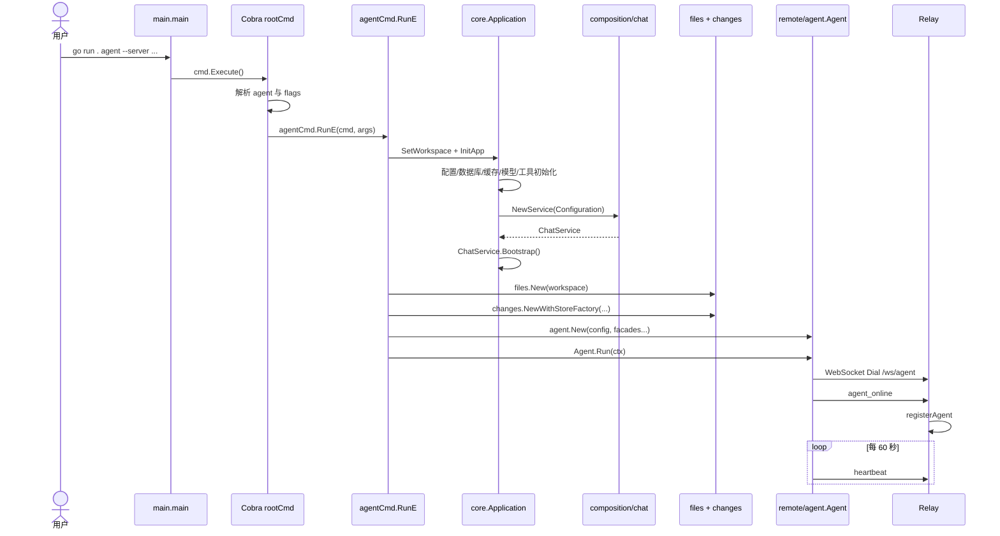

# Agent 启动功能实现说明

> 本文只讲一个功能：**PC Agent 从命令行启动，完成应用初始化，并连接到 Relay**。
>
> 它不是架构概览，而是一份面向开发人员的源码级实现说明。阅读完成后，开发人员应该能够回答：命令进入了哪个函数、创建了哪些对象、每个对象有什么作用、初始化顺序为什么不能交换、Agent 如何上线、失败会从哪里返回。

## 1. 功能目标

Agent 是运行在用户电脑上的执行进程。它负责：

1. 加载模型、会话、工具、Skill、Hook、MCP 等应用能力。
2. 绑定一个本地工作区，提供文件浏览、Changes 和历史恢复能力。
3. 主动连接 Relay WebSocket。
4. 向 Relay 注册 `user_id`、`device_id` 和配对码。
5. 接收手机端经 Relay 转发的请求。
6. 将聊天流、工具事件和业务结果发回手机端。

启动成功不等于“进程没有退出”。启动成功至少要求：

```text
配置已加载
-> 至少一个模型已注册
-> 当前会话已恢复或创建
-> workspace 服务初始化成功
-> WebSocket 已连接 Relay
-> agent_online 已发送
-> Agent 进入消息读取和心跳循环
```

## 2. 用户如何启动 Agent

在项目根目录执行：

```powershell
cd D:\Go_All\myai

go run . agent `
  --server ws://127.0.0.1:18080/ws/agent `
  --user local `
  --device pc-local `
  --bind-code 123456 `
  --workspace D:\Go_All\myai
```

其中 Relay 应当已经启动：

```powershell
go run . relay --addr 0.0.0.0:18080
```

### 2.1 参数含义

| 参数 | 绑定变量 | 默认值 | 作用 |
|---|---|---|---|
| `--server` | `agentServerURL` | 空 | Relay 的 Agent WebSocket 地址，必须包含 `/ws/agent` |
| `--user` | `agentUserID` | `local` | Relay 中的用户路由标识 |
| `--device` | `agentDeviceID` | `pc-local` | Relay 中的设备路由标识 |
| `--bind-code` | `agentBindCode` | 空 | 手机配对码；为空时由 `Agent.New` 生成六位码 |
| `--workspace` | `agentWorkspace` | `.` | 文件、Shell、Skill、Changes 和 SQLite 历史使用的根目录 |

`go run .` 会先编译当前 Go module，再运行临时可执行文件。`agent` 及其后面的内容才是传给 Cobra 的命令参数。

## 3. Java/Spring Boot 视角下的对象关系

Go 没有 Java 的 `class` 关键字。本项目主要使用 `struct + interface + 构造函数` 表达对象关系。

| Go 对象 | 类型 | Spring Boot 类比 | 作用 |
|---|---|---|---|
| `cobra.Command` | 第三方结构体 | `CommandLineRunner` 和参数解析器 | 注册 `agent` 子命令并执行 `RunE` |
| `core.Application` | 结构体 | `ApplicationContext` | 持有进程级基础设施和应用服务 |
| `config.Properties` | POJO 风格结构体 | `@ConfigurationProperties` | 保存 YAML 映射后的配置 |
| `composition/chat.Configuration` | 结构体 | `@Configuration` 方法的输入 | 接收已创建的基础设施对象 |
| `service.ChatDependencies` | 接口集合结构体 | 构造器注入参数集合 | 保存 ChatService 使用的应用层接口 |
| `service.ChatService` | Facade 结构体 | `@Service` 门面 | 给 CLI 和 Agent 提供统一业务入口 |
| `agent.Config` | POJO 风格结构体 | Agent 配置 DTO | 保存 Relay、用户、设备和工作区配置 |
| `agent.ChatFacade` | 接口 | Service 接口 | 限制 Agent 只能使用所需聊天能力 |
| `files.Service` | 实现结构体 | 文件查询 Service | 在 workspace 边界内读取目录和文件 |
| `changes.Service` | 实现结构体 | Changes Service | 维护工作区 baseline、diff 和恢复历史 |
| `agent.Agent` | 结构体 | WebSocket Controller/Adapter | 将远程协议适配为 ChatFacade 调用 |
| `protocol.Message` | DTO 结构体 | WebSocket 消息 POJO | 统一承载请求类型、路由字段和 payload |
| `sessionRuntimeManager` | 进程内协调对象 | Session 级锁管理器 | 串行化同一会话任务，并提供取消能力 |

最关键的依赖方向是：

```text
Agent
  -> ChatFacade interface
       <- ChatService implements

ChatService
  -> application api interfaces
       <- application service structs implement

application service
  -> port interfaces
       <- Mongo / Redis / memory / tool adapters implement
```

因此 `Agent` 不直接依赖 Mongo、Redis 或具体模型 SDK。

## 4. 启动总时序



完整调用链：

```text
main.main
-> cmd.Execute
-> rootCmd.Execute
-> Cobra 解析 agent 子命令和 flags
-> agentCmd.RunE
   -> core.SetWorkspace
   -> core.InitApp
      -> Application.InitConfig
      -> Application.InitAssetClient
      -> Application.InitMongoDb
      -> Application.InitRedisDb
      -> Application.InitStore
      -> Application.InitCache
      -> Application.InitThreadPool
      -> Application.InitClient
      -> Application.InitSessionMemory
      -> Application.InitSandbox
      -> Application.InitSkillManager
      -> Application.InitHookManager
      -> Application.InitRegister
      -> Application.InitMCP
      -> Application.InitChatService
         -> composition/chat.NewService
         -> composition/chat.BuildDependencies
         -> service.NewChatService
         -> ChatService.Bootstrap
   -> files.New
   -> changes.NewWithStoreFactory
   -> agent.New
   -> Agent.Run
      -> websocket.DialContext
      -> writeMessage(agent_online)
      -> readLoop goroutine
      -> heartbeat loop
```

## 5. 第一阶段：Go 进入 `main.main`

源码：[main.go](main.go)

```go
func main() {
	if err := cmd.Execute(); err != nil {
		fmt.Println(err)
		os.Exit(1)
	}
}
```

这里不创建 Agent，也不初始化数据库。`main` 只做两件事：

1. 把控制权交给 `core/cmd` 包的 Cobra 命令树。
2. 如果命令返回错误，打印错误并以退出码 `1` 结束进程。

在 `main` 执行前，Go 已经完成包级变量初始化和各包的 `init()`。这也是 `agent` 子命令能够被 Cobra 找到的原因。

## 6. 第二阶段：Cobra 注册并解析 `agent` 命令

### 6.1 根命令对象

源码：[core/cmd/root.go](core/cmd/root.go)

```go
var rootCmd = &cobra.Command{
	Use:           "myai",
	Short:         "A tiny AI coding CLI",
	SilenceUsage:  true,
	SilenceErrors: true,
}

func Execute() error {
	return rootCmd.Execute()
}
```

`rootCmd` 是整个 CLI 的根对象。`SilenceUsage` 和 `SilenceErrors` 表示 Cobra 不自动重复打印 usage 和错误，最终错误统一由 `main` 打印。

### 6.2 `agentCmd` 的注册

源码：[core/cmd/agent.go](core/cmd/agent.go)

```go
func init() {
	rootCmd.AddCommand(agentCmd)

	agentCmd.Flags().StringVar(&agentServerURL, "server", "", "relay server websocket url")
	agentCmd.Flags().StringVar(&agentUserID, "user", "local", "user id")
	agentCmd.Flags().StringVar(&agentDeviceID, "device", "pc-local", "device id")
	agentCmd.Flags().StringVar(&agentBindCode, "bind-code", "", "fixed pairing code")
	agentCmd.Flags().StringVar(&agentWorkspace, "workspace", ".", "workspace directory for remote file preview and local tools")
}
```

这里有两个容易忽略的行为：

1. `rootCmd.AddCommand(agentCmd)` 把 `agent` 注册为根命令的子命令。
2. `StringVar` 不是在 `RunE` 中读取参数，而是让 Cobra 在解析命令行时直接把值写入包级变量。

例如用户输入：

```text
--device pc-001
```

Cobra 解析后：

```go
agentDeviceID == "pc-001"
```

完成参数解析后，Cobra 才调用 `agentCmd.RunE`。

## 7. 第三阶段：执行 `agentCmd.RunE`

核心源码：

```go
RunE: func(cmd *cobra.Command, args []string) error {
	core.SetWorkspace(agentWorkspace)
	core.InitApp()
	defer func() { _ = core.GetApp().Close() }()

	ctx, stop := signal.NotifyContext(context.Background(), os.Interrupt, syscall.SIGTERM)
	defer stop()

	fileService, err := files.New(agentWorkspace)
	if err != nil {
		return err
	}
	changeService, err := changes.NewWithStoreFactory(agentWorkspace, "", sqlitehistory.Factory{})
	if err != nil {
		return err
	}

	a := remoteagent.New(remoteagent.Config{
		ServerURL:   agentServerURL,
		UserID:      agentUserID,
		DeviceID:    agentDeviceID,
		BindingCode: agentBindCode,
		Workspace:   agentWorkspace,
	}, core.GetApp().GetChatService(), fileService, changeService)

	return a.Run(ctx)
},
```

这段代码是 Agent 启动功能的编排入口，可以拆为六步。

### 7.1 保存 workspace

```go
core.SetWorkspace(agentWorkspace)
```

`SetWorkspace` 当前只把字符串保存到包级变量：

```go
func SetWorkspace(workspace string) {
	configuredWorkspace = workspace
}
```

它不检查目录是否存在。目录校验稍后分别由 Sandbox、files 和 changes 构造函数完成。

必须先调用 `SetWorkspace`，再调用 `InitApp`，因为 `InitApp` 会把这个值写入 `Application.workspace`。

### 7.2 初始化进程级应用对象

```go
core.InitApp()
```

它创建模型、会话、工具和 ChatService。详细过程见第 8 节。

### 7.3 注册退出清理

```go
defer func() { _ = core.GetApp().Close() }()
```

`defer` 会在 `RunE` 返回前执行。当前 `Application.Close()` 会：

1. 关闭 MCP Manager。
2. 停止线程池并等待已提交任务结束。

Mongo 和 Redis Client 当前没有在 `Application.Close()` 中显式关闭；进程退出时连接会由操作系统释放。这是当前代码行为，不应误认为 `Close()` 已经管理所有资源。

### 7.4 创建可取消的根 Context

```go
ctx, stop := signal.NotifyContext(
	context.Background(),
	os.Interrupt,
	syscall.SIGTERM,
)
```

当用户按 `Ctrl+C` 或进程收到 `SIGTERM` 时，`ctx.Done()` 会关闭。这个 Context 会传入 `Agent.Run`，进而控制 WebSocket 主循环退出。

### 7.5 创建 workspace 服务

```go
fileService, err := files.New(agentWorkspace)
changeService, err := changes.NewWithStoreFactory(
	agentWorkspace,
	"",
	sqlitehistory.Factory{},
)
```

这两个服务不属于聊天业务核心，它们是 Agent 为手机端额外暴露的工作区能力。

### 7.6 创建并运行 Agent

```go
a := remoteagent.New(config, chatService, fileService, changeService)
return a.Run(ctx)
```

`New` 只构造对象；真正联网发生在 `Run`。

## 8. 第四阶段：`core.InitApp()` 初始化整个应用

源码：[core/App.go](core/App.go)

### 8.1 `Application` 是什么

```go
type Application struct {
	threadPool     *adapterthreadpool.Pool
	properties     appconfig.Properties
	client         *llm.Client
	sessionMemory  *memorysession.Store
	mongoDb        *mongo.Client
	redisDb        *redis.Client
	store          persistenceport.Store
	cache          cacheport.CurrentSessionCache
	assetClient    *asset.Client
	chatService    *service.ChatService
	toolRegister   *tool.RegisterTools
	skillManager   *skill.Manager
	hookManager    *hook.Manager
	mcpManager     *mcp.Manager
	sandbox        sandbox.Sandbox
	defaultModelID string
	workspace      string
}
```

它是进程级资源容器，类似 Spring 的 `ApplicationContext`。字段可以分成四组：

| 分组 | 字段 | 含义 |
|---|---|---|
| 配置 | `properties`、`workspace` | 其他对象的创建参数 |
| 基础设施 | `mongoDb`、`redisDb`、`threadPool`、`sandbox` | 技术资源 |
| Adapter | `store`、`cache`、`assetClient`、`client` | 对应用层接口的具体实现 |
| 应用入口 | `chatService`、`toolRegister`、`skillManager`、`hookManager`、`mcpManager` | 业务门面与扩展能力 |

`Application` 不应实现“发送消息”“执行 Plan”这样的业务规则。它只创建、装配和持有对象。

### 8.2 为什么使用 `sync.Once`

```go
var (
	instance            *Application
	once                sync.Once
	configuredWorkspace string
)

func InitApp() {
	once.Do(func() {
		instance = &Application{workspace: configuredWorkspace}
		// ...初始化调用...
	})
}
```

`sync.Once` 保证同一进程中初始化代码只执行一次，避免重复创建线程池、MCP 子进程和数据库连接。

这也意味着：

- `SetWorkspace` 必须发生在第一次 `InitApp` 之前。
- 进程运行中再次调用 `SetWorkspace + InitApp` 不会切换 workspace。
- 测试若需要不同 Application，不能简单地重复调用 `InitApp`。

### 8.3 初始化顺序和产物

```go
instance.InitConfig()
instance.InitAssetClient()
instance.InitMongoDb()
instance.InitRedisDb()
instance.InitStore()
instance.InitCache()
instance.InitThreadPool()
instance.InitClient()
instance.InitSessionMemory()
instance.InitSandbox()
instance.InitSkillManager()
instance.InitHookManager()
instance.InitRegister()
instance.InitMCP()
instance.InitChatService()
```

| 顺序 | 方法 | 读取的对象 | 创建或写入的对象 |
|---|---|---|---|
| 1 | `InitConfig` | YAML、环境变量、workspace | `properties` |
| 2 | `InitAssetClient` | `properties.Asset` | 可选 `assetClient` |
| 3 | `InitMongoDb` | `properties.Mongo` | 可选 `mongoDb` |
| 4 | `InitRedisDb` | `properties.Redis` | 可选 `redisDb` |
| 5 | `InitStore` | `mongoDb` | 可选 Mongo `store` |
| 6 | `InitCache` | `redisDb` | 可选 Redis `cache` |
| 7 | `InitThreadPool` | `properties.Thread` | `threadPool` |
| 8 | `InitClient` | model 配置、`store` | `client`、`defaultModelID` |
| 9 | `InitSessionMemory` | `defaultModelID` | `sessionMemory` |
| 10 | `InitSandbox` | workspace | `sandbox` |
| 11 | `InitSkillManager` | skill root | `skillManager` |
| 12 | `InitHookManager` | hook 配置 | `hookManager` |
| 13 | `InitRegister` | workspace、sandbox 等 | `toolRegister` |
| 14 | `InitMCP` | MCP 配置、`toolRegister` | `mcpManager` 和 MCP tools |
| 15 | `InitChatService` | 前面所有对象 | `chatService`、当前 Session |

这个顺序有依赖约束。例如 `InitRegister` 必须晚于 `InitSandbox`，因为 Shell Tool 的构造函数需要 Sandbox；`InitChatService` 必须最后执行，因为它需要模型、会话、Store、Cache、工具、Skill 和 Hook。

## 9. 配置是如何加载的

调用：

```text
Application.InitConfig
-> config.ViperLoader.Load(workspace)
-> ViperLoader.Map(viper, workspace)
-> config.Properties
```

核心源码：[core/config/loader.go](core/config/loader.go)

```go
func (l ViperLoader) Load(workspace string) (Properties, error) {
	v := viper.New()
	v.SetConfigFile(l.configFile())
	v.SetEnvKeyReplacer(strings.NewReplacer(".", "_"))
	v.AutomaticEnv()

	if err := v.ReadInConfig(); err != nil {
		return Properties{}, err
	}
	return l.Map(v, workspace)
}
```

默认配置文件是：

```text
./resource/application.yaml
```

注意它相对于**进程当前工作目录**，不是相对于 `--workspace`。因此推荐在项目根目录执行命令。

配置对象：

```go
type Properties struct {
	Model  ModelProperties
	Mongo  MongoProperties
	Redis  RedisProperties
	Thread ThreadProperties
	Asset  AssetProperties
	Skill  SkillProperties
	Hooks  HookProperties
	MCP    MCPProperties
}
```

这就是配置 POJO。后续初始化函数只读取 `Application.properties`，不再直接访问 Viper。

环境变量可以覆盖 YAML。例如：

```text
myai.api_key -> MYAI_API_KEY
mongo.uri    -> MONGO_URI
redis.addr   -> REDIS_ADDR
```

## 10. 基础设施对象如何创建

### 10.1 MongoDB 和 Store

```go
func (app *Application) InitMongoDb() {
	uri := app.properties.Mongo.URI
	if uri == "" {
		return
	}
	client, err := infra.NewMongoClient(context.Background(), uri)
	if err != nil {
		panic(err)
	}
	app.mongoDb = client
}
```

`infra.NewMongoClient` 在返回前会执行 `Ping`。因此“地址配置了但 Mongo 不可达”会在启动阶段直接失败。

`InitStore` 再把 Mongo Client 包装成实现多个持久化 port 的 `adaptermongo.Store`：

```go
func (app *Application) InitStore() {
	if app.mongoDb == nil {
		return
	}
	app.store = adaptermongo.New(app.mongoDb, app.properties.Mongo.Database)
}
```

Mongo 没有配置时，`store == nil`。composition 层会把 nil Store 传给支持无持久化模式的服务，内存聊天仍可启动。

### 10.2 Redis 和 CurrentSessionCache

Redis Client 同样在创建时执行 `Ping`。之后：

```go
app.cache = adapterredis.NewCurrentSessionCache(app.redisDb)
```

Redis 只负责“当前用户正在使用哪个 Session”等短期指针，不保存完整会话正文。Redis 未配置时 `cache == nil`，Session Bootstrap 会跳过缓存查询。

### 10.3 线程池

```go
app.threadPool = adapterthreadpool.New(
	properties.Core,
	properties.QueueSize,
)
```

线程池创建固定数量的 worker goroutine，负责异步持久化消息、工具记录等任务。它不是模型推理线程池。

### 10.4 Sandbox

```go
localSandbox, err := sandbox.NewLocalSandbox(app.workspace)
```

Sandbox 在这里把 workspace 规范化为绝对路径并检查目录存在。之后 Shell Tool 的 `work_dir` 必须位于这个目录内。

## 11. 模型是如何注册的

调用链：

```text
Application.InitClient
-> llm.NewClient
-> model.BootstrapService.Bootstrap
   -> Repository.ListConfigs 或 YAML seed
   -> Factory.CreateModel
   -> Registry.SetModelInfo
-> Application.defaultModelID
```

`llm.Client` 不是某一个模型，它是运行时模型注册表：

```go
type Client struct {
	models map[string]modelport.ChatModelPort
	infos  map[string]ModelInfo
}
```

模型 Bootstrap 的关键代码：

```go
model, err := s.Factory.CreateModel(modelport.CreationConfig{
	Provider:  config.Provider,
	APIKey:    config.APIKey,
	BaseURL:   config.BaseURL,
	ModelName: modelName,
})

s.Registry.SetModelInfo(modelID, model, modelport.ModelInfo{
	ID:        modelID,
	Name:      config.Name,
	Provider:  config.Provider,
	ModelName: modelName,
	Enabled:   config.Enabled,
	IsDefault: config.IsDefault || modelID == defaultModelID,
})
```

模型配置来源优先级：

```text
Mongo 中已有模型配置
-> 使用 Mongo 配置

Mongo 没有模型配置
-> 使用 application.yaml 生成 seed
-> Mongo 可用时把 seed 保存到 Mongo

Mongo 不可用
-> 直接使用 YAML seed
```

如果最终没有任何启用模型，Agent 会在 `core.InitApp()` 阶段 panic，尚未连接 Relay。

## 12. 工具、Skill、Hook 和 MCP 如何进入应用

### 12.1 本地工具注册

`Application.InitRegister` 创建统一工具注册表：

```go
tools := tool.NewRegisterTools()
localTools := []tooldef.Tool{
	local.NewListFilesToolWithWorkspace(app.workspace),
	local.NewReadFileToolWithWorkspace(app.workspace),
	local.NewSearchFilesToolWithWorkspace(app.workspace),
	local.NewWriteFileToolWithWorkspace(app.workspace),
	local.NewEditFileToolWithWorkspace(app.workspace),
	local.NewShellToolWithWorkspace(app.workspace, app.sandbox),
	local.NewInstallSkillToolWithWorkspaceRegistryHooksAndSkills(...),
}
tools.RegisterSource("local", localTools)
```

如果 Asset Client 可用，还会注册 `read_asset` 和 `share_file`。

### 12.2 MCP 工具注册

```go
app.mcpManager = mcp.NewManager(config)
app.mcpManager.RegisterAll(context.Background(), app.toolRegister)
```

MCP Manager 会启动配置的 MCP Server、读取工具列表，并把工具注册到同一个 `toolRegister`。因此应用层不需要区分本地 Tool 和 MCP Tool。

### 12.3 Skill 和 Hook

```go
app.skillManager = skill.NewManager(app.skillRoot())
app.hookManager = hook.NewManager(mappedHookConfig)
```

Skill Manager 给每轮模型请求提供匹配后的运行时指令；Hook Manager 在工具执行前后、Session 变化和 Skill 刷新时触发外部命令。

## 13. ChatService 如何装配

调用入口：

```go
app.chatService = chatcomposition.NewService(chatcomposition.Configuration{
	Models:       app.client,
	ModelFactory: adaptermodel.Factory{},
	Sessions:     app.sessionMemory,
	Store:        app.store,
	Cache:        app.cache,
	Async:        adapterthreadpool.Executor{Pool: app.threadPool},
	Tools:        app.toolRegister,
	Skills:       app.skillManager,
	Hooks:        app.hookManager,
	DefaultModel: app.defaultModelID,
})
```

源码：[core/composition/chat/configuration.go](core/composition/chat/configuration.go)

`composition/chat` 相当于 Spring Boot 的显式 `@Configuration`。它负责把实现对象注入应用服务，例如：

```text
memorysession.Store
-> LoadService.Memory
-> SettingsService.Memory
-> MessageCommandService.Memory

Mongo Store
-> LoadService.Sessions
-> LoadService.Messages
-> SessionQueryService.Sessions
-> PersistenceService.Sessions

Redis CurrentSessionCache
-> CurrentSessionService.Cache

Tool Register
-> ToolCatalog
-> ToolExecutor

Skill Manager
-> RuntimeInstructionBuilder

Hook Manager
-> Tool HookBridge
-> Session event Publisher
```

最终构造：

```go
func NewService(configuration Configuration) *service.ChatService {
	return service.NewChatService(BuildDependencies(configuration))
}
```

`ChatService` 自身只保存 `ChatDependencies`：

```go
type ChatService struct {
	dependencies ChatDependencies
}
```

这说明 `ChatService` 是 Facade，不是一个把所有业务代码写在一起的“大 Service”。真正实现位于 `core/application/.../service`。

## 14. 启动时如何恢复当前会话

`InitChatService` 创建 ChatService 后立即执行：

```go
if err := app.chatService.Bootstrap(context.Background()); err != nil {
	panic(err)
}
```

调用链：

```text
ChatService.Bootstrap
-> SessionBootstrap.Bootstrap
   -> Redis Cache.Get 当前 session ID
   -> Lifecycle.LoadSession
      -> Mongo Session + Messages
      -> memory Store
   -> 若没有可恢复 Session，则 Lifecycle.NewSession
   -> Persistence.Save
   -> Cache.Save 当前 session ID
```

`BootstrapService` 返回三种动作：

| Action | 含义 |
|---|---|
| `loaded` | 根据 Redis 中的 ID，从持久层恢复 Session |
| `created` | 没有可用 Session，创建新 Session |
| `reused` | 进程内存已经存在当前 Session，直接复用 |

`ChatService.Bootstrap` 会对 `loaded` 和 `created` 发布 `session_changed` Hook。

这一步完成后，Agent 尚未联网，但 `ChatService.CurrentSessionID()` 已经应该返回一个可用会话 ID。

## 15. workspace 文件服务如何初始化

源码：[core/remote/files/service.go](core/remote/files/service.go)

```go
func New(root string) (*Service, error) {
	if strings.TrimSpace(root) == "" {
		root = "."
	}
	abs, err := filepath.Abs(root)
	abs, err = filepath.EvalSymlinks(abs)
	info, err := os.Stat(abs)
	if !info.IsDir() {
		return nil, fmt.Errorf("workspace is not a directory: %s", abs)
	}
	return &Service{root: abs}, nil
}
```

构造完成后，`files.Service.root` 一定是已解析符号链接的绝对目录。

它实现 `agent.WorkspaceFileFacade`：

```go
type WorkspaceFileFacade interface {
	Root() string
	List(ctx context.Context, payload protocol.FileListPayload) (...)
	Read(ctx context.Context, payload protocol.FileReadPayload) (...)
}
```

Go 使用隐式接口实现，不需要写 `implements WorkspaceFileFacade`。只要方法签名一致，`*files.Service` 就可以传给 `agent.New`。

## 16. Changes 服务如何初始化

调用：

```go
changes.NewWithStoreFactory(
	agentWorkspace,
	"",
	sqlitehistory.Factory{},
)
```

参数含义：

| 参数 | 值 | 含义 |
|---|---|---|
| `root` | `agentWorkspace` | 被跟踪的工作区 |
| `historyPath` | 空 | 让 Factory 计算默认 SQLite 路径 |
| `factory` | `sqlitehistory.Factory{}` | 创建 SQLite history store 的实现对象 |

内部调用：

```text
NewWithStoreFactory
-> normalizeRoot
-> factory.DefaultPath
-> factory.Open
-> newService
-> loadOrCreateBaseline
   -> store.HasBaseline
   -> 不存在：scan workspace + ReplaceBaseline
   -> 已存在：LoadBaseline
```

首次启动可能扫描整个 workspace，因此大型目录在连接 Relay 前可能有明显等待时间。

`changes.Service` 实现 `agent.WorkspaceChangeFacade`，同时持有需要关闭的 SQLite Store。`Agent.Run` 使用 `defer a.changeService.Close()` 负责清理。

## 17. `Agent.New` 创建了什么

Agent 的输入配置对象：

```go
type Config struct {
	ServerURL   string
	UserID      string
	DeviceID    string
	BindingCode string
	Workspace   string
}
```

构造函数：

```go
func New(
	config Config,
	chatService ChatFacade,
	fileService WorkspaceFileFacade,
	changeService WorkspaceChangeFacade,
) *Agent {
	if config.BindingCode == "" {
		config.BindingCode = newBindingCode()
	}

	return &Agent{
		config:            config,
		chatService:       chatService,
		fileService:       fileService,
		changeService:     changeService,
		runtimes:          newSessionRuntimeManager(),
		permissionWaiters: newPermissionWaiterRegistry(),
		permissionTimeout: 60 * time.Second,
	}
}
```

构造后的核心字段：

| 字段 | 对象来源 | 作用 |
|---|---|---|
| `config` | Cobra 参数 | WebSocket 和 Relay 路由配置 |
| `chatService` | `Application.GetChatService()` | 业务 Facade |
| `fileService` | `files.New` | 手机远程浏览 workspace |
| `changeService` | `changes.NewWithStoreFactory` | Changes、diff、恢复 |
| `runtimes` | `newSessionRuntimeManager` | 同 Session 任务互斥和暂停 |
| `permissionWaiters` | 内部构造 | 等待手机返回工具授权结果 |
| `writeMu` | 零值可用 | 串行化 WebSocket 写入 |
| `permissionTimeout` | 60 秒 | 工具授权最长等待时间 |

`Agent.New` 不进行网络请求。它只是完成依赖注入和默认值填充。

### 17.1 为什么注入 `ChatFacade` 而不是 `*ChatService`

接口定义在 [core/remote/agent/chat_facade.go](core/remote/agent/chat_facade.go)：

```go
type ChatFacade interface {
	ChatGenerationFacade
	SessionLifecycleFacade
	SessionQueryFacade
	SessionSettingsFacade
	CurrentSessionFacade
	CatalogFacade
}
```

Agent 只知道这些方法，不知道 ChatService 内部如何使用 Mongo、模型或工具。这让远程协议层和业务实现保持隔离，也方便测试传入 fake Facade。

## 18. `Agent.Run` 如何连接 Relay

### 18.1 启动参数校验

```go
if a.config.ServerURL == "" {
	return fmt.Errorf("server url is empty")
}
if a.config.UserID == "" {
	return fmt.Errorf("user id is empty")
}
if a.config.DeviceID == "" {
	return fmt.Errorf("device id is empty")
}
if a.chatService == nil || a.fileService == nil || a.changeService == nil {
	return ...
}
```

这些错误通过 `RunE -> cmd.Execute -> main` 返回，最终打印并以退出码 `1` 结束。

### 18.2 建立 WebSocket

```go
conn, response, err := websocket.DefaultDialer.DialContext(
	ctx,
	a.config.ServerURL,
	nil,
)
```

这是 Agent 主动向 Relay 发起连接。用户电脑即使在 NAT 后面，也不需要对外暴露 Agent 监听端口。

连接失败时：

```go
return fmt.Errorf("connect relay failed: %w", err)
```

### 18.3 发送上线消息

```go
err := a.writeMessage(conn, protocol.TypeAgentOnline, protocol.AgentOnlinePayload{
	Status:   "online",
	BindCode: a.config.BindingCode,
})
```

`writeMessage` 会生成 `request_id`，再委托 `writeRemoteMessage`：

```text
writeMessage
-> newRequestID
-> writeRemoteMessage
-> protocol.NewMessage
-> Agent.writeJSON
-> websocket.Conn.WriteJSON
```

最终消息类似：

```json
{
  "type": "agent_online",
  "request_id": "1783760000000000000",
  "user_id": "local",
  "device_id": "pc-local",
  "payload": {
    "status": "online",
    "bind_code": "123456"
  }
}
```

`writeJSON` 使用 `writeMu` 加锁，因为聊天流、工具回调和心跳可能从不同 goroutine 同时写 WebSocket。

### 18.4 Relay 如何登记 Agent

Relay 收到消息后：

```text
Server.handleAgentMessage
-> protocol.DecodePayload[AgentOnlinePayload]
-> registerAgent(peer, userID, deviceID, bindCode, remoteAddr)
```

Relay 内部形成两个索引：

```text
agents["local/pc-local"] = agentEntry
bindings["123456"] = "local/pc-local"
```

第一个索引用于把手机请求转发给正确 Agent；第二个索引用于手机配对。

## 19. 启动后为什么进程不会退出

上线后，`Agent.Run` 启动读取 goroutine：

```go
readDone := make(chan error, 1)
go a.readLoop(ctx, conn, readDone)
```

主 goroutine 进入事件循环：

```go
ticker := time.NewTicker(60 * time.Second)

for {
	select {
	case <-ctx.Done():
		// 发送 offline 并退出
	case err := <-readDone:
		return err
	case <-ticker.C:
		// 发送 heartbeat
	}
}
```

三种退出条件：

| 条件 | 来源 | 处理 |
|---|---|---|
| `ctx.Done()` | Ctrl+C、SIGTERM | 发 `agent_offline`、WebSocket Close、返回 nil |
| `readDone` 返回错误 | Relay 断开或读取失败 | 将错误返回到 `main` |
| 心跳写入失败 | 网络断开 | 将错误返回到 `main` |

每 60 秒发送一次 `heartbeat`。Relay 收到后调用 `touchAgent` 更新 `LastSeenAt`。

## 20. 收到第一条 Relay 消息后会发生什么

虽然本文不展开“用户消息处理”功能，但启动后的接收入口必须明确。

```go
func (a *Agent) readLoop(...) {
	for {
		var message protocol.Message
		if err := conn.ReadJSON(&message); err != nil {
			done <- err
			return
		}

		if err := a.handleRelayMessage(ctx, conn, message); err != nil {
			a.writeRemoteMessage(conn, protocol.TypeError, ...)
		}
	}
}
```

`handleRelayMessage` 是远程协议总分发器：

```text
user_message         -> processUserMessage
session_plan_execute -> processPlanExecuteMessage
session_new          -> handleSessionNew
session_mode_set     -> handleSessionModeSet
model_switch         -> handleModelSwitch
file_list            -> handleFileList
changes_list         -> handleChangesList
...
```

因此 Agent 启动功能的终点不是某个一次性返回值，而是进入 `readLoop + heartbeat loop` 的长期运行状态。

## 21. 启动完成后的对象状态

假设 Mongo、Redis、Asset 和 MCP 都有配置，启动成功后大致是：

```text
core.instance = *Application
Application.workspace = D:\Go_All\myai
Application.properties = YAML + 环境变量映射结果
Application.mongoDb = connected Mongo Client
Application.redisDb = connected Redis Client
Application.store = Mongo Store adapter
Application.cache = Redis CurrentSessionCache adapter
Application.client = model registry with >= 1 model
Application.defaultModelID = 当前默认模型
Application.sessionMemory = current Session in memory
Application.sandbox = LocalSandbox(workspace)
Application.toolRegister = local tools + MCP tools
Application.chatService = fully composed ChatService

Agent.config = CLI 参数和配对码
Agent.chatService = Application.chatService
Agent.fileService = workspace files.Service
Agent.changeService = SQLite-backed changes.Service
Agent.runtimes = empty session runtime map
Agent WebSocket = connected
Relay agents[user/device] = current Agent peer
```

Mongo、Redis、Asset 或 MCP 没有配置时，对应可选字段可能为 nil 或空 Manager，但核心 Agent 仍可以在支持的降级模式下启动。

## 22. 错误传播有两种方式

### 22.1 返回 `error`

以下阶段主要返回 error：

```text
Cobra RunE
files.New
changes.NewWithStoreFactory
Agent.Run 参数校验
WebSocket 连接
WebSocket 读写循环
```

传播路径：

```text
error
-> agentCmd.RunE return
-> rootCmd.Execute return
-> cmd.Execute return
-> main 打印
-> os.Exit(1)
```

### 22.2 `panic`

`core.InitApp()` 内部的初始化方法当前主要使用 panic 处理不可恢复错误，例如：

```text
application.yaml 读取失败
Mongo/Redis 已配置但连接失败
模型构造失败
workspace Sandbox 初始化失败
MCP required server 初始化失败
ChatService Bootstrap 失败
```

这些 panic 不会转换为 Cobra error，而是打印 Go panic stack。排查时应先看 stack 中第一个项目源码位置。

## 23. 正常退出时的清理顺序

用户按 Ctrl+C：

```text
signal.NotifyContext 取消 ctx
-> Agent.Run 收到 ctx.Done
-> 发送 agent_offline
-> 发送 WebSocket normal close
-> Agent.Run return nil
-> Agent.Run 内 defer changeService.Close
-> RunE 内 defer Application.Close
   -> MCP Manager.Close
   -> ThreadPool.Shutdown
-> RunE return nil
-> cmd.Execute return nil
-> main 正常结束
```

Relay 收到 `agent_offline` 后调用 `unregisterAgent`，删除 `agents` 和 `bindings` 中的记录。手机不能再使用旧配对码定位这个 Agent。

## 24. 一个具体启动示例

用户执行：

```powershell
go run . agent `
  --server ws://192.168.1.10:18080/ws/agent `
  --user gaomu `
  --device office-pc `
  --workspace D:\Projects\demo
```

具体状态变化：

```text
1. Cobra:
   agentServerURL = ws://192.168.1.10:18080/ws/agent
   agentUserID = gaomu
   agentDeviceID = office-pc
   agentBindCode = ""
   agentWorkspace = D:\Projects\demo

2. Application:
   workspace = D:\Projects\demo
   加载当前目录下 resource/application.yaml
   skill.root 等相对路径按 D:\Projects\demo 解析
   创建模型注册表、内存 Session、Sandbox 和 ChatService

3. Workspace services:
   files.Service.root = D:\Projects\demo
   changes.Service.root = D:\Projects\demo
   changes.Service 打开默认 SQLite history

4. Agent.New:
   自动生成六位 BindingCode，例如 482731
   注入 ChatService、files.Service、changes.Service

5. Agent.Run:
   连接 ws://192.168.1.10:18080/ws/agent
   发送 user=gaomu, device=office-pc, bind_code=482731

6. Relay:
   agents["gaomu/office-pc"] = 当前连接
   bindings["482731"] = "gaomu/office-pc"

7. 控制台打印:
   agent starting...
   server: ws://192.168.1.10:18080/ws/agent
   user: gaomu
   device: office-pc
   binding code: 482731
   workspace: D:\Projects\demo
   agent connected.
```

## 25. 推荐调试断点

按执行顺序设置断点：

| 顺序 | 文件 | 函数 | 观察内容 |
|---|---|---|---|
| 1 | `core/cmd/agent.go` | `agentCmd.RunE` | Cobra 是否正确写入五个参数变量 |
| 2 | `core/App.go` | `InitApp` | workspace 是否在第一次初始化前设置 |
| 3 | `core/config/loader.go` | `ViperLoader.Map` | YAML 和环境变量映射结果 |
| 4 | `core/App.go` | `InitClient` | 模型列表和 `defaultModelID` |
| 5 | `core/composition/chat/configuration.go` | `BuildDependencies` | 每个 interface 最终注入哪个实现 |
| 6 | `core/application/session/bootstrap/service/bootstrap_service.go` | `Bootstrap` | loaded、created、reused 走哪条分支 |
| 7 | `core/remote/files/service.go` | `New` | workspace 绝对路径 |
| 8 | `core/remote/changes/service.go` | `loadOrCreateBaseline` | 是否首次创建 baseline |
| 9 | `core/remote/agent/agent.go` | `New` | 自动配对码和 Facade 是否非 nil |
| 10 | `core/remote/agent/agent.go` | `Run` | WebSocket URL 和连接错误 |
| 11 | `core/remote/relay/server.go` | `handleAgentMessage` | Relay 是否收到 `agent_online` |
| 12 | `core/remote/relay/registry.go` | `registerAgent` | agents、bindings 是否写入 |

## 26. 常见问题如何定位

### 26.1 `server url is empty`

检查 `--server` 是否传入。该错误来自 `Agent.Run`，说明应用和 workspace 初始化已经完成，只是联网前校验失败。

### 26.2 找不到 `resource/application.yaml`

配置文件相对于当前工作目录。先执行：

```powershell
cd D:\Go_All\myai
```

再执行 Agent 命令。

### 26.3 workspace 不存在

可能在三个位置失败：

```text
Application.InitSandbox -> panic
files.New                -> error
changes.normalizeRoot    -> error
```

最早通常会在 `InitSandbox` 失败。

### 26.4 启动很久才打印 `agent connected`

连接 Relay 发生在全部应用初始化和 Changes baseline 加载之后。重点检查：

```text
Mongo/Redis Ping
模型 Bootstrap
MCP Server 启动
ChatService Session 恢复
Changes workspace scan
```

### 26.5 Relay 已启动但 Agent 连接失败

确认 URL 是 WebSocket 地址：

```text
正确: ws://127.0.0.1:18080/ws/agent
错误: http://127.0.0.1:18080
错误: ws://127.0.0.1:18080/ws/client
```

### 26.6 Agent 已连接但手机无法配对

检查：

```text
Agent 控制台打印的 binding code
Relay /agents 是否包含目标 user/device
Relay registry.bindings 是否包含该 code
Agent 是否因 readLoop/heartbeat 错误已经退出
```

## 27. 测试与验证

基础验证：

```powershell
cd D:\Go_All\myai
go test ./core/cmd ./core/remote/agent ./core/remote/relay
go test ./core/composition/chat ./core/application/session/...
go test ./...
```

人工启动验证：

```powershell
# Terminal 1
go run . relay --addr 127.0.0.1:18080

# Terminal 2
go run . agent `
  --server ws://127.0.0.1:18080/ws/agent `
  --user local `
  --device pc-local `
  --bind-code 123456 `
  --workspace D:\Go_All\myai

# Terminal 3
Invoke-RestMethod http://127.0.0.1:18080/agents
```

验收点：

```text
Agent 打印 agent connected
Relay 打印 agent registered
/agents 返回 local/pc-local
返回内容包含 bind code 或可确认对应 Agent 在线
等待 60 秒后 Agent 打印 agent heartbeat sent
Ctrl+C 后 Agent 正常打印 agent stopped
Relay 删除在线 Agent 和配对码
```

## 28. 本功能涉及的源码文件

| 文件 | 职责 |
|---|---|
| `main.go` | 可执行程序入口 |
| `core/cmd/root.go` | Cobra 根命令 |
| `core/cmd/agent.go` | Agent 命令参数和启动编排 |
| `core/App.go` | 进程级对象创建、装配和关闭 |
| `core/config/loader.go` | YAML 与环境变量加载 |
| `core/config/properties.go` | 配置 POJO |
| `core/config/mapper.go` | 配置对象到领域/Adapter 配置的转换 |
| `core/composition/chat/configuration.go` | Chat 模块依赖注入 |
| `core/service/chat.go` | Chat Facade 和 Session Bootstrap 入口 |
| `core/service/chat_dependencies.go` | ChatService 依赖接口集合 |
| `core/application/model/service/bootstrap_service.go` | 模型配置加载和运行时注册 |
| `core/application/session/bootstrap/service/bootstrap_service.go` | 当前 Session 恢复或创建 |
| `core/remote/files/service.go` | workspace 文件查询实现 |
| `core/remote/changes/service.go` | Changes baseline 和 SQLite Store 初始化 |
| `core/remote/agent/config.go` | Agent 配置 DTO |
| `core/remote/agent/chat_facade.go` | Agent 所需聊天接口 |
| `core/remote/agent/workspace_facade.go` | Agent 所需 workspace 接口 |
| `core/remote/agent/session_runtime.go` | Session 级并发和取消控制 |
| `core/remote/agent/agent.go` | Agent 构造、联网、心跳和协议分发 |
| `core/remote/protocol/message.go` | WebSocket DTO 和 payload 编解码 |
| `core/remote/relay/server.go` | Relay 接收 Agent 消息 |
| `core/remote/relay/registry.go` | Agent 在线索引和配对码索引 |

## 29. 阅读完成后应能回答的问题

1. 为什么 `agentCmd.RunE` 中必须先 `SetWorkspace` 再 `InitApp`？
2. Cobra 如何把 `--server` 写入 `agentServerURL`？
3. `Application` 和 `ChatService` 的职责有什么区别？
4. Mongo 和 Redis 未配置时哪些对象会是 nil，为什么仍能启动？
5. `composition/chat.BuildDependencies` 相当于 Spring Boot 中的什么？
6. `ChatService.Bootstrap` 如何决定恢复还是创建 Session？
7. `files.Service` 为什么天然实现 `WorkspaceFileFacade`？
8. `Agent.New` 和 `Agent.Run` 为什么要分开？
9. Relay 如何通过 `agent_online` 建立 user/device 和配对码索引？
10. Ctrl+C 后各资源按什么顺序关闭？

如果这十个问题都能从本文和对应源码中找到答案，就已经掌握了 Agent 启动功能的完整实现。
