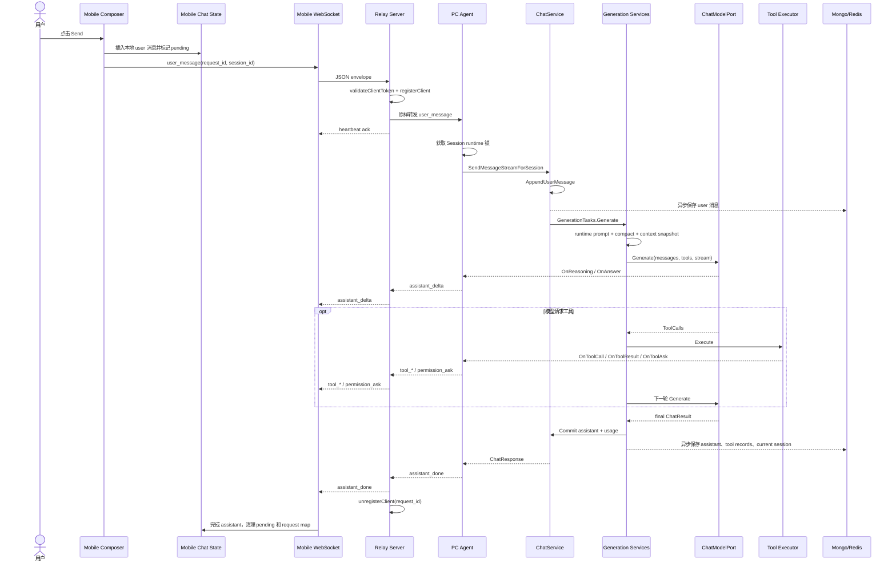

# 普通聊天消息功能实现说明

> 本文讲解一条普通用户消息如何从手机界面进入 MyAI，经过 Relay、PC Agent、ChatService、模型与工具循环，再以流式响应返回手机。
>
> 本文面向需要维护和扩展项目的开发人员。重点不是描述“系统会聊天”，而是说明每一层创建了什么对象、调用了什么函数、传递了什么参数、修改了什么状态，以及错误如何返回。

## 1. 功能边界

本文覆盖：

```text
手机点击 Send
-> 本地聊天状态更新
-> user_message WebSocket 消息
-> Relay 鉴权和路由
-> Agent Session 级执行控制
-> ChatService 追加用户消息
-> 上下文与运行时提示词构建
-> 模型流式生成
-> 可选工具调用循环
-> Assistant 结果提交和异步持久化
-> assistant_delta / tool_* / assistant_done
-> 手机合并流式气泡并清理 pending
```

本文不深入展开以下独立功能，但会说明它们在聊天链路中的接入点：

- Plan 模式的结构化计划提取与执行。
- 工具权限、Hook 和具体 Tool 实现。
- 上下文压缩算法。
- Session 历史增量同步。
- 文件上传与 Asset 服务。

这些能力后续分别编写独立功能文档。

## 2. 用户操作示例

假设当前状态：

```text
Relay URL:    http://192.168.1.10:18080
user_id:      local
device_id:    pc-local
session_id:   session-001
client_token: 已通过 /pair 获得
WebSocket:    OPEN
Agent mode:   chat
Permission:   ask
```

用户在手机输入：

```text
请读取 main.go，并说明程序如何启动。
```

然后点击 `Send`。一次可能的消息序列是：

```text
Mobile -> Relay: user_message
Relay  -> Mobile: heartbeat ack
Relay  -> Agent: user_message

Agent  -> Relay: assistant_delta(reasoning)
Relay  -> Mobile: assistant_delta(reasoning)

Agent  -> Relay: tool_call(read_file)
Relay  -> Mobile: tool_call(read_file)

Agent  -> Relay: permission_ask
Relay  -> Mobile: permission_ask
Mobile -> Relay: permission_result
Relay  -> Agent: permission_result

Agent  -> Relay: tool_result
Relay  -> Mobile: tool_result

Agent  -> Relay: assistant_delta(content) ... 0..n 次
Relay  -> Mobile: assistant_delta(content) ... 0..n 次

Agent  -> Relay: assistant_done
Relay  -> Mobile: assistant_done
```

没有工具调用时，`tool_call`、`permission_ask`、`permission_result` 和 `tool_result` 都不会出现。

## 3. 参与对象

### 3.1 手机端对象

| 对象/Hook | 类型 | 作用 |
|---|---|---|
| `Composer` | React 组件 | 输入文本、点击发送、显示发送中状态 |
| `MobileAppScreen` | 页面组合组件 | 把状态 Hook 和动作 Hook 连接起来 |
| `useChatActions` | React Hook | 编排发送、暂停、重新生成和权限响应 |
| `useFileActions` | React Hook | 拼接附件上下文并发送 `user_message` |
| `useRelaySender` | React Hook | 构造统一 WebSocket 信封 |
| `useChatMessages` | React Hook | 按 Session 保存本地消息和 pending 状态 |
| `useRelayConnection` | React Hook | 管理 WebSocket 和 JSON 解码 |
| `useRemoteMessageHandler` | React Hook | 消费远程事件并更新手机状态 |
| `RelayMessage` | TypeScript DTO | 跨端协议对象 |

### 3.2 Relay 对象

| 对象 | 类型 | 作用 |
|---|---|---|
| `relay.Server` | Go struct | WebSocket 鉴权、连接注册和消息路由 |
| `peer` | Go struct | 一个 WebSocket 连接及其写锁 |
| `agentEntry` | Go struct | 在线 Agent 的 user/device 路由记录 |
| `clientEntry` | Go struct | 一次请求对应的手机连接记录 |
| `authorization.Store` | Go interface | 校验配对 Token |

### 3.3 Agent 对象

| 对象 | 类型 | 作用 |
|---|---|---|
| `agent.Agent` | Go struct | 将远程协议适配为业务 Facade 调用 |
| `sessionRuntimeManager` | Go struct | 按 Session 管理互斥和取消函数 |
| `ChatFacade` | Go interface | Agent 可调用的聊天业务接口 |
| `ChatStreamHandler` | 回调 DTO | reasoning、answer、tool 和权限回调 |
| `permissionWaiterRegistry` | Go struct | 等待手机返回工具权限结果 |

### 3.4 应用和领域对象

| 对象 | 类型 | 作用 |
|---|---|---|
| `ChatService` | Facade struct | 普通聊天的应用入口 |
| `session.Session` | 聚合根 | 保存模型、模式、消息、用量、摘要和 Plan |
| `MessageCommandService` | 应用 Service | 加载 Session 并追加用户消息 |
| `TaskService` | 应用 Service | 创建内部任务 ID 和文件变更检查点 |
| `AssistantGenerationService` | 应用 Service | 编排一次完整 Assistant 生成 |
| `AgentLoopService` | 应用 Service | 执行“模型 -> 工具 -> 模型”循环 |
| `ResponseCommitService` | 应用 Service | 把最终结果写回内存 Session |
| `ChatModelPort` | interface | 隔离具体模型 SDK |
| `llm.Model` | adapter struct | 调用 LangChainGo 模型并桥接流式输出 |

## 4. 三种 ID 不要混淆

聊天链路中存在三种不同 ID。

| ID | 示例 | 谁生成 | 生命周期 | 用途 |
|---|---|---|---|---|
| 协议 `request_id` | `1720000000-a3f` | 手机 `newRequestID()` | 一次远程请求 | Relay 回包路由、手机流式消息归并、权限响应 |
| `session_id` | `session-001` | Session 生命周期服务 | 一段会话 | 内存聚合、持久化、并发隔离、上下文 |
| 生成任务 `RequestID` | UUID | `TaskService.RequestIDs` | 一次内部生成任务 | Tool 执行记录、Asset、Changes 检查点 |

普通消息中两个 request ID 的关系：

```text
Mobile request_id
  -> Relay 和 Agent 远程协议使用

TaskService internal RequestID
  -> AgentLoop、工具记录、TaskRecorder 使用
```

它们不是同一个值。不要用内部生成任务 ID 给手机回包，也不要用手机 request ID 作为持久化检查点主键。

## 5. 协议 DTO

Go 定义：[core/remote/protocol/message.go](core/remote/protocol/message.go)

```go
type Message struct {
	Type        MessageType     `json:"type"`
	RequestID   string          `json:"request_id,omitempty"`
	UserID      string          `json:"user_id,omitempty"`
	DeviceID    string          `json:"device_id,omitempty"`
	SessionID   string          `json:"session_id,omitempty"`
	ClientToken string          `json:"client_token,omitempty"`
	Payload     json.RawMessage `json:"payload,omitempty"`
}

type UserMessagePayload struct {
	Content string `json:"content"`
}
```

TypeScript 定义：[mobile/src/protocol.ts](mobile/src/protocol.ts)

```ts
export type RelayMessage<TPayload = unknown> = {
  type: MessageType;
  request_id?: string;
  user_id?: string;
  device_id?: string;
  session_id?: string;
  client_token?: string;
  payload?: TPayload;
};
```

普通请求示例：

```json
{
  "type": "user_message",
  "request_id": "1720000000000-a3f09b",
  "user_id": "local",
  "device_id": "pc-local",
  "session_id": "session-001",
  "client_token": "paired-client-token",
  "payload": {
    "content": "请读取 main.go，并说明程序如何启动。"
  }
}
```

返回事件：

| 类型 | Payload | 是否终态 |
|---|---|---|
| `heartbeat` | Relay ack 信息 | 否 |
| `assistant_delta` | `content` 或 `reasoning` | 否 |
| `tool_call` | 工具名和参数 | 否 |
| `permission_ask` | 工具、参数、权限类型 | 否 |
| `tool_result` | 工具结果和错误标记 | 否 |
| `assistant_done` | 完整回答、用量、上下文、压缩、Plan | 是 |
| `error` | 错误文本 | 是 |

## 6. 完整时序



## 7. 第一阶段：手机点击发送

组件链路：

```text
Composer.onPress
-> props.onSend
-> MobileAppScreen.sendUserMessage
-> useChatActions.sendUserMessage
```

源码：[mobile/src/components/chat/Composer.tsx](mobile/src/components/chat/Composer.tsx)

```tsx
<Pressable
  disabled={pendingSend}
  onPress={onSend}
>
  <ButtonContent loading={pendingSend} text={pendingSend ? "Sending" : "Send"} />
</Pressable>
```

`pendingSend` 来自当前 Session 的 `pendingRequestID`。正常 UI 会阻止用户在同一 Session 的上一条请求未结束时再次点击发送。

## 8. `useChatActions.sendUserMessage` 做了什么

源码：[mobile/src/hooks/useChatActions.ts](mobile/src/hooks/useChatActions.ts)

核心代码：

```ts
const content = messageInput.trim();
if (!content && attachedFiles.length === 0) {
  return;
}

const targetSessionID = sessionID.trim();
const requestID = newRequestID();
activeRequestIDRef.current = requestID;
requestSessionMapRef.current[requestID] = targetSessionID;
resetActiveAssistant(targetSessionID);
setSessionPendingPermission(targetSessionID, null);
setSessionLastUsage(targetSessionID, null);
setSessionPendingRequest(targetSessionID, requestID);
addUserMessage(targetSessionID, userMessageEcho(content, attachedFiles));

const sent = sendMessageWithFiles(content, requestID);
```

发送前先修改手机本地状态：

| 状态 | 新值 | 作用 |
|---|---|---|
| `activeRequestIDRef` | 新 request ID | 发送信封默认使用的活动请求 |
| `requestSessionMapRef[requestID]` | 当前 Session ID | delta 没带 Session 时仍能归并 |
| `activeAssistantID` | 清空 | 下一批 delta 创建新 Assistant 气泡 |
| `pendingPermission` | null | 清除上一轮权限弹窗 |
| `lastUsage` | null | 清除上一轮 Token 展示 |
| `pendingRequestID` | request ID | 禁用发送按钮并显示 loading |
| `messages` | 追加 user item | 用户立即看到自己的消息 |

这是本地乐观显示，但不是乐观提交业务结果。发送失败时：

```ts
if (!sent) {
  activeRequestIDRef.current = "";
  delete requestSessionMapRef.current[requestID];
  clearSessionPendingRequest(targetSessionID, requestID);
}
```

本地 user 气泡当前不会被自动删除，而是另外追加 WebSocket 错误消息。

## 9. 附件如何变成消息内容

`useFileActions.sendMessageWithFiles`：

```ts
setMessageInput("");
clearAttachedFiles();

return sendEnvelope("user_message", {
  request_id: requestID,
  payload: { content: messageWithAttachedFiles(content, attachedFiles) },
});
```

手机界面显示的 user 文本使用 `userMessageEcho`，发送给模型的文本使用 `messageWithAttachedFiles`，两者可能不同。

例如手机显示：

```text
请分析这个文件

@main.go
```

模型实际收到：

```text
请分析这个文件

Attached files:
<file path="main.go" language="go" size="1024">
package main
...
</file>
```

工作区文件正文最多拼入 12000 个字符。上传 Asset 则拼入 `short_url` 和 `code`，模型需要调用 `read_asset` 获取内容。

## 10. `useRelaySender` 构造完整信封

源码：[mobile/src/hooks/useRelaySender.ts](mobile/src/hooks/useRelaySender.ts)

```ts
const socket = socketRef.current;
if (!socket || socket.readyState !== WebSocket.OPEN) {
  addErrorMessage("WebSocket is not connected");
  return false;
}

const envelope: RelayMessage = {
  type,
  request_id: overrides.request_id === undefined
    ? activeRequestIDRef.current || newRequestID()
    : overrides.request_id,
  user_id: userID.trim(),
  device_id: deviceID.trim(),
  session_id: overrides.session_id || sessionID.trim(),
  client_token: clientToken,
  payload: overrides.payload || {},
};
socket.send(JSON.stringify(envelope));
```

`useRelaySender` 是手机端唯一的协议信封构造入口。业务 Hook 只指定消息类型、request ID 和 payload，用户、设备、Session 和 Token 在这里统一补齐。

## 11. Relay 如何处理 `user_message`

源码：[core/remote/relay/server.go](core/remote/relay/server.go)

调用链：

```text
Server.handleWebSocket(role="client")
-> conn.ReadJSON(&protocol.Message)
-> handleRemoteMessage
-> handleClientMessage
-> validateClientToken
-> registerClient
-> forwardToAgent
-> writeAck
```

### 11.1 Token 校验

```go
if !s.validateClientToken(message.UserID, message.DeviceID, message.ClientToken) {
	return fmt.Errorf("client token is invalid or expired")
}
```

Relay 不因为 WebSocket 已连接就信任后续请求。每条业务请求都携带并校验 `client_token`。

### 11.2 注册回包路由

```go
s.registerClient(
	message.RequestID,
	message.Type,
	p,
	message.UserID,
	message.DeviceID,
	remoteAddr,
)
```

内部状态：

```text
clients[request_id] = clientEntry{
    RequestType: user_message,
    peer: 当前手机 WebSocket,
    user/device: 当前 Agent 路由目标,
}
```

Relay 使用 `request_id` 路由流式响应，不使用 `session_id`。同一个手机 WebSocket 可以同时承载多个不同 Session 的请求。

### 11.3 转发给 Agent

```go
agent := s.getAgent(message.UserID, message.DeviceID)
return agent.peer.writeJSON(message)
```

Relay 不解码 `UserMessagePayload`，也不调用模型。它保持消息字段原样。

### 11.4 Heartbeat ack

消息处理成功后，Relay 向发送方回一个 `heartbeat`：

```json
{
  "type": "heartbeat",
  "request_id": "原请求ID",
  "payload": {
    "role": "client",
    "received": "user_message"
  }
}
```

这个 ack 只表示 Relay 已接收和转发，不表示模型执行完成，也不能清理 `pendingRequestID`。

## 12. Agent 如何接收并分发消息

Agent 的 `readLoop` 持续读取 Relay：

```go
var message protocol.Message
if err := conn.ReadJSON(&message); err != nil {
	// 连接结束
}
if err := a.handleRelayMessage(ctx, conn, message); err != nil {
	// 发送 TypeError
}
```

分发：

```go
case protocol.TypeUserMessage:
	go a.processUserMessage(ctx, conn, message)
```

这里启动 goroutine，原因是模型生成可能持续较长时间，不能阻塞 Agent 读取权限结果、暂停请求和其他 Session 的消息。

## 13. Session 级串行执行

`processUserMessage`：

```go
sessionID := strings.TrimSpace(message.SessionID)
if sessionID == "" {
	sessionID = a.chatService.CurrentSessionID()
}

runtime := a.runtimes.get(sessionID)
runtime.mu.Lock()
defer runtime.mu.Unlock()

runCtx, cancel, ok := runtime.start(ctx)
defer runtime.finish(cancel)

err := a.handleUserMessage(runCtx, conn, message)
```

作用：

- 同一个 `session_id` 的消息、重新生成和 Plan 执行串行运行。
- 不同 Session 使用不同 `sessionRuntime`，可以并行。
- `runtime.start` 保存取消函数，`session_pause` 可以取消本轮生成。

需要注意真实执行顺序：当前代码先获得 `runtime.mu`，再执行 `runtime.start`。因此同时到达的第二个同 Session 请求通常会阻塞等待前一个任务结束，而不是立即返回 busy。手机 UI 正常情况下已经通过 `pendingSend` 阻止重复发送。

## 14. Agent Handler 解码协议

源码：[core/remote/agent/chat_handlers.go](core/remote/agent/chat_handlers.go)

```go
payload, err := protocol.DecodePayload[protocol.UserMessagePayload](message)
if err != nil {
	return fmt.Errorf("decode user message failed: %w", err)
}
if payload.Content == "" {
	return fmt.Errorf("user message content is empty")
}
```

然后解析 Session 并调用：

```go
a.chatService.SendMessageStreamForSession(
	ctx,
	sessionID,
	payload.Content,
	stream,
)
```

Agent Handler 只做：

1. DTO 解码和基本校验。
2. 创建流式回调。
3. 调用 `ChatFacade`。
4. 将最终 `ChatResponse` 转为远程协议。

它不直接操作 Session、模型或数据库。

## 15. 流式回调如何建立

`Agent.streamChatResponse` 创建 `llm.ChatStreamHandler`：

```go
llm.ChatStreamHandler{
	OnReasoning: func(text string) {
		send(TypeAssistantDelta, AssistantDeltaPayload{Reasoning: text})
	},
	OnAnswer: func(text string) {
		send(TypeAssistantDelta, AssistantDeltaPayload{Content: text})
	},
	OnToolCall: func(name, arguments string) {
		send(TypeToolCall, ToolCallPayload{Name: name, Arguments: arguments})
	},
	OnToolResult: func(name, arguments, result string) {
		send(TypeToolResult, ToolResultPayload{...})
	},
	OnToolAsk: func(request ToolPermissionRequest) bool {
		return a.askToolPermission(...)
	},
}
```

所有事件复用手机原始 `request_id` 和目标 `session_id`。`Agent.writeMu` 保证多个回调不会并发写坏同一 WebSocket 帧。

`sendErrCh` 保存第一个流式发送错误。模型流程结束后如果通道中有错误，Agent 不再发送伪成功的 `assistant_done`。

## 16. ChatService 入口

源码：[core/service/chat.go](core/service/chat.go)

```go
func (s *ChatService) SendMessageStreamForSession(
	ctx context.Context,
	sessionID string,
	input string,
	stream llm.ChatStreamHandler,
) (ChatResponse, error)
```

主要步骤：

```text
检查 Model Registry
-> 解析或创建 Session
-> MessageCommands.AppendUserMessage
-> 生成会话标题
-> 异步 PersistUserMessage
-> generateAssistantForSession
-> GenerationTasks.Generate
```

`ChatService` 是 Facade。它负责用例编排，不知道 Mongo Collection、Redis Key 或模型 HTTP SDK 的细节。

## 17. 用户消息先进入内存 Session

调用：

```go
prepared, err := s.dependencies.MessageCommands.AppendUserMessage(
	ctx,
	messagecommand.AppendUserMessage{
		SessionID: sessionID,
		Input:     input,
	},
)
```

内部链路：

```text
CommandService.AppendUserMessage
-> LoadService.Load
   -> Memory.GetSession
   -> 未命中时 Mongo GetSession + ListMessages
   -> 重建内存 Session
-> Memory.AddUserMessageTo
-> Memory.GetSession
```

内存聚合变化：

```text
修改前:
[system, history...]

修改后:
[system, history..., user(current input)]
```

必须先追加用户消息，再构建模型上下文，否则模型快照看不到本轮输入。

## 18. 会话标题和用户消息持久化

新会话前几条消息使用输入生成标题：

```go
title := "New chat"
if len(current.Messages) <= 2 {
	title = titleFromInput(input)
}
```

标题最多 30 个 Unicode 字符。

用户消息持久化：

```go
s.dependencies.UserMessages.PersistUserMessage(...)
```

它通过线程池异步执行：

```text
UserMessagePersistence
-> AsyncTaskService.Submit
-> 10 秒 timeout context
-> chatmessage.Writer.SaveUserMessage
   -> SessionPersistence.Save(title/model)
   -> MessageSaver.SaveMessage(role=user)
```

内存 Session 是生成过程中的事实来源。Mongo 写入失败只记录日志，不中断已经开始的模型请求。

由于线程池可以有多个 worker，“调用顺序”不等于数据库物理写入完成顺序；查询历史时应依赖记录时间和 ID，而不是依赖网络返回先后。

## 19. TaskService 创建内部生成任务

`generateAssistantForSession` 调用：

```go
GenerationTasks.Generate(ctx, generationcommand.GenerationTask{
	Session:     current,
	LatestInput: latestInput,
	Title:       title,
	Reason:      "user request",
	Stream:      stream,
	CapturePlan: true,
})
```

`TaskService.Generate`：

```go
requestID := s.RequestIDs.NewRequestID()
recorder := s.newRecorder(TaskRecord{
	Title: title,
	Reason: reason,
	SessionID: command.Session.ID,
	RequestID: requestID,
})
ctx = recorder.Attach(ctx)
return s.Generator.Generate(ctx, AssistantGeneration{...})
```

TaskRecorder 被附加到 Context。`write_file`、`edit_file` 和 Shell 等工具可以从 Context 取出 Recorder，把文件修改记录到本次任务的可恢复检查点。

无论生成成功还是失败，defer 都会尝试 `Save` 和 `Close` Recorder。

## 20. AssistantGenerationService 编排一次回答

源码：[core/application/chat/generation/service/assistant_generation_service.go](core/application/chat/generation/service/assistant_generation_service.go)

调用顺序：

```text
根据 Session.Model 获取 ChatModelPort
-> CompactIfNeeded
-> AgentLoopService.Run
-> ResponseCommitService.Commit
-> PersistAssistant
-> PersistCurrentSession
-> 计算 ContextInfo
-> 返回 GenerationResponse
```

模型选择：

```go
model := s.Models.GetModel(command.Session.Model)
if model == nil {
	return error("model not found")
}
```

模型是会话级配置，不一定等于应用默认模型。

## 21. 运行时提示词和缓存前缀

```go
runtimeInstruction := runtimeProvider.Prompt(
	ctx, current, input, forceChatMode,
)
memory.AddUserTurnTo(
	current.ID, runtimeInstruction, input,
)
```

普通 Chat 模式下：

- 没有匹配 Skill 时，runtime instruction 只包含 turn boundary。
- 匹配 Skill 时，runtime instruction 是 turn boundary + Skill 指令。
- Plan 模式时，还会包含 Plan 规则。

运行时指令在 `MessageCommandService` 阶段写入 `Session.Messages`，紧挨着对应 user 消息之前：

```text
[system 固定提示词]
[历史消息]
[system 本轮 runtime instructions, SyntheticReason=runtime_instruction]
[user 本轮输入]
```

该 Synthetic Message 与 user message 一起异步写入 Mongo；会话重载时恢复，但手机历史查询会隐藏它。这样下一轮的已完成历史前缀不会因为 runtime 指令消失而错位。

## 22. 自动上下文压缩

模型调用前执行：

```go
s.Compactor.CompactIfNeeded(
	ctx,
	command.Session,
	model,
)
```

触发条件：

```text
上下文已被窗口截断
或
SelectedTokens >= ContextWindowK * 1000 * 70%
```

压缩失败不会阻断聊天，`OnCompactError` 记录日志后继续生成。压缩成功的信息最终放进 `assistant_done.compact`，供手机展示和调试。

## 23. AgentLoopService 调用模型

源码：[core/application/chat/generation/service/agent_loop_service.go](core/application/chat/generation/service/agent_loop_service.go)

每轮调用：

```go
result, err := command.Model.Generate(ctx, modelport.GenerateRequest{
	Messages: s.Contexts.Snapshot(command.Session).Messages,
	Tools:    s.toolsForSession(command.Session, command.ForceChatMode),
	Stream:   command.Stream,
	Settings: command.Settings,
})
```

输入对象：

```go
type GenerateRequest struct {
	Messages []domainmessage.Message
	Tools    []modelport.Tool
	Stream   ChatStreamHandler
	Settings generation.ResolvedSettings
}
```

如果 `result.ToolCalls` 为空，说明模型已经产生最终回答，循环立即结束。

## 24. 模型 Adapter 如何产生流式 delta

接口：

```go
type ChatModelPort interface {
	Generate(ctx context.Context, request GenerateRequest) (ChatResult, error)
}
```

当前实现：[core/llm/model.go](core/llm/model.go)

```go
func (m *Model) Generate(ctx context.Context, request GenerateRequest) (ChatResult, error) {
	return m.ChatWithStreamToolsHandlerCtx(
		ctx,
		llmmapper.ToLLMS(request.Messages),
		llmmapper.ToLLMTools(request.Tools),
		request.Stream,
	)
}
```

Adapter 做三类映射：

```text
domain Message -> langchaingo MessageContent
modelport Tool -> langchaingo Tool
provider response -> ChatResult / ToolCalls / TokenUsage
```

流式正文：

```go
llms.WithStreamingFunc(func(ctx context.Context, chunk []byte) error {
	builder.WriteString(string(chunk))
	handler.OnAnswer(string(chunk))
	return nil
})
```

流式 reasoning 使用 `WithStreamingReasoningFunc` 调用 `OnReasoning`。

如果 chunk 是工具调用内容，Adapter 不把它作为正文发送，避免手机显示模型内部的工具 JSON。

默认请求参数当前为：

```text
temperature = 0.7
max_tokens  = 2048
tool_choice = auto（存在工具时）
```

## 25. 工具调用分支

模型返回 `ToolCalls` 时，AgentLoop 不提交最终 Assistant，而是：

```text
ToolExecutor.Execute
-> Hook BeforeToolUse
-> PermissionService.Allow
-> registeredTool.Call
-> Hook AfterToolUse
-> stream.OnToolCall / OnToolResult / OnToolAsk
-> 持久化 Tool execution records
-> Session.Messages 追加 assistant tool-call message
-> Session.Messages 追加 tool-result message
-> 重新构建 runtime prompt 和 context
-> 下一轮 Model.Generate
```

默认最多执行 `6` 个工具轮次。达到上限后再发起一次不带 Tools 的模型请求，强制模型输出最终答案。

工具轮次的 TokenUsage 会累加：

```go
totalUsage = totalUsage.Add(result.Usage)
```

多轮 reasoning 最终使用换行连接。

## 26. 权限询问如何暂停工具调用

当权限模式需要手机确认时：

```text
ExecutionService
-> stream.OnToolAsk
-> Agent.askToolPermission
-> permissionWaiters.register(mobile request_id)
-> permission_ask 发给手机
-> 等待 permission_result / 60 秒 / ctx canceled
```

手机返回时必须复用原聊天的 `request_id`：

```json
{
  "type": "permission_result",
  "request_id": "原聊天request_id",
  "payload": { "allowed": true }
}
```

Relay 对 `permission_result` 做特殊处理：它校验 Token 并转发给 Agent，但**不重新注册 request 路由**。否则会把原来的 `RequestType=user_message` 覆盖掉，导致最终 `assistant_done` 不能释放聊天路由。

## 27. 最终回答如何提交到 Session

模型不再请求工具后，`ResponseCommitService.Commit`：

```go
s.Memory.AddAssistantMessageTo(sessionID, result.Content)
s.Memory.AddUsageTo(sessionID, result.Usage)
```

Session 变化：

```text
Messages += assistant(final content)
Usage = Usage + 本次所有模型轮次 usage
LastUsage = 本次所有模型轮次 usage
```

普通 Chat 模式不会解析 Plan。虽然 `CapturePlan=true`，但只有 `Session.AgentMode == plan` 时才调用 `CaptureService`。

需要注意：内存 Session 的 Assistant Message 保存最终正文；reasoning 和精确 Token 字段在持久化 `MessageRecord` 中保存。

## 28. 最终结果如何异步持久化

提交内存成功后：

```go
s.Persistence.PersistAssistant(command.Session, result)
s.Persistence.PersistCurrentSession(command.Session.ID)
```

异步链路：

```text
PersistAssistant
-> ThreadPool
-> chatmessage.Writer.SaveAssistantMessage
   -> MessageRecord(role=assistant, content, reasoning, usage)
   -> SessionRecord(model, mode, summary, total usage, plan...)

PersistCurrentSession
-> ThreadPool
-> Redis CurrentSessionCache.Save
```

工具调用和工具结果通过 `toolrecords.Repository.Recorder` 保存为消息记录；共享文件通过 AssetRecord 保存。

异步落库失败只记录日志，不把已经生成的回答改成错误。此设计优先保证交互完成，但意味着数据库短暂故障时内存和持久层可能不一致。

## 29. ChatResponse 如何转换为 `assistant_done`

业务返回：

```go
type ChatResponse struct {
	SessionID string
	Result    llm.ChatResult
	Context   ContextInfo
	Compact   CompactInfo
	Plan      *agentplan.Plan
}
```

Agent 转换：

```go
a.writeRemoteMessage(conn, TypeAssistantDone, message.RequestID, response.SessionID,
	AssistantDonePayload{
		Content:   response.Result.Content,
		Reasoning: response.Result.Reasoning,
		Usage:     tokenUsagePayload(response.Result.Usage),
		Context:   contextInfoPayload(response.Context),
		Compact:   compactInfoPayload(response.Compact),
		Plan:      planPayload(response.Plan),
	},
)
```

`assistant_done` 包含完整正文。即使手机已经通过多个 delta 收到正文，也以 done 作为终态和缺失内容的兜底。

## 30. Relay 如何把流返回正确手机

Agent 每个事件都带原始 `request_id`。Relay：

```go
client := s.getClient(message.RequestID)
if client == nil {
	return error("client request is not online")
}
return client.peer.writeJSON(message)
```

终态判断：

```go
case TypeUserMessage, TypeSessionRegenerate:
	return responseType == TypeAssistantDone
```

`assistant_delta`、`tool_call`、`tool_result`、`permission_ask` 和中间 Skill 刷新不会删除路由。

当 `assistant_done` 或 `error` 到达时，Relay 在写回后执行：

```go
unregisterClient(requestID)
```

这样 `clients` map 不会无限增长。

## 31. 手机如何合并 `assistant_delta`

WebSocket 消息入口：

```text
useRelayConnection.socket.onmessage
-> JSON.parse
-> useRemoteMessageHandler
```

`assistant_delta`：

```ts
appendAssistant(
  resolveChatSessionID(message, requestSessionMapRef, sessionIDRef),
  message.request_id,
  payload.content || "",
  payload.reasoning || "",
);
```

`appendAssistant` 根据 request ID 查找现有 Assistant 条目：

```text
第一次 delta:
创建 assistant item
activeAssistantID = 新 item ID
status = streaming

后续 delta:
找到同一 item
text = old text + delta content
reasoning = old reasoning + delta reasoning
```

因此 100 个 delta 仍然只显示一个 Assistant 气泡。

## 32. 手机如何处理工具事件

| 事件 | 手机方法 | UI 状态 |
|---|---|---|
| `tool_call` | `addToolCall` | Assistant 状态改为 `tool_running`，追加工具调用条目 |
| `tool_result` | `addToolResult` | Assistant 恢复 `streaming`，追加工具结果条目 |
| `permission_ask` | `setSessionPendingPermission` | 显示允许/拒绝操作 |

权限结果通过 `useChatActions.sendPermissionResult` 发送，使用原请求 ID，并清除本地权限弹窗。

## 33. 手机如何处理 `assistant_done`

主要步骤：

```text
解析 request_id 对应的原 Session
-> 如服务端返回不同 Session ID，合并本地临时 Chat 状态
-> 保存 lastUsage
-> 保存 ContextInfo
-> 保存 CompactInfo
-> completeAssistant(status=done/paused)
-> 更新当前 session_id
-> 清除 pending permission
-> 清除 pendingRequestID
-> 刷新 Session/Model/Skill/Asset/File/Changes/History
-> 清空 activeRequestIDRef
-> 删除 requestSessionMapRef[request_id]
```

`completeAssistant` 不会重复 delta 内容：

```ts
text: item.text || content || ""
```

如果已有流式正文，保留现有正文；如果 provider 没有流式输出，则使用 done 中的完整正文创建或补全气泡。

## 34. 一次无工具聊天的完整函数路径

用户输入“你好”：

```text
Composer.onSend
-> useChatActions.sendUserMessage
-> useFileActions.sendMessageWithFiles
-> useRelaySender
-> WebSocket.send(user_message)

Relay.handleWebSocket
-> Relay.handleClientMessage
-> validateClientToken
-> registerClient(request_id, user_message)
-> forwardToAgent

Agent.readLoop
-> Agent.handleRelayMessage
-> go Agent.processUserMessage
-> sessionRuntimeManager.get
-> runtime.mu.Lock
-> runtime.start
-> Agent.handleUserMessage
-> Agent.streamChatResponse

ChatService.SendMessageStreamForSession
-> MessageCommandService.AppendUserMessage
-> LoadService.Load
-> RuntimeInstructionProvider.Prompt
-> memory.Store.AddUserTurnTo(Synthetic runtime + User)
-> UserMessagePersistence.PersistUserMessage (async, 保存两条 MessageRecord)
-> ChatService.generateAssistantForSession
-> TaskService.Generate
-> TaskRecorder.Attach
-> AssistantGenerationService.Generate
-> ModelRegistry.GetModel
-> CompactService.CompactIfNeeded
-> AgentLoopService.Run
-> SnapshotService.Snapshot
-> ChatModelPort.Generate
-> llm.Model.GenerateContent
-> stream.OnAnswer
-> Agent sends assistant_delta
-> model returns ChatResult
-> ResponseCommitService.Commit
-> memory.Store.AddAssistantMessageTo
-> memory.Store.AddUsageTo
-> Persistence.PersistAssistant (async)
-> Persistence.PersistCurrentSession (async)
-> ChatResponse
-> Agent sends assistant_done
-> Relay.unregisterClient(request_id)
-> Mobile.completeAssistant
-> Mobile clears pending state
```

## 35. 一次带工具聊天的额外路径

在第一个 `ChatModelPort.Generate` 后：

```text
ChatResult.ToolCalls != empty
-> AgentLoopService.executeTools
-> adapter/tool/executor.Executor
-> application/tool/ExecutionService
-> Registry.GetTool
-> Hook.BeforeToolUse
-> PermissionService.Allow
-> Tool.Call
-> Hook.AfterToolUse
-> ToolResultMessage
-> Tool execution records async persistence
-> Session.Messages append ToolCall + ToolResult
-> rebuild context snapshot
-> second ChatModelPort.Generate
-> final answer
```

模型不是在一次 HTTP 请求中自动执行工具。工具调用由应用代码执行，工具结果作为新消息加入上下文，再发起下一轮模型请求。

## 36. 状态变化总表

| 阶段 | Mobile | Relay | Agent | Session | Persistence |
|---|---|---|---|---|---|
| 点击 Send | user 气泡、pending | 无 | 无 | 无 | 无 |
| Relay 收到 | heartbeat ack | clients[request] | 无 | 无 | 无 |
| Agent 接收 | pending | route 保留 | Session runtime active | 无 | 无 |
| 追加 user | pending | route 保留 | active | Messages + Synthetic runtime + user | 两条 message async save |
| 模型 delta | Assistant streaming | route 保留 | stream callback | 暂不加最终 assistant | 无 |
| 工具执行 | tool UI | route 保留 | permission waiter | ToolCall/Result 加入 Messages | tool records async |
| 最终 commit | streaming | route 保留 | active | Messages + assistant、Usage | assistant/session async |
| assistant_done | done、清 pending | 删除 route | runtime.finish | 完成 | Redis current async |

## 37. 错误如何传播

### 37.1 手机发送前错误

WebSocket 未连接：

```text
useRelaySender returns false
-> addErrorMessage
-> 清理 active request 和 pending
```

### 37.2 Relay 错误

例如 Token 失效或 Agent 离线：

```text
handleClientMessage returns error
-> writeError(peer, original message)
-> Mobile receives TypeError
-> markAssistantError
-> clear pending and request map
```

### 37.3 Agent/业务错误

例如 payload 为空、Session 不存在、模型不存在或模型 API 报错：

```text
handleUserMessage returns error
-> processUserMessage sends TypeError
-> Relay treats TypeError as terminal
-> Mobile marks assistant error
```

### 37.4 流式发送错误

Agent 用 `sendErrCh` 保存 WebSocket 写错误。业务生成完成后先检查发送错误，再决定是否返回成功。

### 37.5 持久化错误

异步 Mongo/Redis 写入错误只记录日志，不发送 TypeError。因为此时模型结果和内存状态可能已经成功。

## 38. 暂停如何取消聊天

手机发送 `session_pause` 后：

```text
Agent.handleSessionPause
-> runtime.pause
-> 调用当前 runCtx cancel
-> 模型/工具检测 ctx.Done
-> handleUserMessage 识别 context.Canceled
-> writePausedAssistantDone
```

手机最终仍然收到 `assistant_done`，但：

```json
{
  "paused": true,
  "message": "Session task paused."
}
```

这样同一套终态逻辑可以清理聊天 pending。

## 39. 一致性和并发边界

### 39.1 强一致范围

一次 Session 生成 goroutine 内：

- 用户消息先写内存。
- 工具调用和结果按顺序追加。
- 最终 Assistant 和 Usage 在返回 done 前写内存。
- 同 Session 通过 runtime mutex 串行。

### 39.2 最终一致范围

- 用户消息 Mongo 保存。
- Assistant Mongo 保存。
- Tool record 和 Asset 保存。
- Redis 当前 Session 指针。

这些通过线程池异步完成，失败不会回滚内存回答。

### 39.3 WebSocket 写并发

- Agent 使用 `Agent.writeMu`。
- Relay 的每个 `peer` 使用 `peer.writeMu`。

gorilla/websocket 不允许多个 goroutine 无保护地并发写，因此这两个锁不能删除。

## 40. 推荐调试断点

| 顺序 | 文件 | 函数 | 观察内容 |
|---|---|---|---|
| 1 | `mobile/src/components/chat/Composer.tsx` | Send `onPress` | `pendingSend` 是否错误阻止发送 |
| 2 | `mobile/src/hooks/useChatActions.ts` | `sendUserMessage` | request/session 映射和本地状态 |
| 3 | `mobile/src/hooks/useRelaySender.ts` | 返回的 callback | 最终 envelope 和 WebSocket 状态 |
| 4 | `core/remote/relay/server.go` | `handleClientMessage` | Token、request ID、Agent route |
| 5 | `core/remote/agent/agent.go` | `processUserMessage` | Session ID、runtime lock、Context |
| 6 | `core/remote/agent/chat_handlers.go` | `handleUserMessage` | payload 和 stream callback |
| 7 | `core/service/chat.go` | `SendMessageStreamForSession` | 内存 user 消息和标题 |
| 8 | `core/application/session/message/service/command_service.go` | `AppendUserMessage` | Session 是否从 Mongo 重建 |
| 9 | `core/application/chat/generation/service/task_service.go` | `Generate` | 内部 request ID 和 Recorder |
| 10 | `core/application/chat/generation/service/assistant_generation_service.go` | `Generate` | model、generation settings、compact |
| 11 | `core/application/chat/generation/service/agent_loop_service.go` | `Run` | 每轮 Messages、Tools、ToolCalls |
| 12 | `core/llm/model.go` | `ChatWithStreamToolsHandlerCtx` | provider 请求和 stream chunk |
| 13 | `core/application/chat/generation/service/response_commit_service.go` | `Commit` | Assistant、Usage、Plan |
| 14 | `core/remote/relay/server.go` | `forwardToClient` | 是否在正确终态删除 route |
| 15 | `mobile/src/hooks/useRemoteMessageHandler.ts` | `assistant_done` case | Session 合并和 pending 清理 |

## 41. 常见问题排查

### 41.1 点击 Send 没有网络请求

检查：

```text
messageInput 是否为空且没有附件
pendingSend 是否为 true
socket.readyState 是否为 OPEN
clientToken 是否存在
```

### 41.2 Relay 收到消息但 Agent 没有收到

检查：

```text
validateClientToken 是否通过
user_id/device_id 是否与在线 Agent 一致
getAgent 是否返回 nil
/agents 是否能看到目标 Agent
```

### 41.3 Agent 收到但没有调用模型

检查：

```text
payload.content 是否为空
session_id 是否存在
LoadService 能否加载 Session
Session.Model 是否在 Model Registry
是否阻塞在同 Session runtime.mu
```

### 41.4 手机一直显示 Sending

按顺序检查：

```text
Agent 是否发送 assistant_done 或 error
Relay clients[request_id] 是否仍存在
Relay 是否把 assistant_done 视为 user_message 终态
permission_result 是否错误覆盖原 route
Mobile message.request_id 是否等于 pendingRequestID
clearSessionPendingRequest 是否执行
```

### 41.5 能看到 delta，但最后显示不完整

检查：

```text
provider streaming callback 是否遗漏 chunk
Agent sendErrCh 是否记录写错误
assistant_done.content 是否为完整结果
completeAssistant 是否定位到同一个 request ID
```

### 41.6 工具执行后模型不继续回答

检查：

```text
ToolResultMessage 是否加入 Session.Messages
下一轮 Snapshot 是否包含 ToolCall + ToolResult
tool call ID 和 tool result ToolCallID 是否一致
是否达到 DefaultMaxToolRounds
权限等待是否超时
```

## 42. 测试与验证

后端核心测试：

```powershell
cd D:\Go_All\myai

go test ./core/remote/relay
go test ./core/remote/agent
go test ./core/application/chat
go test ./core/application/tool
go test ./core/composition/chat
go test ./...
```

手机类型检查：

```powershell
cd D:\Go_All\myai\mobile
npm run typecheck
```

重点测试：

| 测试 | 验证内容 |
|---|---|
| `TestRelayForwardsClientAndAgentMessages` | user_message 和 delta 路由 |
| `TestRelayKeepsChatRequestOpenForIntermediateSkillReload` | 中间事件不释放 route |
| `TestRelayPermissionResultPreservesOriginalChatRoute` | 权限回包不覆盖聊天终态类型 |
| `TestAgentLoopServiceReturnsWhenModelDoesNotRequestTools` | 无工具单轮结束 |
| `TestAgentLoopServiceExecutesToolsAndContinuesGeneration` | 工具结果进入下一轮模型 |
| `TestAgentLoopServiceFinalGenerationOmitsToolsAfterMaxRounds` | 工具轮数上限 |
| `TestAssistantGenerationServiceGenerateOrchestratesUseCase` | 生成编排顺序 |
| `TestResponseCommitServiceWritesAssistantMessageAndUsage` | 最终内存提交 |

人工验收至少覆盖：

```text
普通文本回复
带 reasoning 的流式回复
只读工具调用
需要权限的工具调用：允许
需要权限的工具调用：拒绝
模型 API 错误
生成中暂停
切换 Session 后后台请求仍回到原 Session
WebSocket 断开后发送
```

## 43. 本功能涉及的源码文件

### 手机端

| 文件 | 职责 |
|---|---|
| `mobile/src/components/chat/Composer.tsx` | 输入和发送按钮 |
| `mobile/src/screens/MobileAppScreen.tsx` | 手机功能组合入口 |
| `mobile/src/hooks/useChatActions.ts` | 发送、权限、暂停和重新生成编排 |
| `mobile/src/hooks/useFileActions.ts` | 附件消息构造 |
| `mobile/src/hooks/useRelaySender.ts` | 协议信封构造 |
| `mobile/src/hooks/useRelayConnection.ts` | WebSocket 生命周期 |
| `mobile/src/hooks/useRemoteMessageHandler.ts` | 远程事件消费 |
| `mobile/src/hooks/useChatMessages.ts` | Session 级本地聊天状态 |
| `mobile/src/utils/attachments.ts` | 附件文本和 UI 回显 |
| `mobile/src/protocol.ts` | TypeScript 协议 DTO |

### Relay 和 Agent

| 文件 | 职责 |
|---|---|
| `core/remote/protocol/message.go` | Go 协议 DTO |
| `core/remote/relay/server.go` | 鉴权、路由、ack 和终态判断 |
| `core/remote/relay/registry.go` | request 和 Agent 连接表 |
| `core/remote/agent/agent.go` | 消息分发和 Session 并发 |
| `core/remote/agent/session_runtime.go` | Session mutex 和 cancel |
| `core/remote/agent/chat_handlers.go` | Chat DTO 映射和流式回包 |
| `core/remote/agent/permission_handlers.go` | 权限等待和结果唤醒 |

### 应用和 Adapter

| 文件 | 职责 |
|---|---|
| `core/service/chat.go` | Chat Facade |
| `core/application/session/message/service/command_service.go` | 用户消息内存命令 |
| `core/application/session/load/service/load_service.go` | Session 加载和重建 |
| `core/application/chat/generation/service/task_service.go` | 任务和检查点 |
| `core/application/chat/generation/service/assistant_generation_service.go` | 完整生成编排 |
| `core/application/chat/generation/service/agent_loop_service.go` | 模型工具循环 |
| `core/application/chat/generation/service/response_commit_service.go` | 最终状态提交 |
| `core/application/chat/context/service/snapshot_service.go` | 上下文快照 |
| `core/application/chat/compaction/service/compact_service.go` | 自动压缩 |
| `core/application/runtime/service/runtime_instruction_builder.go` | Plan/Skill 动态指令 |
| `core/application/tool/service/execution_service.go` | 工具执行用例 |
| `core/adapter/tool/executor/executor.go` | 生成层到 Tool 层适配 |
| `core/llm/model.go` | 模型 SDK 和流式回调适配 |
| `core/adapter/llm/langchaingo/message_mapper.go` | Message 映射 |
| `core/adapter/chat/generation/user_message_persistence.go` | 用户消息异步保存 |
| `core/adapter/chat/generation/persistence.go` | Assistant 和当前 Session 保存 |
| `core/adapter/persistence/chatmessage/repository/writer.go` | Mongo 写入编排 |
| `core/adapter/persistence/toolrecords/repository/recorder.go` | Tool 记录保存 |
| `core/adapter/session/memory/store.go` | 内存 Session Store |
| `core/session/Session.go` | Session 聚合根 |

## 44. 阅读完成后应能回答的问题

1. 手机为什么在网络发送前先插入 user 气泡？
2. `request_id` 和 `session_id` 分别解决什么问题？
3. Relay 为什么按 request ID 而不是 Session ID 路由回包？
4. `heartbeat` ack 为什么不能清理发送状态？
5. 同一 Session 的两个生成请求当前会立即失败还是串行等待？
6. 用户输入为什么必须先写内存再调用模型？
7. runtime prompt 为什么要作为 Synthetic Message 保存在 Session.Messages？
8. 模型 ToolCall 是如何经过应用代码执行后进入下一轮模型的？
9. 手机 request ID 和 TaskService 内部 request ID 有什么区别？
10. 为什么 delta 和 assistant_done 都包含正文能力？
11. 哪些状态是强一致的，哪些持久化是最终一致的？
12. `permission_result` 为什么不能重新注册 Relay 请求路由？

能够结合本文和源码回答这些问题，就已经掌握了普通聊天消息的完整实现。
