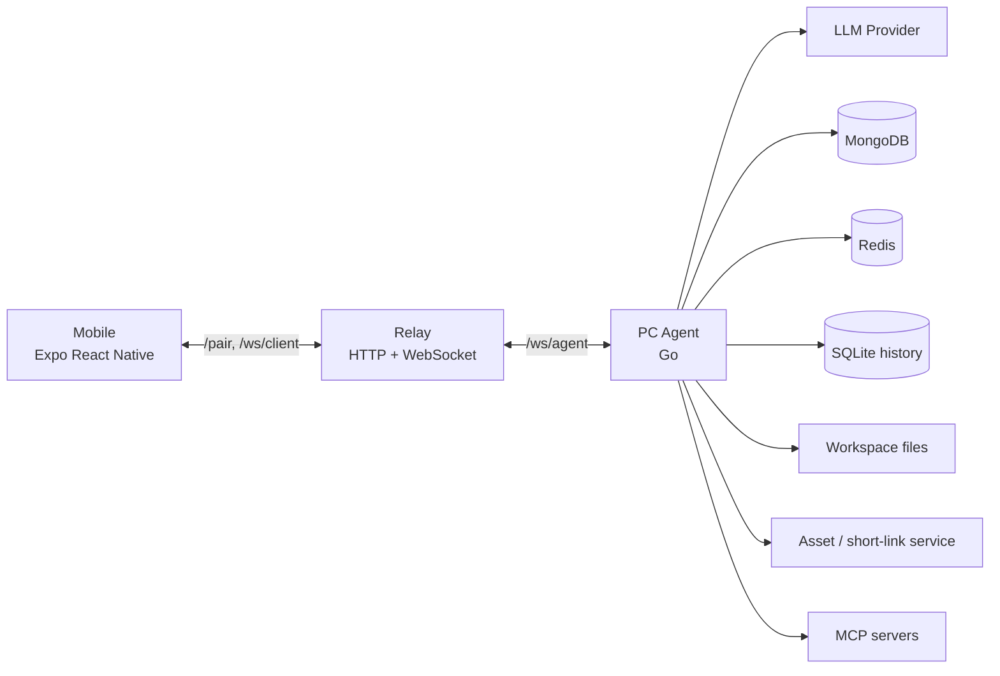
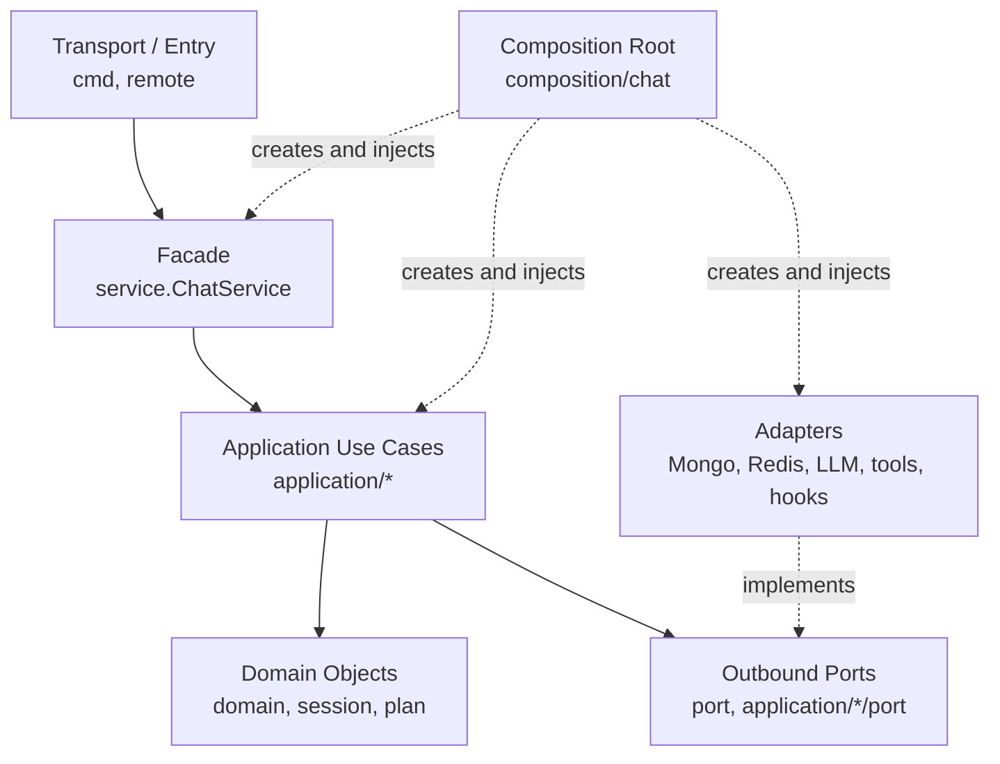
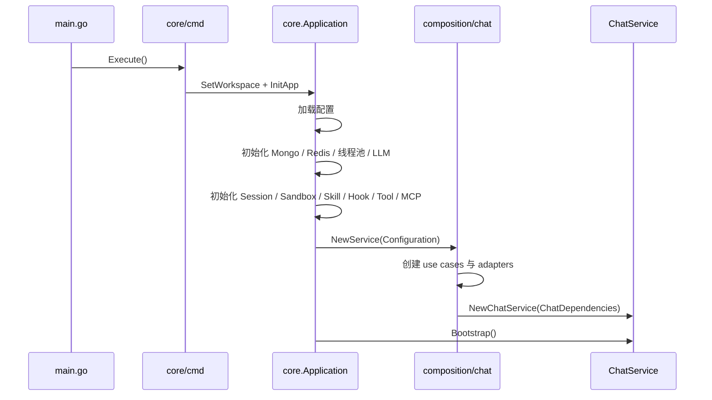
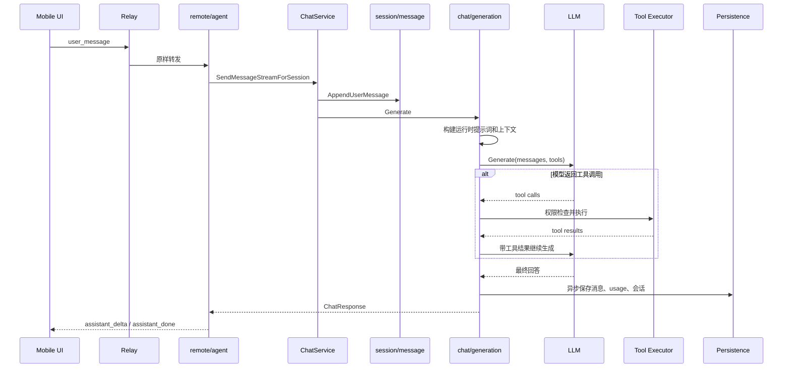
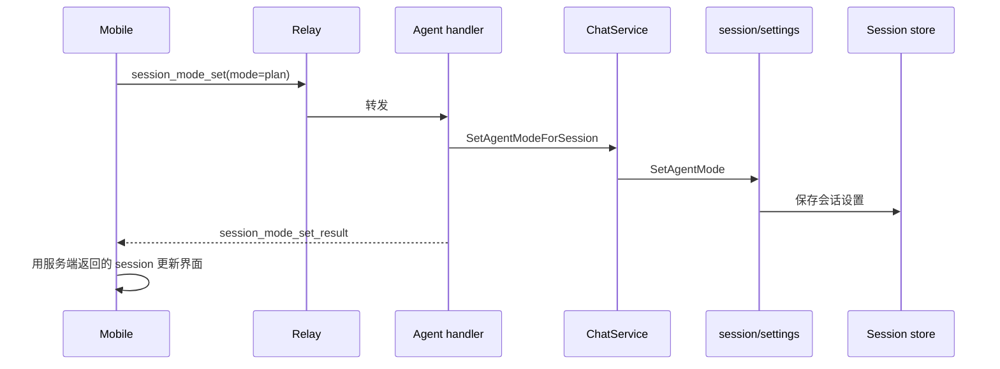
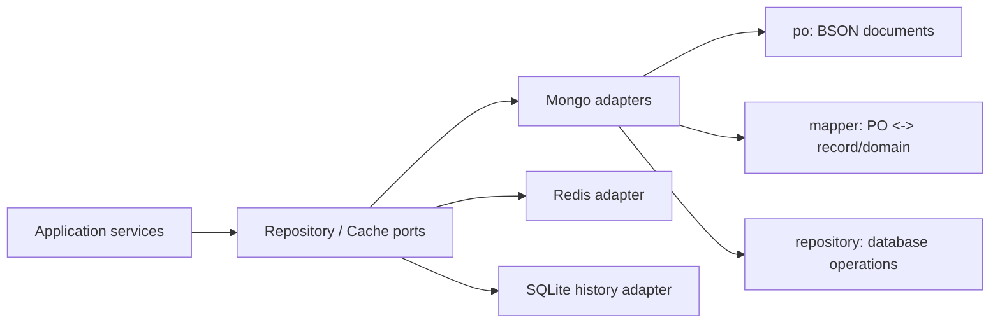

# MyAI 项目与架构指南

> 面向第一次接手本项目的开发者，尤其是熟悉 Java / Spring Boot 的开发者。
>
> 本文描述的是当前代码实际结构，而不是理想化的目标结构。阅读完第 1～6 节，应该能建立完整的全局认识；需要修改代码时，再查阅后续章节。

希望先看动态版本，可以直接打开 [PROJECT_ARCHITECTURE_INTRO.html](PROJECT_ARCHITECTURE_INTRO.html)。

## 1. 一句话认识 MyAI

MyAI 是一个可以通过命令行或手机远程使用的 AI 编程助手：

- Go 进程负责会话、模型调用、Plan 模式、工具执行、文件操作和持久化。
- Relay 服务负责在手机和电脑 Agent 之间转发消息，不执行 AI 业务。
- Expo React Native 手机端负责聊天、会话管理、Plan 执行、权限审批、文件预览和变更查看。
- MongoDB 保存会话、消息、模型配置和共享资源记录。
- Redis 保存用户当前会话等短期状态。
- SQLite 保存工作区历史检查点，用于查看和恢复文件变更。

这个项目不是普通的“调用一次大模型 API”。它已经具备一个 Agent 的基本闭环：

```text
用户输入 -> 构建上下文 -> 调用模型 -> 识别工具调用 -> 权限判断
        -> 执行工具 -> 把结果交回模型 -> 生成最终答案 -> 保存会话
```

## 2. 系统全景

项目运行时由三个可以独立启动的进程组成。



### 2.1 三个进程分别做什么

| 进程 | 启动命令 | 主要职责 |
|---|---|---|
| CLI Chat | `go run . chat` | 在当前电脑终端直接聊天，不经过 Relay 和手机 |
| Relay | `go run . relay --addr 0.0.0.0:18080` | 配对、鉴权、维护 WebSocket 连接、转发消息 |
| PC Agent | `go run . agent ...` | 真正执行聊天、模型调用、工具调用、文件与历史操作 |
| Mobile | `cd mobile && npm start` | 手机 UI，通过 Relay 控制 PC Agent |

一个重要结论：**Relay 不是业务后端，PC Agent 才是业务执行端。** Relay 不应该依赖 ChatService、Mongo 会话仓库或工具执行器。

## 3. 当前架构思想

当前后端采用的是“分层架构 + 六边形架构思想 + 显式依赖注入”，并使用 Go 的小接口习惯，而不是机械复制 Java 包结构。



依赖方向的核心规则：

```text
外层可以依赖内层
内层不能依赖外层
业务代码依赖接口
技术实现去实现接口
composition 负责把两者装配起来
```

例如，应用层只知道“需要保存会话”的接口，不应该知道 BSON、Mongo Collection 或 Redis Key。

## 4. 与 Spring Boot 的对应关系

| Spring Boot 概念 | MyAI 中的对应位置 | 说明 |
|---|---|---|
| `Controller` | `core/cmd`、`core/remote/agent` | 接收 CLI 或 WebSocket 请求并转换参数 |
| `Service` 接口 | `core/application/**/api` | 入站用例接口，描述系统能做什么 |
| `ServiceImpl` | `core/application/**/service` | 用例实现，负责业务编排 |
| Request DTO | `core/application/**/command` 或 `query` | 输入对象，不包含业务实现 |
| Response VO | `core/application/**/result` | 应用层输出对象 |
| Repository 接口 | `core/port/**` 或 `core/application/**/port` | 应用层需要的出站能力 |
| Repository 实现 | `core/adapter/persistence/**/repository` | Mongo、SQLite 等具体实现 |
| PO / DO | `core/adapter/persistence/**/po` | 带 BSON 等存储标签的持久化对象 |
| Converter / MapStruct | `core/adapter/persistence/**/mapper` | PO、Record 与业务对象之间转换 |
| `@Configuration` | `core/composition/chat/configuration.go` | 创建对象并注入依赖 |
| `@ConfigurationProperties` | `core/config` | 加载并映射 YAML / 环境变量 |
| Facade | `core/service/ChatService` | 给 CLI 和远程 Agent 提供稳定的统一入口 |
| Entity / Domain Model | `core/domain`、`core/session`、`core/plan` | 与具体传输和数据库无关的业务状态 |

Go 与 Java 最大的区别是：

1. Go 接口通常定义在“使用方”，而不是统一放进一个巨大的 `interfaces` 包。
2. 实现类不需要写 `implements`，只要方法集合满足接口即可。
3. 构造器注入通过普通结构体字段和构造函数完成，不依赖运行时注解扫描。
4. 包既是代码组织单位，也是访问边界；为了避免循环依赖，不能照搬 Java 的每一种目录层级。

## 5. 根目录速览

```text
myai/
├── main.go                         # Go 程序唯一入口
├── core/App.go                     # 应用资源初始化和生命周期
├── core/
│   ├── cmd/                        # Cobra CLI 入口
│   ├── remote/                     # Relay、Agent、协议、远程文件/变更接口
│   ├── service/                    # 面向入口的 ChatService Facade
│   ├── application/                # 应用用例及其接口、命令、结果、实现
│   ├── domain/                     # 纯业务对象
│   ├── port/                       # 跨用例共享的出站接口
│   ├── adapter/                    # 数据库、缓存、模型、工具等接口实现
│   ├── composition/                # 依赖装配
│   ├── config/                     # 配置读取和映射
│   ├── architecture/               # 自动化架构约束测试
│   ├── session/                    # 会话核心对象及固定系统提示词
│   ├── plan/                       # Plan 核心对象和解析规则
│   ├── llm/                        # 模型注册和兼容入口
│   ├── tool/                       # 工具定义、注册及本地工具
│   ├── contextmgr/                 # 上下文窗口、摘要和 token 计算
│   ├── history/                    # 工作区任务历史与快照
│   ├── sandbox/                    # 本地命令执行边界
│   ├── skill/、skillhub/           # Skill 加载和安装
│   ├── hook/                       # 生命周期和工具事件 Hook
│   ├── mcp/                        # MCP 客户端和工具注册
│   ├── asset/                      # 文件上传与短链接客户端
│   └── infra/                      # Mongo、Redis 等底层客户端创建
├── mobile/                         # Expo React Native 手机端
├── resource/application.yaml       # 默认运行配置，通常包含敏感信息
├── application.redacted.yaml       # 已脱敏的配置结构示例
├── skills/                         # 本地 Skill 目录
└── ARCHITECTURE_REFACTOR_NOTES.md  # 重构过程记录，不是入门文档
```

### 5.1 为什么 `session`、`plan`、`llm` 没有全部移进 `domain`

这些包是项目早期已经形成并被大量引用的核心对象或兼容入口。当前重构优先完成了职责隔离和依赖方向，没有为了目录纯粹而一次性改掉所有公开包名。

因此当前结构是务实的渐进式架构：

- 新业务优先进入 `application/domain/port/adapter` 体系。
- `core/session` 和 `core/plan` 仍被视为领域核心。
- `core/service` 是稳定 Facade，不在里面继续堆积新的业务实现。
- 旧入口只有在有明确收益时再迁移，避免无意义的大规模改名。

## 6. `application` 目录如何阅读

`application` 按“业务模块 -> 对象角色”组织。

```text
application/
├── chat/
│   ├── context/                    # 构建模型上下文
│   ├── compaction/                 # 自动/手动压缩上下文
│   ├── generation/                 # 模型生成与工具循环
│   ├── plan/                       # 已批准计划的逐步执行
│   └── port/                       # chat 模块共享出站接口
├── model/                          # 模型配置、查询和启动加载
├── plan/                           # Plan 捕获、状态转换、输入构造
├── runtime/                        # 每轮运行时提示词和模式策略
├── session/
│   ├── bootstrap/                  # 启动时恢复或创建会话
│   ├── current/                    # 当前会话状态
│   ├── lifecycle/                  # 新建、加载、删除、恢复、清空
│   ├── load/                       # 从内存或持久层加载
│   ├── message/                    # 追加消息、重新生成准备
│   ├── persistence/                # 会话持久化编排
│   ├── query/                      # 会话、消息、资源查询
│   └── settings/                   # 模型、模式、权限、上下文设置
├── skill/                          # Skill 查询与刷新
└── tool/                           # 工具选择和模式权限策略
```

一个完整子模块通常具有以下目录：

| 目录 | 允许放什么 | 不允许放什么 |
|---|---|---|
| `api` | 入站接口 | struct 实现、DTO |
| `command` | 改变状态的输入 DTO | interface、业务实现 |
| `query` | 查询输入 DTO | interface、业务实现 |
| `result` | 输出 DTO / VO | interface、业务实现 |
| `port` | 该用例需要的出站接口 | struct 实现 |
| `service` | 用例实现 | interface 声明 |

不是每个模块都必须凑齐六个目录。只有真实存在相应职责时才创建，避免产生空包。

## 7. 核心对象关系

### 7.1 Session

`core/session/Session.go` 中的 `Session` 是聊天运行时的聚合状态，主要包含：

```text
ID
Model
AgentMode          chat / plan
PermissionMode     readonly / ask / full
ContextWindowK
Summary
CompactedMessages
Usage / LastUsage
CurrentPlan
Messages
```

会话创建时会把固定系统提示词作为第一条消息。切换模式不会重写这条提示词，也不会重写历史消息。

### 7.2 Plan

`core/plan` 中的 Plan 主要包含：

```text
Plan
├── id
├── session_id
├── goal
├── status            draft / running / done / failed / canceled
├── raw_content
└── steps[]
    ├── order
    ├── title
    ├── description
    └── status         pending / running / done / failed
```

### 7.3 Message

消息领域对象位于 `core/domain/message`，支持：

- system
- user
- assistant
- tool call
- tool result

JSON、BSON 等序列化标签不进入这些内层对象，而是留在远程协议 DTO 或数据库 PO 中。

## 8. 应用如何启动与装配

启动过程如下：



### 8.1 `core/App.go` 的职责

它类似一个应用级资源容器，负责：

- 读取配置。
- 创建数据库和缓存客户端。
- 创建模型注册表、内存会话、工具、Skill、Hook、MCP。
- 调用 composition root 创建 ChatService。
- 在退出时关闭 MCP 和线程池。

它不应该承载聊天业务规则。

### 8.2 `composition/chat/configuration.go` 的职责

这个文件相当于 Spring 的 `@Configuration`：

1. 创建具体 Adapter。
2. 创建各个 Application Service。
3. 将接口和实现连接起来。
4. 最终生成 `ChatDependencies` 并创建 ChatService。

当你想知道“某个接口实际注入了哪个实现”时，第一站就是这里。

## 9. 普通 Chat 请求完整链路

手机发送一条普通消息时，主链路如下：



### 9.1 Agent Loop

`AgentLoopService` 默认最多执行 6 轮工具循环：

1. 把上下文和当前可用工具发给模型。
2. 没有工具调用时直接返回最终答案。
3. 有工具调用时执行工具并记录结果。
4. 把 tool call 和 tool result 追加到上下文。
5. 再次调用模型。
6. 达到最大轮数后，再进行一次不携带工具的最终生成。

同一个会话的远程请求会被串行化，避免同时修改相同 Session；不同会话可以独立运行。

## 10. Plan 模式如何实现

Plan 模式不是把用户输入改写成另一段用户输入，也不是替换整个固定系统提示词。它由三部分协作完成：

1. **会话状态**：`Session.AgentMode = plan`。
2. **运行时提示词**：在本轮最新 user message 之前临时插入 Plan 指令。
3. **代码层编排**：捕获结构化计划，并在用户批准后逐步骤执行。

### 10.1 手机切换 Chat / Plan



模式切换必须等待 `session_mode_set_result`，手机端不能只修改本地按钮状态。服务端返回是最终事实来源。

### 10.2 Plan 请求如何进入模型

固定系统提示词一直位于会话消息开头：

```text
[system] 固定的 MyAI 系统提示词
[user]   历史问题
[assistant] 历史回答
...
```

Plan 模式下，在构建本轮模型快照时临时形成：

```text
[system] 固定的 MyAI 系统提示词
[历史消息 ...]
[system] Runtime instructions for this turn: Plan mode rules...
[user]   本轮最新输入
```

临时运行时指令不会写回历史消息，因此：

- 固定系统提示词不变。
- 旧消息顺序不变。
- 模式切换不需要重写整个会话。
- 大模型看到的稳定前缀可以继续命中 prompt cache。
- 变化内容只位于靠近本轮输入的尾部。

Skill 指令也通过同一运行时构建器按当前输入追加，而不是污染固定前缀。

### 10.3 生成计划

Plan 指令要求模型输出：

```markdown
## Plan
1. 第一步
2. 第二步
```

`ResponseCommitService` 保存 assistant 消息后，`CaptureService` 从回复中捕获 Plan，生成 `Plan` 和 `PlanStep`，再保存到 `Session.CurrentPlan`。

对于需要写文件、执行命令或产生外部副作用的任务，模型应在 Plan 后停止，等待用户点击执行。

### 10.4 执行已批准计划

用户点击执行后，手机发送 `session_plan_execute`。`ExecutionService`：

1. 加载当前会话和 `CurrentPlan`。
2. 把 Plan 标记为 `running`。
3. 把当前步骤标记为 `running` 并推送 `session_plan_update`。
4. 为当前步骤构造一条明确的执行输入。
5. 调用正常生成链路，并设置 `ForceChatMode=true`。
6. 允许该步骤按照权限策略调用写文件、Shell 等工具。
7. 完成后将步骤标记为 `done`。
8. 所有步骤结束后将 Plan 标记为 `done`。

`ForceChatMode=true` 很关键：会话本身仍是 Plan 模式，但执行已批准步骤时不再重复生成一份新计划。

### 10.5 “写一首古诗”的特殊情况

这是安全的纯文本任务，不需要文件、Shell 或外部副作用。Plan 提示词要求模型在同一次回复中先规划、再给结果：

```markdown
## Plan
1. 确定主题和意象。
2. 按七言绝句组织四句。
3. 检查韵律和表达。

## Result
（古诗正文）
```

当 `CaptureService` 发现 `Result` 区段时，会直接把计划及步骤标记为 `done`，手机端不需要再点击一次“执行计划”。

## 11. 工具、权限和安全边界

当前本地工具在 `core/App.go` 中注册，包括：

- `list_files`
- `read_file`
- `search_files`
- `write_file`
- `edit_file`
- `shell`
- `install_skill`
- 配置 Asset 服务后可用 `read_asset`、`share_file`
- 配置 MCP 后可注册外部 MCP 工具

权限模式：

| 模式 | 行为 |
|---|---|
| `readonly` | 只允许只读操作 |
| `ask` | 敏感操作向手机请求批准 |
| `full` | 在策略允许范围内直接执行 |

Plan 生成阶段额外限制为只读工具；批准执行时通过 `ForceChatMode` 恢复正常工具策略。权限审批消息通过 `permission_ask` / `permission_result` 在手机与 Agent 间往返。

Shell 命令由 `core/sandbox` 约束在工作区内；文件工具也应使用工作区归一化路径，不能任意访问工作区之外。

## 12. 上下文、压缩与缓存

### 12.1 上下文组成

模型请求上下文大致由以下内容组成：

```text
固定系统提示词
已有摘要（如果发生过压缩）
选中的历史消息
本轮运行时指令（Plan / Skill）
最新用户消息
工具调用和工具结果（Agent Loop 中追加）
```

### 12.2 自动压缩

`application/chat/compaction` 在模型调用前检查上下文大小。达到阈值时：

1. 选择较旧消息。
2. 生成摘要。
3. 保存摘要和已压缩消息数量。
4. 保留较新的原始消息继续对话。

手动 `session_compact` 与自动压缩共享相同核心服务。

### 12.3 缓存稳定性

本项目为了 prompt cache 采用“稳定前缀 + 动态尾部”的策略：

- 固定系统提示词不因 Chat / Plan 切换而改变。
- Plan 和 Skill 指令只在请求快照中插入到最新用户消息前。
- 不在每轮请求前拼接一个完全不同的顶层系统提示词。
- `ContextInfo` 会返回 `prefix_hash`、`cacheable_tokens`、`prompt_cached_tokens` 等指标用于观察缓存情况。

## 13. 数据保存在哪里



| 存储 | 主要数据 | 对应代码 |
|---|---|---|
| 内存 | 当前进程正在使用的 Session | `adapter/session/memory` |
| MongoDB | Session、Message、ModelConfig、Asset、授权 | `adapter/persistence/mongo` |
| Redis | 用户当前 Session ID，带 TTL | `adapter/cache/redis` |
| SQLite | 工作区历史检查点与恢复数据 | `adapter/persistence/sqlite/history` |

Mongo 持久化目录严格分工：

```text
po/          只放 BSON 文档
mapper/      只做数据转换
repository/  只做持久化实现
template/    封装通用 Mongo 操作
```

Redis 的常用操作封装在 `adapter/cache/redis`，包括模板、字符串和有序集合操作。业务层不应直接调用 `go-redis`。

## 14. 手机、Relay 与 Agent 协议

统一消息信封定义为：

```text
type
request_id
user_id
device_id
session_id
client_token
payload
```

### 14.1 Relay HTTP / WebSocket 入口

| 路径 | 用途 |
|---|---|
| `GET /health` | 健康检查 |
| `GET /agents` | 查看在线 Agent |
| `POST /pair` | 使用绑定码配对手机 |
| `/authorizations` | 查询授权 |
| `/authorizations/revoke` | 撤销授权 |
| `/ws/agent` | PC Agent WebSocket |
| `/ws/client` | 手机 WebSocket |

### 14.2 手机端主要目录

```text
mobile/
├── App.tsx                           # React Native 入口
└── src/
    ├── screens/                      # 页面级状态装配
    ├── components/                   # UI 组件
    │   └── plan/PlanPanel.tsx        # Plan 展示和执行入口
    ├── hooks/
    │   ├── useRelayConnection.ts     # WebSocket 连接
    │   ├── useRelaySender.ts         # 统一发送协议消息
    │   ├── useRemoteMessageHandler.ts# 处理服务端消息
    │   └── useSessionSettingsActions.ts # 模式、权限、Plan 等动作
    ├── protocol.ts                   # TypeScript 协议 DTO
    ├── types/                        # UI 状态类型
    └── storage/                      # 手机本地数据
```

Go 的 `core/remote/protocol` 与 TypeScript 的 `mobile/src/protocol.ts` 是跨端契约。新增或修改消息类型时，必须同步修改两端并补充处理分支。

## 15. 远程 Agent 的内部拆分

`core/remote/agent` 是传输适配层，不直接实现 Chat 业务：

| 文件类别 | 职责 |
|---|---|
| `agent.go` | WebSocket 生命周期、消息分发、同 Session 并发控制 |
| `*_handlers.go` | 解码某类请求、调用 Facade、编码响应 |
| `chat_facade.go` | Agent 所需的窄接口组合 |
| `payload_mapper.go` | 应用对象到协议 DTO 的映射 |
| `permission_waiters.go` | 等待手机权限审批 |
| `session_runtime.go` | 每个 Session 的运行、暂停和互斥状态 |
| `workspace_facade.go` | 文件与变更服务窄接口 |

Handler 中不应该新增模型循环、Plan 状态机、数据库查询细节等业务逻辑。

## 16. 新功能应该放在哪里

### 16.1 新增一个业务用例

例如新增“归档会话”：

```text
application/session/archive/api       定义 ArchiveUseCase
application/session/archive/command   定义 ArchiveSession
application/session/archive/result    定义 ArchiveResult
application/session/archive/port      定义用例需要的出站接口
application/session/archive/service   实现业务流程
```

然后：

1. 在 adapter 中实现所需 port。
2. 在 `composition/chat/configuration.go` 装配。
3. 在 `ChatDependencies` 注入。
4. 在 `ChatService` 暴露 Facade 方法。
5. 最后由 CLI 或 remote handler 调用。

### 16.2 新增数据库字段

通常需要依次修改：

```text
领域/应用对象
repository record 接口对象
adapter/persistence/.../po
adapter/persistence/.../mapper
adapter/persistence/.../repository
协议 DTO（仅当需要传给手机）
mobile protocol 类型（仅当需要传给手机）
```

不要把 BSON tag 加到 domain、application 或 service。

### 16.3 新增本地工具

1. 在 `core/tool/local` 实现工具。
2. 明确工具权限级别。
3. 在 `core/App.go` 的 `InitRegister` 注册。
4. 为输入校验、工作区边界和结果补测试。
5. 如果产生共享文件，让 Tool Executor 提取并记录 Asset。

### 16.4 新增手机协议

1. 在 `core/remote/protocol` 增加消息类型和 payload DTO。
2. 在 `core/remote/agent` 增加 handler。
3. 在 Relay 确认该消息可以按现有路由转发。
4. 在 `mobile/src/protocol.ts` 增加对应 TypeScript 类型。
5. 在发送 action 和 `useRemoteMessageHandler` 中处理请求与响应。

## 17. 架构守卫

`core/architecture/dependency_rules_test.go` 会阻止结构再次混乱，当前主要检查：

- 内层不能依赖外层技术实现。
- domain / application / port / service 不能出现 JSON、BSON、YAML 标签。
- interface 文件不能同时混入 struct 对象。
- `api/port` 目录不能声明 struct。
- `command/result/service` 目录不能声明 interface。
- application 模块根目录必须保持为容器。
- Mongo BSON 对象只能放在 `po`。
- 生产代码不能重新依赖已淘汰的旧包。

修改架构后至少执行：

```powershell
go test ./core/architecture
go test ./...
cd mobile
npm run typecheck
```

## 18. 配置说明

默认配置路径是 `resource/application.yaml`，配置对象由 `core/config` 读取。不要提交真实密钥。

```yaml
myai:
  base_url: "https://your-provider.example/v1"
  api_key: "${API_KEY}"
  model: "your-model"

mongo:
  uri: "mongodb://localhost:27017"
  database: "myai"

redis:
  addr: "localhost:6379"
  password: ""
  db: 0

thread:
  core: 5
  queueSize: 10

asset:
  shortener_base_url: "http://localhost:18081"
  upload_timeout_seconds: 60
  ttl_seconds: 604800
  max_visits: 0

skill:
  root: "skills"
  registry: ""

mcp:
  servers: []

hooks:
  commands: []
```

Viper 同时支持环境变量覆盖，配置键中的 `.` 会转换为 `_`。例如 `myai.api_key` 可通过对应环境变量注入，具体命名应在部署环境中统一约定。

## 19. 本地启动

### 19.1 仅使用终端聊天

```powershell
cd D:\Go_All\myai
go run . chat
```

### 19.2 启动远程手机链路

终端 1：

```powershell
cd D:\Go_All\myai
go run . relay --addr 0.0.0.0:18080
```

终端 2：

```powershell
cd D:\Go_All\myai
go run . agent `
  --server ws://127.0.0.1:18080/ws/agent `
  --user local `
  --device pc-local `
  --workspace D:\Go_All\myai
```

终端 3：

```powershell
cd D:\Go_All\myai\mobile
npm start
```

真机不能使用 `127.0.0.1` 连接电脑 Relay，应填写电脑局域网 IP，例如 `http://192.168.1.23:18080`。

## 20. 推荐阅读顺序

如果你只想快速理解，不要从目录第一行开始逐文件阅读。建议按以下顺序：

1. `main.go`：程序从哪里开始。
2. `core/cmd/agent.go`：PC Agent 如何启动。
3. `core/App.go`：全局资源有哪些。
4. `core/composition/chat/configuration.go`：所有服务如何装配。
5. `core/service/chat.go`：对外提供哪些业务能力。
6. `core/application/chat/generation/service`：普通聊天和工具循环。
7. `core/application/runtime/service`：Chat / Plan 提示词策略。
8. `core/application/chat/plan/service`：批准后的 Plan 执行。
9. `core/remote/agent`：手机请求如何进入 ChatService。
10. `mobile/src/hooks`：手机如何发送请求并消费响应。

## 21. 常见问题速查

### “一个接口由谁实现？”

先搜索接口名，再到 `core/composition/chat/configuration.go` 看实际注入对象。

### “手机点按钮后为什么没响应？”

按以下顺序检查：

```text
组件 onPress
-> mobile action hook 是否发送消息
-> WebSocket 是否 connected
-> Relay 是否转发
-> Agent switch 是否匹配 message type
-> handler 是否调用 ChatFacade
-> 是否返回 *_result 或 error
-> useRemoteMessageHandler 是否处理返回类型
-> pending 状态是否被 stop
```

### “Plan 为什么没有执行？”

区分两个动作：

- `user_message`：在 Plan 模式中生成计划。
- `session_plan_execute`：执行已经保存的计划。

纯文本任务可能已经在 `Result` 区段完成，不需要第二次执行。

### “为什么有些接口在 `core/port`，有些在 application 子模块的 `port`？”

- 多个业务模块共享的稳定能力放 `core/port`。
- 只服务某个用例的最小接口放在该用例自己的 `port`。

这符合 Go 的“接口靠近使用方”原则。

### “能不能直接在 Handler 里调用 Mongo？”

不能。Handler 应调用 Facade / Application API；Application 依赖 port；Mongo repository 实现 port。

## 22. 当前架构边界

本轮重构已经完成目录职责隔离、应用服务拆分、持久化对象隔离和架构守卫，但需要准确理解“完成”的含义：

- 已完成：核心业务按职责分层，接口与实现物理分离，PO/Mapper/Repository 分离。
- 已完成：Chat、Plan、Session、Model、Skill、Tool 等应用模块完成结构化整理。
- 已完成：Mongo、Redis、SQLite 等技术实现与应用接口隔离。
- 保留：`core/session`、`core/plan`、`core/llm` 等已有公共包，避免一次性破坏所有调用方。
- 保留：`core/service.ChatService` 作为入口 Facade，而不是把传输层直接绑定到大量细粒度用例。
- 后续开发原则：优先沿当前结构扩展，不再向 Facade、Handler 或数据库 Adapter 中堆积跨层业务逻辑。

## 23. 最短记忆版本

只记住下面七句话，也可以正确地在项目里工作：

1. 手机只负责 UI，Relay 只负责转发，Agent 才负责执行。
2. `ChatService` 是给入口使用的 Facade。
3. 真正业务流程放在 `application/**/service`。
4. 接口放 `api/port`，输入放 `command/query`，输出放 `result`。
5. Mongo/Redis/LLM/工具实现放 `adapter`。
6. `composition/chat` 决定一个接口最终使用哪个实现。
7. 改完先跑架构测试、Go 全量测试和手机类型检查。
