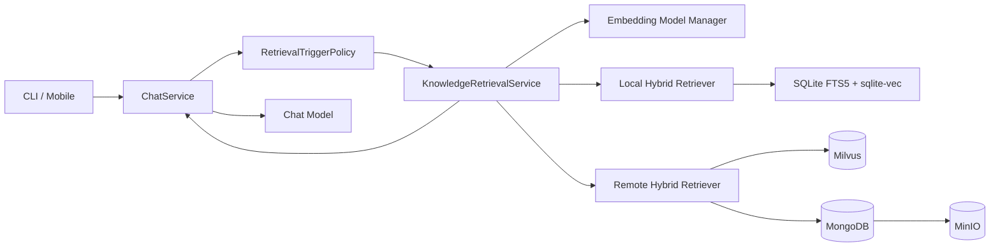
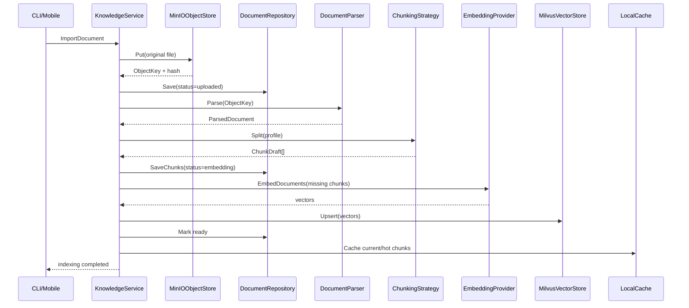
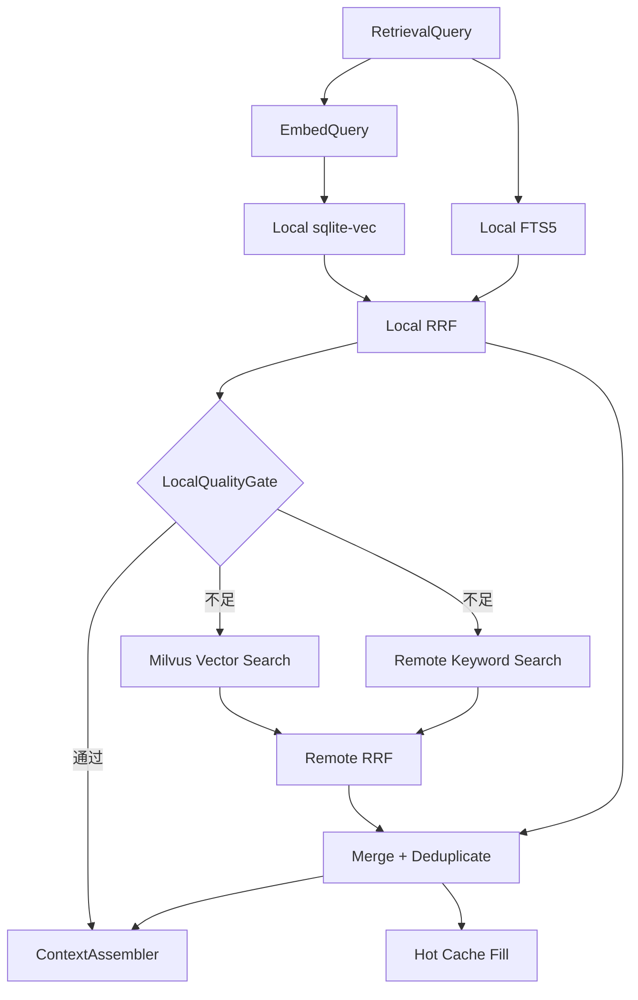

# MyAI RAG 架构设计

> 状态：核心架构已落地并持续完善。基础设施、索引、本地优先 RetrievalService、跨 Profile SearchFacade、Chat 自动检索、Session 范围和手机知识库管理入口已实现。
>
> 面向熟悉 Java / Spring Boot 的开发人员。本文使用当前 MyAI 已经采用的 `domain / application / port / adapter / composition` 分层方式设计 RAG，不把 MinIO、Milvus、sqlite-vec 或模型 SDK 直接写进业务层。

## 1. 文档目标

本文确定 MyAI 第一版 RAG 的业务边界、对象关系、接口、实现目录、存储结构、同步方式、检索触发方式和开发顺序。

已经确认的主要决策：

```text
项目定位：个人使用，不做用户、租户和 ACL 隔离
知识原文：MinIO
结构化元数据：MongoDB
线上完整向量索引：Milvus
本地热点向量索引：sqlite-vec
本地关键词索引：SQLite FTS5
检索策略：本地优先，质量不足时查询线上
检索方式：向量检索 + 关键词检索 + RRF 融合
知识组织：KnowledgeCategory（树） -> KnowledgeBase -> Document -> Chunk
删除方式：永久逻辑删除，不做业务数据物理清理
ID：接口化，默认雪花 ID；Chunk 使用稳定派生 ID
Embedding Model：独立 Registry、Resolver 和 Provider
分块策略：接口化并允许按 KnowledgeBase 切换
距离算法：接口化并允许按 KnowledgeBase 切换
Chat Model 切换：不影响已有向量
Embedding Model 切换：复用 Chunk，为缺失 Profile 重新生成向量
```

本文描述目标架构，不能代替实现文档。当前真实函数调用链见各 `FEATURE_RAG_*_IMPLEMENTATION.md`。

## 2. RAG 在 MyAI 中解决什么问题

RAG 的职责不是替代模型，也不是把文件简单拼进 Prompt。它负责在模型回答前，从用户维护的知识资料中找出与当前问题最相关的内容，并把可验证的引用交给模型。

```text
用户问题
-> 判断是否需要知识检索
-> 生成查询向量
-> 本地/线上混合检索
-> 去重和重排
-> 组装带来源的 RAG Context
-> 调用 Chat Model
-> 返回答案和引用
```

典型场景：

- 查询 MyAI 的架构说明、开发规范和功能文档。
- 查询个人保存的 PDF、Word、Markdown、HTML 和文本资料。
- 在本地 Agent 离线时使用已经缓存的热点知识。
- 本地结果不足时回退到线上完整知识库。
- 模型主动调用 `knowledge_search` 进行二次检索。

## 3. 核心概念

### 3.1 KnowledgeBase

`KnowledgeBase` 是知识资料的逻辑容器，类似带有 RAG 配置的文件夹。

```text
KnowledgeBase：MyAI 项目文档
├── PROJECT_ARCHITECTURE_GUIDE.md
├── FEATURE_AGENT_STARTUP_IMPLEMENTATION.md
└── FEATURE_PLAN_MODE_IMPLEMENTATION.md

KnowledgeBase：Go 学习资料
├── Go 语言规范.pdf
└── Go 并发编程.docx
```

它不是 Milvus Collection，也不是 sqlite 数据库文件。它是领域对象，用来：

- 组织相关文档。
- 选择本次会话允许检索的资料范围。
- 绑定分块、Embedding 和距离算法配置。
- 独立查看索引状态和构建进度。
- 对一组文档执行逻辑删除、重新索引或同步。

默认行为：

```text
Session 未指定 KnowledgeBase -> 检索全部未删除 KnowledgeBase
Session 指定一个或多个 KnowledgeBase -> 只检索选中范围
Session 关闭 RAG -> 不执行自动知识检索
```

### 3.2 KnowledgeCategory

`KnowledgeCategory` 是知识库目录树中的分类节点，类似文件夹；KnowledgeBase 是分类下面的逻辑知识容器。分类只改变组织关系和检索范围，不改变 MinIO 原文、Document、Chunk 或向量对象，因此移动分类不需要重新解析、分块或向量化。

```text
项目资料（KnowledgeCategory）
├── 架构（KnowledgeCategory）
│   └── MyAI 架构（KnowledgeBase）
└── 需求（KnowledgeCategory）
    └── 功能文档（KnowledgeBase）
```

分类使用 `ParentID` 和 `AncestorIDs` 保存层级，最大深度为 5，同一父节点下不允许同名分类。选择父分类进行检索时，SearchFacade 会自动包含所有后代分类中的启用 KnowledgeBase。删除默认要求节点为空；显式递归删除时对整个子树和其中 KnowledgeBase 做逻辑删除。

### 3.3 Document

`Document` 表示导入知识库的一份原始资料。

```text
Document 元数据 -> MongoDB
Document 原始文件 -> MinIO
```

Document 只保存 MinIO ObjectKey，不在领域对象中出现 MinIO SDK 类型。

### 3.4 Chunk

`Chunk` 是 Document 按某个分块策略切分后的文本单元。Chunk 和 Embedding 必须分开建模：

```text
Document
-> Chunk 001
   -> bge-m3 Embedding
   -> text-embedding-3-large Embedding
-> Chunk 002
   -> bge-m3 Embedding
   -> text-embedding-3-large Embedding
```

这样切换 Embedding Model 时可以复用 Chunk，不需要重新读取 MinIO 或重新分块。

### 3.5 EmbeddingProfile

`EmbeddingProfile` 描述一套不可混用的向量空间：

```text
provider
model
model_version
dimensions
normalize
distance_metric
```

即使两个模型都是 1024 维，只要模型或预处理不兼容，也必须视为不同 Profile。

### 3.5 ChunkingProfile

`ChunkingProfile` 描述一套可重复执行的分块规则：

```text
strategy_id
strategy_version
max_chunk_size
overlap
tokenizer
options
```

修改分块策略会产生新的 Chunk 版本，不能把新旧 Chunk 当成同一份数据。

### 3.6 IndexProfile

`IndexProfile` 把分块、Embedding、距离算法和检索索引配置组合成一个可版本化对象：

```text
IndexProfile
├── ChunkingProfile
├── EmbeddingProfile
├── DistanceMetric
└── VectorIndexOptions
```

KnowledgeBase 保存：

```text
active_index_profile_id
pending_index_profile_id
```

当前 Profile 继续服务检索，新的 Profile 在后台构建完成后再原子切换。

## 4. 系统全景



职责边界：

| 组件 | 职责 | 不负责 |
|---|---|---|
| MinIO | 保存原始文件和版本对象 | 向量检索、业务状态 |
| MongoDB | 保存 KnowledgeBase、Document、Chunk、Profile、任务和同步状态 | KNN 向量搜索 |
| Milvus | 保存线上完整向量并执行线上向量检索 | 原文事实源、用例编排 |
| sqlite-vec | 保存本地热点向量并执行本地 KNN | 完整线上数据、业务事实源 |
| SQLite FTS5 | 本地关键词检索 | Embedding 生成 |
| Embedding Provider | 把文本转换为向量 | 保存文档、选择 KnowledgeBase |
| Retrieval Service | 本地优先、线上回退、融合和上下文组装 | 直接调用具体数据库 SDK |

## 5. Spring Boot 对照

| MyAI 目标对象 | Spring Boot 类比 | 作用 |
|---|---|---|
| `KnowledgeBase`、`Document`、`Chunk` | Entity / Domain Model | 纯领域对象 |
| `KnowledgeService` | Facade | 给 CLI、Mobile、Chat 提供知识功能入口 |
| `KnowledgeRetrievalUseCase` | Service 接口 | 定义检索用例 |
| `KnowledgeRetrievalService` | ServiceImpl | 编排本地、线上、融合和缓存回填 |
| `VectorStore` | Repository / Gateway 接口 | 隔离 Milvus 和 sqlite-vec |
| `MilvusVectorStore` | RepositoryImpl | Milvus 适配器 |
| `SQLiteVecVectorStore` | RepositoryImpl | sqlite-vec 适配器 |
| `DocumentObjectStore` | Object Storage Gateway | 隔离 MinIO SDK |
| `MinIOObjectStore` | GatewayImpl | MinIO 适配器 |
| `EmbeddingProvider` | AI Gateway 接口 | 隔离具体 Embedding API |
| `EmbeddingModelRegistry` | Bean Registry | 管理向量模型元数据和运行时实现 |
| `ChunkingStrategy` | Strategy 接口 | 隔离 Markdown、Token、Code 等分块方式 |
| `KnowledgeDocumentPO` | Mongo PO | 带 BSON 标签的持久化对象 |
| Mapper | MapStruct | Domain、Record、PO 互转 |
| `composition/knowledge` | `@Configuration` | 创建并注入实现类 |

## 6. 目标目录结构

以下是建议新增的目标结构。目录按真实职责创建，不为形式制造空包。

```text
core/
├── domain/knowledge/
│   ├── knowledge_base.go
│   ├── document.go
│   ├── chunk.go
│   ├── embedding_profile.go
│   ├── chunking_profile.go
│   ├── index_profile.go
│   ├── retrieval.go
│   ├── indexing_job.go
│   └── sync_change.go
├── application/knowledge/
│   ├── base/
│   │   ├── api/
│   │   ├── command/
│   │   ├── result/
│   │   ├── port/
│   │   └── service/
│   ├── document/
│   ├── ingestion/
│   ├── retrieval/
│   ├── indexing/
│   ├── sync/
│   └── settings/
├── port/knowledge/
│   ├── vector_store.go
│   ├── keyword_store.go
│   ├── object_store.go
│   ├── embedding.go
│   ├── id_generator.go
│   └── repositories.go
├── adapter/
│   ├── id/snowflake/
│   ├── knowledge/chunking/markdown/
│   ├── knowledge/chunking/token/
│   ├── knowledge/chunking/code/
│   ├── knowledge/distance/cosine/
│   ├── knowledge/distance/innerproduct/
│   ├── knowledge/distance/l2/
│   ├── embedding/openaicompatible/
│   ├── vector/milvus/
│   ├── vector/sqlitevec/
│   ├── keyword/sqlitefts/
│   ├── keyword/remote/
│   ├── objectstorage/minio/
│   └── persistence/mongo/knowledge/
│       ├── po/
│       ├── mapper/
│       └── repository/
├── composition/knowledge/
│   └── configuration.go
└── service/
    └── knowledge.go
```

分层约束继续遵守当前架构测试：

- `domain` 不包含 BSON、JSON、YAML、Milvus、MinIO 或 SQLite 类型。
- `api` 和 `port` 文件只声明接口。
- `command`、`result` 和 `service` 不声明接口。
- Adapter 依赖并实现 Port，Application 不反向依赖 Adapter。
- `composition` 是唯一知道具体实现并负责装配的位置。

## 7. 领域对象设计

### 7.1 KnowledgeBase

```go
type KnowledgeBase struct {
	ID                    string
	Name                  string
	Description           string
	RAGEnabled            bool
	ActiveIndexProfileID  string
	PendingIndexProfileID string
	Deleted               bool
	DeletedAt             *time.Time
	DeleteReason          string
	SyncSequence          int64
	CreatedAt             time.Time
	UpdatedAt             time.Time
}
```

### 7.2 Document

```go
type Document struct {
	ID              string
	KnowledgeBaseID string
	FileName        string
	ContentType     string
	ObjectKey       string
	ContentHash     string
	Version         int64
	Status          DocumentStatus
	FailureReason   string
	Deleted         bool
	DeletedAt       *time.Time
	DeleteReason    string
	SyncSequence    int64
	CreatedAt       time.Time
	UpdatedAt       time.Time
}
```

建议状态：

```text
uploaded
parsing
chunking
embedding
indexing
ready
failed
deleted
```

### 7.3 Chunk

```go
type Chunk struct {
	ID                string
	KnowledgeBaseID   string
	DocumentID        string
	DocumentVersion   int64
	ChunkingProfileID string
	Ordinal           int
	Text              string
	ContentHash       string
	StartOffset       int
	EndOffset         int
	SourcePage        int
	SourceHeading     string
	Deleted           bool
	DeletedAt         *time.Time
	SyncSequence      int64
	CreatedAt         time.Time
	UpdatedAt         time.Time
}
```

### 7.4 ChunkEmbedding

```go
type ChunkEmbedding struct {
	ID                 string
	ChunkID            string
	KnowledgeBaseID    string
	DocumentID         string
	EmbeddingProfileID string
	Dimensions         int
	Deleted            bool
	DeletedAt          *time.Time
	SyncSequence       int64
	CreatedAt          time.Time
	UpdatedAt          time.Time
}
```

领域对象不直接携带大向量也可以。向量本体由 `VectorStore` 接收和保存，MongoDB 只保存状态和 Profile 关联。

### 7.5 RetrievalHit

```go
type RetrievalHit struct {
	KnowledgeBaseID string
	DocumentID      string
	ChunkID         string
	DocumentVersion int64
	Text            string
	SourceName      string
	SourceLocation  string
	Score           float64
	Rank            int
	Channel         RetrievalChannel
	Origin          RetrievalOrigin
}
```

`Channel` 表示 `vector` 或 `keyword`，`Origin` 表示 `local` 或 `remote`。

## 8. ID 设计

### 8.1 ID 接口

```go
type IDGenerator interface {
	NewID() string
}
```

默认实现使用雪花算法，后续可以增加 UUID、ULID 或测试用顺序 ID。

```text
IDGenerator
├── SnowflakeGenerator
├── UUIDGenerator
└── SequentialGenerator  // test
```

### 8.2 哪些对象使用雪花 ID

建议使用雪花 ID：

- KnowledgeBaseID
- DocumentID
- IndexProfileID
- EmbeddingProfileID
- ChunkingProfileID
- IndexingJobID
- SyncChangeID

### 8.3 ChunkID 必须稳定

本地和线上不能分别生成两个 Chunk 雪花 ID。ChunkID 应由稳定输入派生：

```text
ChunkID = hash(
    DocumentID
    + DocumentVersion
    + ChunkingProfileID
    + Ordinal
    + ContentHash
)
```

EmbeddingID 同理：

```text
EmbeddingID = hash(ChunkID + EmbeddingProfileID)
```

这样可以实现：

- 本地和线上使用同一个 ID。
- 重试不会产生重复数据。
- 已存在的同 Profile 向量可以直接跳过。
- 切回旧模型时复用旧向量。

## 9. Embedding Model 管理

### 9.1 职责拆分

不要创建一个同时负责配置、HTTP、Registry、重试和索引的巨大 Manager。建议拆分为：

```text
EmbeddingModelRegistry
    管理模型元数据和运行时 Provider

EmbeddingModelResolver
    根据 EmbeddingProfile 选择 Provider

EmbeddingProvider
    执行 EmbedDocuments / EmbedQuery
```

### 9.2 接口

```go
type EmbeddingProvider interface {
	EmbedDocuments(ctx context.Context, request EmbedRequest) (EmbedResult, error)
	EmbedQuery(ctx context.Context, request EmbedRequest) (EmbedResult, error)
}

type EmbeddingModelRegistry interface {
	Get(modelID string) (EmbeddingProvider, bool)
	GetInfo(modelID string) (EmbeddingModelInfo, bool)
	List() []EmbeddingModelInfo
}
```

Document 和 Query 分开声明，便于未来支持模型要求的 `search_document`、`search_query` task type。

### 9.3 Profile 一致性

以下字段共同决定向量是否兼容：

```text
provider
model
model_version
dimensions
normalize
input_mode
```

仅维度相同不能复用。检索时 Query Embedding 和 Document Embedding 必须使用同一个兼容 Profile。

## 10. 分块策略

### 10.1 接口

```go
type ChunkingStrategy interface {
	ID() string
	Version() string
	Supports(contentType string) bool
	Split(ctx context.Context, document ParsedDocument, profile ChunkingProfile) ([]ChunkDraft, error)
}
```

### 10.2 第一批实现

```text
MarkdownChunkingStrategy
    按标题、段落和最大长度切分，保留父标题上下文

TokenChunkingStrategy
    按 Token 数和重叠窗口切分普通文本

CodeChunkingStrategy
    按语言语法节点、函数或类型切分源代码
```

PDF、DOCX 和 HTML 先解析为带页码、标题等结构的 `ParsedDocument`，再交给策略切分。

### 10.3 切换规则

```text
修改 Chunk 大小或 overlap -> 新 ChunkingProfile
切换 Markdown/Token/Code -> 新 ChunkingProfile
新 Profile -> 新 Chunk 版本 -> 新 Embedding
```

旧 Chunk 永久逻辑保留，通过 `active_index_profile_id` 控制是否参与检索。

## 11. 距离算法

### 11.1 接口

```go
type DistanceMetric interface {
	ID() string
	Validate(profile EmbeddingProfile) error
	NormalizeScore(rawDistance float64) float64
}
```

第一批实现：

```text
CosineMetric
InnerProductMetric
L2Metric
```

距离计算主要由 Milvus 和 sqlite-vec 执行。领域接口负责：

- 声明算法身份。
- 校验是否要求向量归一化。
- 把不同数据库返回值转换成统一的“越大越相关”分数。

Adapter 负责把领域 Metric ID 映射为数据库参数，不允许 Application 层出现 Milvus Metric 枚举。

### 11.2 切换规则

```text
只改变索引算法参数 -> 复用向量，重建检索结构
Cosine/Inner Product 且归一化规则兼容 -> 可能复用向量
归一化规则变化 -> 新 EmbeddingProfile，需要重新向量化
```

## 12. 存储设计

### 12.1 MinIO

建议 ObjectKey：

```text
knowledge/{knowledge_base_id}/{document_id}/v{document_version}/{file_name}
```

MinIO 中的文件永久保留。Document 逻辑删除后，应用层禁止继续下载或解析，但不删除 Object。

接口：

```go
type DocumentObjectStore interface {
	Put(ctx context.Context, object ObjectWrite) (ObjectRef, error)
	Open(ctx context.Context, objectKey string) (io.ReadCloser, error)
	Stat(ctx context.Context, objectKey string) (ObjectInfo, error)
}
```

### 12.2 MongoDB

建议 Collection：

```text
knowledge_bases
knowledge_documents
knowledge_chunks
embedding_profiles
chunking_profiles
index_profiles
knowledge_indexing_jobs
knowledge_sync_changes
knowledge_retrieval_records
```

MongoDB 是以下数据的事实源：

- KnowledgeBase 和 Profile 配置。
- Document 状态、MinIO ObjectKey 和版本。
- Chunk 文本、来源位置和内容 Hash。
- 构建任务进度和错误。
- 逻辑删除状态和同步序列。

### 12.3 Milvus

Milvus 保存线上完整向量。一个 Collection 的向量维度和索引配置固定，因此物理 Collection 建议按 EmbeddingProfile 划分，而不是按 KnowledgeBase 划分：

```text
knowledge_vectors_{embedding_profile_id}
```

Milvus Entity 建议字段：

```text
embedding_id
chunk_id
knowledge_base_id
document_id
document_version
embedding_profile_id
vector
deleted
sync_sequence
created_at
updated_at
```

所有查询必须过滤：

```text
deleted == false
AND knowledge_base_id IN selectedKnowledgeBases
AND embedding_profile_id == activeEmbeddingProfile
```

Milvus 不是原文或 Chunk 文本事实源。检索返回 ID 后，由 Chunk Repository 批量读取正文和引用元数据。

### 12.4 sqlite-vec

sqlite-vec 运行在 PC Agent 的 Go 进程中，不是独立服务：

```text
Go Agent
-> SQLite Driver
-> sqlite-vec Extension
-> knowledge.db
```

建议普通表：

```sql
CREATE TABLE local_knowledge_chunks (
    chunk_id TEXT PRIMARY KEY,
    knowledge_base_id TEXT NOT NULL,
    document_id TEXT NOT NULL,
    document_version INTEGER NOT NULL,
    embedding_profile_id TEXT NOT NULL,
    text TEXT NOT NULL,
    source_name TEXT NOT NULL,
    source_location TEXT,
    content_hash TEXT NOT NULL,
    deleted INTEGER NOT NULL DEFAULT 0,
    sync_sequence INTEGER NOT NULL,
    last_accessed_at INTEGER NOT NULL,
    cached_at INTEGER NOT NULL
);
```

向量虚拟表示意：

```sql
CREATE VIRTUAL TABLE local_chunk_vectors USING vec0(
    embedding_id TEXT PRIMARY KEY,
    embedding FLOAT[1024]
);
```

真实建表 SQL 由 sqlite-vec Adapter 根据维度和所选扩展版本生成，不能散落在业务服务中。

sqlite-vec 适合中小规模热点集：

- 无需独立进程。
- 单文件部署和备份简单。
- 本地查询延迟低。
- 可以与 SQLite FTS5、元数据和 LRU 状态放在同一事务边界。

它不承担 Milvus 的分布式海量检索职责。

## 13. 永久逻辑删除

业务对象统一包含：

```text
deleted
deleted_at
delete_reason
sync_sequence
```

删除流程：

```text
用户删除 Document
-> Mongo Document.deleted = true
-> Mongo Chunk.deleted = true
-> Milvus Entity.deleted = true
-> 写入 knowledge_sync_changes
-> 本地增量同步
-> SQLite Chunk.deleted = true
-> 后续所有检索过滤 deleted = false
```

确定不执行业务数据物理清理：

- MinIO Object 永久保留。
- Mongo 逻辑删除记录永久保留。
- Milvus 逻辑删除向量永久保留。
- 同步变更永久保留或建立不会丢失删除事实的完整快照。

本地热点淘汰不等于业务删除。LRU 可以移除未删除数据的本地缓存副本，后续再从线上恢复；逻辑删除墓碑和最新同步游标必须保留，避免旧数据复活。

## 14. 文档导入与索引流程



### 14.1 幂等性

每一步都必须允许重试：

```text
ObjectKey + ContentHash 已存在 -> 不重复上传
ChunkID 已存在且 ContentHash 相同 -> 不重复保存 Chunk
ChunkID + EmbeddingProfileID 已存在 -> 不重复调用 Embedding
EmbeddingID 已存在 -> VectorStore Upsert
```

### 14.2 失败恢复

IndexingJob 保存：

```text
job_id
knowledge_base_id
document_id
index_profile_id
stage
total_chunks
completed_chunks
failed_chunks
last_error
retry_count
status
```

失败后从当前 Stage 和缺失对象继续，不从头重复整条链路。

## 15. 向量检索如何触发

### 15.1 三种入口

```text
自动检索
    每次正常知识问题在 Chat Model 生成前执行

模型工具检索
    模型主动调用 knowledge_search 补充或改写查询

手动检索
    用户在 CLI/Mobile 中直接搜索知识库
```

### 15.2 自动触发策略

`RetrievalTriggerPolicy` 第一版使用低成本规则，不额外调用模型：

```text
   (Session.RAGSettings.Mode == always
OR  (Session.RAGSettings.Mode == auto AND DefaultTriggerPolicy 命中))
AND 存在未删除且启用 RAG 的 KnowledgeBase
AND UserMessage 非空
```

`off` 和 `manual` 不触发 Chat 自动检索；`manual` 只保留给显式搜索入口。Session 的 `KnowledgeBaseIDs` 和 `CategoryIDs` 由 SearchFacade 解析，空范围表示全部启用 KnowledgeBase。

以下消息默认跳过：

```text
你好
继续
好的
谢谢
/help
/exit
```

后续可以增加模型意图分类实现，但必须作为新的 Policy Adapter，不修改 ChatService 主流程。

### 15.3 Chat 主链路接入位置

目标调用链：

```text
ChatService.SendMessageStreamForSession
-> SessionLoader.Load
-> chat/retrieval ContextService.Prepare
-> RetrievalTriggerPolicy.ShouldRetrieve
-> knowledge/search SearchFacade.Search
-> RAGContextFormatter.Build
-> MessageCommandService.AppendUserMessage
   -> Synthetic RAG Context
   -> Runtime Instruction
   -> User Message
-> TaskService.Generate
-> AssistantGenerationService.Generate
```

RAG 不应该放进 `llm.Model.Generate`，因为 LLM Adapter 只负责模型 SDK 映射，不负责知识库选择和数据库查询。

## 16. 本地优先检索流程



### 16.1 LocalQualityGate

本地有结果不代表结果足够。建议判断：

```text
本地索引健康
AND EmbeddingProfile 与当前 KnowledgeBase 一致
AND 命中数量 >= min_local_results
AND TopScore >= min_local_score
```

第一版建议默认：

```text
min_local_results = 3
min_local_score = 0.55
```

阈值必须放入配置并通过实际数据调优。

### 16.2 RRF 融合

不同检索通道和数据规模的分数不能直接相加，第一版使用 Reciprocal Rank Fusion：

```text
RRFScore(document) = sum(1 / (k + rank_i))
```

建议 `k = 60`。按以下键去重：

```text
KnowledgeBaseID + DocumentID + ChunkID
```

### 16.3 热点回填

Milvus 返回线上结果后：

```text
读取 Chunk 正文
-> 写入本地 Chunk Metadata
-> 同步对应 Embedding
-> 写入 SQLite FTS5
-> 更新 cached_at / last_accessed_at
```

同步向量时优先复用线上已经生成的向量，避免 PC Agent 再次调用 Embedding Model。

## 17. 本地热点缓存

第一版默认：

```text
最大容量：2 GB
淘汰单位：Chunk + 当前 Profile 的 Embedding
淘汰策略：LRU
最近访问时间：last_accessed_at
当前 Session 命中结果：优先保留
```

当超过容量：

```text
排除固定离线 KnowledgeBase
-> 按 last_accessed_at 升序选择
-> 删除本地缓存副本
-> 保留同步游标和逻辑删除墓碑
```

本地索引损坏恢复：

```text
Health Check 失败
-> 隔离损坏 knowledge.db
-> 创建新 SQLite 数据库
-> 拉取 Sync Snapshot/Change
-> 优先恢复当前 KnowledgeBase 和最近热点
-> 后台继续回填
```

由于 MinIO、MongoDB 和 Milvus 是线上事实源，本地向量损坏不会造成知识原文丢失。

## 18. 增量同步

### 18.1 SyncChange

```go
type SyncChange struct {
	ID              string
	Sequence        int64
	KnowledgeBaseID string
	EntityType      string
	EntityID        string
	Operation       string
	EntityVersion   int64
	Deleted         bool
	OccurredAt      time.Time
}
```

本地保存 `last_sync_sequence`：

```text
请求 sequence > last_sync_sequence
-> 按顺序应用变更
-> 事务提交
-> 更新 last_sync_sequence
```

### 18.2 同步触发

```text
Agent 启动时快速同步
后台定时同步
本地查询发现 Profile/Version 不匹配时同步
本地上传成功后立即同步
用户手动刷新
```

### 18.3 本地修改回传

允许本地导入和修改知识：

```text
本地创建 operation_id
-> 进入可靠上传队列
-> 上传 MinIO
-> MongoDB 创建 Document/Version
-> 线上索引
-> 返回正式 ID 和 SyncSequence
-> 本地替换临时状态并标记 synced
```

同步状态：

```text
local_pending
uploading
indexing
synced
conflict
failed
```

个人项目第一版采用“线上版本优先，冲突生成新 DocumentVersion”，不静默覆盖线上版本。

## 19. RAG Context 与 Prompt Cache

检索结果不能改写固定 System Prompt。建议作为当前轮 User Message 之前的 Synthetic RAG Message：

```text
System Prompt                     稳定
Historical Messages              稳定
Runtime Instruction              当前轮尾部
Synthetic RAG Context            当前轮尾部
Current User Message             当前轮尾部
```

示例：

```text
<rag-context>
KnowledgeBase: MyAI 项目文档

[1] PROJECT_ARCHITECTURE_GUIDE.md, section "当前架构思想"
ChunkID: ...
DocumentVersion: 3
Content: ...

[2] FEATURE_MODEL_GENERATION_IMPLEMENTATION.md
ChunkID: ...
DocumentVersion: 1
Content: ...
</rag-context>
```

保存 RetrievalRecord：

```text
request_id
session_id
query
knowledge_base_ids
embedding_profile_id
hits[]
context_text
created_at
```

保存当时注入的 Context Snapshot，而不是恢复会话时按最新分数重新搜索。这样可以：

- 保持会话重放一致。
- 避免恢复时改写历史 Prompt 前缀。
- 调试模型为什么引用某段知识。
- 在文档后续变化时保留当时的回答依据。

RAG Context 属于 Synthetic Message，消息查询层应能标识它，但不能把它当作真实用户输入参与标题、主题或 Plan 目标解析。

## 20. 模型和配置切换

### 20.1 Chat Model

```text
GPT -> Claude -> Grok
```

Chat Model 只消费 RAG Context，不生成文档向量。切换后立即生效，不重新分块、不重新向量化、不重建向量索引。

### 20.2 Embedding Model

```text
bge-m3 1024 -> another-model 1024
```

即使维度相同，向量空间通常不兼容。切换时：

```text
复用 Document
复用 Chunk
保留旧 Embedding
为缺少新 EmbeddingProfile 的 Chunk 生成新向量
构建新 Profile 的向量检索结构
完成后切换 ActiveIndexProfile
```

唯一键保证不会重复向量化：

```text
ChunkID + EmbeddingProfileID
```

### 20.3 分块策略

修改分块策略会改变 Chunk 边界，必须创建新的 ChunkingProfile、Chunk 和 Embedding。

### 20.4 距离算法和索引参数

只改变 Milvus HNSW/IVF 参数时，复用向量并重建检索结构。距离算法变化是否需要重新向量化，由归一化规则和 EmbeddingProfile 兼容性决定。

### 20.5 用户设置

用户在设置中可以：

- 注册和选择 Embedding Model。
- 为 KnowledgeBase 选择分块策略。
- 选择距离算法。
- 调整 Chunk 大小、Overlap 和检索 TopK。
- 选择 Session 使用的 KnowledgeBase。
- 开启或关闭 Session RAG。

设置变更不直接修改运行中索引，而是创建新的 IndexProfile 和 IndexingJob。

## 21. 核心接口草案

### 21.1 VectorStore

```go
type VectorStore interface {
	EnsureIndex(ctx context.Context, definition VectorIndexDefinition) error
	Upsert(ctx context.Context, embeddings []EmbeddingVector) error
	Search(ctx context.Context, query VectorQuery) ([]VectorHit, error)
	MarkDeleted(ctx context.Context, deletion VectorDeletion) error
	Health(ctx context.Context) error
}
```

### 21.2 KeywordStore

```go
type KeywordStore interface {
	Upsert(ctx context.Context, chunks []KeywordDocument) error
	Search(ctx context.Context, query KeywordQuery) ([]KeywordHit, error)
	MarkDeleted(ctx context.Context, command KeywordDelete) error
}
```

### 21.3 Chunk Repository

```go
type ChunkRepository interface {
	SaveAll(ctx context.Context, chunks []knowledge.Chunk) error
	GetByIDs(ctx context.Context, ids []string) ([]knowledge.Chunk, error)
	ListMissingEmbeddings(ctx context.Context, profileID string, limit int) ([]knowledge.Chunk, error)
	MarkDeletedByDocument(ctx context.Context, documentID string, deletedAt time.Time) error
}
```

### 21.4 Retrieval UseCase

```go
type KnowledgeRetrievalUseCase interface {
	Retrieve(ctx context.Context, command RetrieveKnowledge) (RetrievalResult, error)
}
```

接口文件中只保留接口。`VectorQuery`、`VectorHit`、`RetrieveKnowledge` 和 `RetrievalResult` 必须分别放入 command/result/domain 文件，遵守当前架构测试。

## 22. CLI 和手机端能力

建议第一批协议能力：

```text
knowledge_catalog_list
knowledge_category_create
knowledge_category_move
knowledge_category_delete
knowledge_base_create
knowledge_base_update
knowledge_base_delete
knowledge_document_list
knowledge_document_upload
knowledge_document_delete
knowledge_index_status
knowledge_search
session_rag_set
embedding_model_list
embedding_profile_set
```

手机端设置页：

- 分类树、子分类创建、分类移动、空分类删除和递归逻辑删除。
- KnowledgeBase 列表、创建、移动分类、RAG 启停和逻辑删除。
- 文档上传、状态、失败原因和逻辑删除。
- Session RAG 模式、TopK、KnowledgeBase/分类范围多选。
- Embedding Model、Chunk Strategy、Distance Metric 选择。
- 新 Profile 构建进度和当前 Active Profile。

CLI 建议：

```text
/knowledge
/knowledge create <name>
/knowledge use <id|all|off>
/knowledge import <path>
/knowledge search <query>
/knowledge status
/embedding-models
```

## 23. 配置结构建议

```yaml
rag:
  enabled: true
  auto_retrieval: true
  top_k: 8
  local_min_results: 3
  local_min_score: 0.55
  rrf_k: 60

  minio:
    endpoint: ""
    access_key: ""
    secret_key: ""
    bucket: "myai-knowledge"
    use_ssl: true

  milvus:
    address: ""
    username: ""
    password: ""
    database: "default"

  local:
    enabled: true
    path: ""
    max_bytes: 2147483648
    sync_interval: "5m"

  embedding:
    default_model: ""
    batch_size: 32

  chunking:
    default_strategy: "markdown"
    max_size: 1600
    overlap: 320
```

真实 Secret 不写进公开配置示例，继续使用当前配置加载和环境变量覆盖模式。

## 24. 错误处理和降级

| 故障 | 行为 |
|---|---|
| MinIO 上传失败 | Document 标记 failed，不创建可检索 Chunk |
| 文档解析失败 | 保存失败阶段和原因，允许重试 |
| Embedding API 失败 | 保留 Chunk，任务暂停或重试；关键词索引仍可使用 |
| Milvus 不可用 | 使用本地 sqlite-vec + FTS5 |
| sqlite-vec 不可用 | 直接走线上检索 |
| 本地和线上都不可用 | 不注入 RAG Context，Chat Model 正常回答并返回降级信息 |
| Profile 不匹配 | 不混合向量，触发同步或线上当前 Profile 检索 |
| 本地索引损坏 | 重建本地缓存，不影响线上事实源 |

RAG 降级错误不应直接导致整个聊天任务失败，除非用户执行的是明确的手动 `knowledge_search` 且要求严格返回检索结果。

## 25. 可观测性

建议记录：

```text
rag_triggered
rag_trigger_reason
knowledge_base_count
local_vector_hit_count
local_keyword_hit_count
local_quality_passed
remote_vector_hit_count
remote_keyword_hit_count
rrf_result_count
context_chars
embedding_model_id
embedding_latency_ms
local_search_latency_ms
remote_search_latency_ms
total_retrieval_latency_ms
cache_fill_count
```

不要记录 MinIO Secret、Embedding API Key、完整私密文档或未经裁剪的用户内容。

## 26. 测试策略

虽然第一轮可以先完成主功能，但正式合并前至少需要覆盖：

- Snowflake ID 唯一性和 ChunkID 稳定性。
- EmbeddingProfile 相同维度但不同模型时拒绝混用。
- ChunkingStrategy 的确定性和边界。
- 永久逻辑删除后所有检索都排除数据。
- 本地优先、质量门禁和线上回退。
- RRF 排名融合和 Chunk 去重。
- Milvus、sqlite-vec、MinIO、Mongo Mapper 往返。
- IndexingJob 断点恢复和幂等跳过。
- SyncSequence 顺序应用和离线删除同步。
- RAG Context 只注入当前轮尾部，不修改固定 System Prompt。
- Embedding Model 切换复用 Chunk，只补齐缺失向量。
- 本地缓存 LRU 不会造成业务数据删除。

## 27. 分阶段开发顺序

### 第一阶段：领域和接口

```text
KnowledgeBase / Document / Chunk
EmbeddingProfile / ChunkingProfile / IndexProfile
IDGenerator + Snowflake 实现
Repository / ObjectStore / VectorStore / EmbeddingProvider 接口
```

目标：建立稳定边界，不连接外部基础设施。

### 第二阶段：原文和元数据

```text
MinIOObjectStore
Mongo Knowledge Repository
KnowledgeBase CRUD
Document 上传、列表和永久逻辑删除
```

目标：完整管理原文和状态，但暂不检索。

### 第三阶段：解析、分块和 Embedding

```text
TXT / Markdown / PDF / DOCX / HTML Parser
Markdown / Token / Code ChunkingStrategy
EmbeddingModelRegistry / Resolver / Provider
IndexingJob 和断点恢复
```

目标：从 MinIO 原文稳定得到 Chunk 和向量。

### 第四阶段：线上检索

```text
MilvusVectorStore
RemoteKeywordStore
RRF
KnowledgeRetrievalService
knowledge_search 手动入口
```

目标：先完成可用的线上完整 RAG。

### 第五阶段：本地热点

```text
sqlite-vec
SQLite FTS5
SyncChange / Cursor
LocalQualityGate
LocalFirstRetriever
LRU 和损坏恢复
```

目标：实现本地优先、线上兜底和离线降级。

### 第六阶段：Chat 和 Agent 接入

```text
RetrievalTriggerPolicy
Synthetic RAG Message
Knowledge Search Tool
Prompt Cache 和 Context Compaction 集成
引用输出
```

目标：完成自动检索和模型主动二次检索。

### 第七阶段：手机设置

```text
KnowledgeBase 管理
文档上传和索引进度
Session KnowledgeBase 选择
Embedding/Chunking/Metric 设置
本地同步和错误展示
```

## 28. 第一版验收标准

```text
1. 可以创建 KnowledgeBase。
2. 可以把文档上传到 MinIO，并在 MongoDB 查看状态。
3. 文档能够解析、分块、生成 Embedding 并写入 Milvus。
4. 手动 knowledge_search 能返回正文和来源引用。
5. Session 开启 RAG 后，正常问题能自动检索并注入模型上下文。
6. 本地已有热点时优先使用 sqlite-vec + FTS5。
7. 本地结果不足时自动查询 Milvus 并回填热点。
8. 删除 Document 后，本地和线上都不再检索到它，但底层数据不物理清理。
9. 切换 Chat Model 不触发向量处理。
10. 切换 Embedding Model 时不重新分块，只生成新 Profile 缺失的向量。
11. RAG Context 不修改固定 System Prompt，恢复会话能重放当时引用。
12. MinIO、Milvus 或本地索引单点失败时具有明确降级行为。
```

## 29. 当前仍需在实现阶段验证的技术项

业务设计已经确定，以下属于技术选型验证，不阻塞领域和接口开发：

- Go SQLite Driver 与 sqlite-vec 在 Windows 的静态/动态加载方式。
- Milvus 客户端版本、Collection Alias 和 Index 参数。
- 线上关键词检索第一版采用 Milvus BM25/Sparse 还是独立 Adapter。
- PDF、DOCX、HTML Parser 的库选择和解析质量。
- 从 Milvus 向本地同步已生成向量的高效批量协议。
- Embedding Model 切换期间的后台并发、限流和进度计算。

这些能力都必须通过 Port 隔离，选型变化不影响 Domain 和 Application 用例。

## 30. 最终架构结论

```text
MinIO 是知识原文事实源
MongoDB 是知识状态、Chunk 和配置事实源
Milvus 是线上完整向量索引
sqlite-vec 是本地热点向量缓存
SQLite FTS5 是本地关键词索引
KnowledgeBase 是知识的逻辑组织单位
IndexProfile 决定分块、Embedding 和距离算法
RetrievalService 负责本地优先、线上回退和融合
ChatService 只调用 RAG 用例，不直接依赖数据库
所有删除均为永久逻辑删除
所有可替换技术能力均采用接口和实现类隔离
```

这套结构保持了 MyAI 当前的分层规则，也为未来替换 Milvus、sqlite-vec、Embedding Provider、分块策略和距离算法留下明确扩展点。
